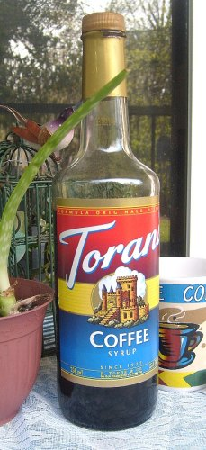
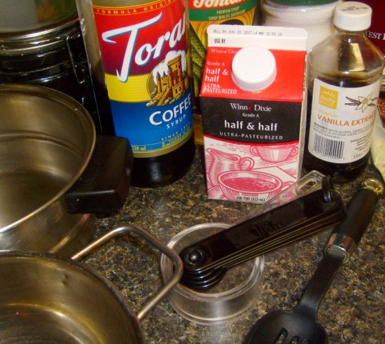
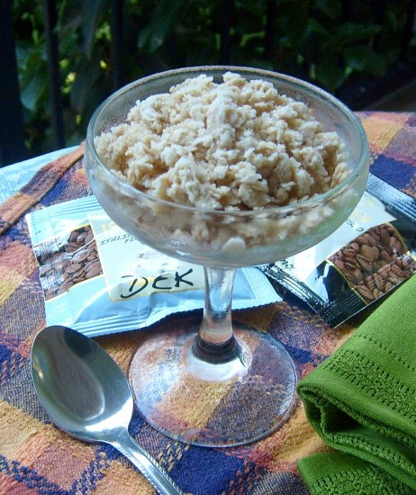

Among the 25.4 fl. oz. bottles of coconut and ginger spice were one bottle of coffee syrup. As I carefully snatched it and clutched it to my bosom I thought, THIS is my best find today! I was at a local salvage retail store of hodge-podge, nick-knacks, and brick-a-brac. Just like at any of the stores throughout the country where freight salvage, insurance losses, and bankruptcy merchandise are sold, you can sometimes scavenge a gourmet delicacy at Solomon’s Ventures.

The hefty, fifth-sized bottle told me that this was good quality stuff. My insatiable curiosity told me that that observation would not be enough. Staring at the bold, primary-colored label, I read *Formula Originale D’Italia*. *Hmm*. Must be an old Italian family recipe. What does Torani mean? I stared at the line drawing on the label of a castle in the sky, surrounded by copious foliage. Looked pretty regal to me. Further indication that I possessed a precious and highly-delectable concoction.

At home when I added a teaspoon of the nearly black mixture to my cup, I was impatient with excitement. I tasted it in my coffee but knew I’d need to add more than a stingy teaspoon to really enjoy what I suspected to be the coffee liqueur-type of flavor. R. Torre and Co. suggest that you add up to 1 oz., and to please explore other creative uses. All I wanted to create at that moment was a mug-sized dosage of intoxicating, syrup-infused brew that I refer to as *Black Witch* in one of my coffee poems.

  
*Torani Coffee Syrup*

### Torani History

Rinalda and Ezilda Torre introduced their syrups, from handwritten recipes to the North Beach San Francisco neighborhood in 1925. A son-in-law took the helm in 1957 and guided the company’s growth to international recognition. The history account on the website claims that after a family friend experimented with a Torani syrup, espresso, and steamed milk, the first flavored caffe latte emerged.

Light research of the word *torani* produced religious debate references of dati or Torani. I am not even sure that this pertains to the trademarked name on the label. Deciding not to write and ask, I abandoned my research to be satisfied with not knowing why the name was chosen. My insatiable curiosity was satiated, and I preferred to drink rather than to know.

My label reads that my Torani Coffee Syrup is delicious in cappuccino, caffe latte, steamed milk, and iced coffee. I especially liked it in my second cup of black coffee (my first is black), which I never thought I’d ever drink. I should have known that after years of happily addictive, creamer-laden drinking, I would become a hardcore drinker. When I grab that fifth of scavenged Torani by the neck, turn it up, and, with heady anticipation, begin to pour the black syrup into black coffee, I know I’m a coffee lush.

Torani Syrups can be purchased from the company website and on Amazon.com. Most of the recipes at the site are basic and include two flavors of their syrup. I made my own Coffee Granita Cream based on my grandmother’s homemade frozen banana mousse recipe, or what I could remember of it. This easy recipe takes 1 day to make.

### Coffee Granita Cream

-   1/4 cup coffee syrup (or 1/8 cup each of 2 flavored syrups)
-   1 pt half and half
-   1/4 cup sugar (or to taste)
-   2 tsp vanilla flavoring or extract
-   1/2 cup strong coffee

The first step in this simple recipe is to gather your tools. You will need:

-   2-qt saucepan
-   metal pan for freezing your granita cream
-   measuring spoons and cups
-   large spoon for stirring (slotted is safer for stirring hot liquids)
-   fork
-   strainer (optional)

Pour half and half into the saucepan and stir in all ingredients. Set the stove to high heat and put a saucepan on the burner. Stir at intervals while on high heat for about 5 minutes, then reduce heat to medium-high. As you stir, the milk will begin to curdle lightly and form little clumps. This is normal. You can strain the mixture later as you pour it. Stir continuously, and when the mixture begins to boil, turn the heat to high again. When foam rises to just short of the top of the pan, turn the heat off and set the pan aside. Allow to cool for 5 minutes and pour into a metal pan, using a strainer if you desire. Not straining will simply allow the solidified strands to blend in with the coarse frozen texture of this crystallized frozen dessert.

The main process of this recipe is to stir up the freezing mixture 2-3 times before serving. Place the pan into the freezer for 2 1/2 to 3 hours, then remove and skim the milk film from the surface of the mixture. Place it back into the freezer for about 2 hours or until it is partially frozen around the edges. Remove and stir with a fork, breaking up ice crystals and mixing them in. Return to the freezer for another 2-3 hours and stir with a fork. Repeat this process until you are satisfied with the texture of the frozen treat.

This is a recipe that can be served the same day if you start early enough. It will not freeze solid if you stir it at least twice before leaving it to freeze overnight. It can be stirred again before serving the next day. If you want a strong-flavored Coffee Granita Cream, be sure to brew your coffee extra strong. My batch though obviously coffee-flavored and rich has a lighter taste than I expected. I didn’t brew my coffee as strongly as I’d planned.

  
*Coffee Granita*

### References

[Dati Or Torani?](http://web.archive.org/web/20140407233857/http://occidentalisraeli.com/2009/02/05/dati-or-torani/) – From the site Occidental Israeli.

[Torani. In Your Home: Our Story](https://www.torani.com/our-story) – From the official site.

[Coffee Granita](/coffee-granita-cream-recipe-and-the-history-of-torani-syrups/) – INeedCoffee’s original Coffee Granita recipe.
