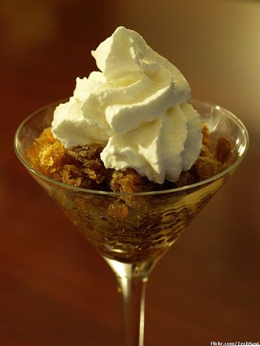

The Coffee Granita is a wonderfully refreshing treat for summer – a light dessert for after the cookout. This has a slight alcoholic kick and it is a little spicy, so it is strictly for adults.

  
*[Coffee Granita](http://www.flickr.com/photos/techsavi/3910515295/in/photostream/) by TechSavi*

### Coffee Granita Ingredients

-   1/2 cup sugar
-   2 tablespoons of honey
-   dash of cinnamon
-   1/2 shot of Kahlua
-   1/2 shot of Dark Rum
-   2 cups of double-strength coffee

### Brew the Coffee

I found that a blend of 75% Kenya and 25% Java Timor roasted to a dark but not oily level works particularly well as iced coffee and excels in this recipe. But if you don’t have access to this type of blend, any dark-roasted, unflavored coffee will do. All you have to do is brew the coffee at double strength.

### Step by Step

1.  Mix the sugar, cinnamon, and alcohol in a separate (glass) dish and add the hot coffee.
2.  Put the mixture in the freezer for 1 hour.
3.  Take it out of the freezer and use a fork to break up the ice.
4.  Add 1/2 cup of crushed ice or chipped ice.
5.  Continue freezing for a total of 3 1/2 hours. Break it up every hour.

The final step is to garnish. Spoon the granita mixture into a serving dish and cover with whipped cream. This recipe serves four.
