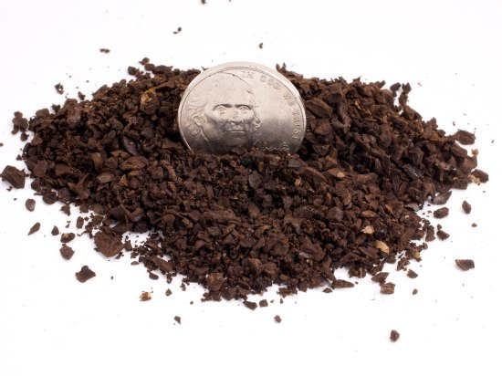
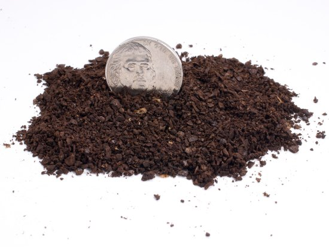
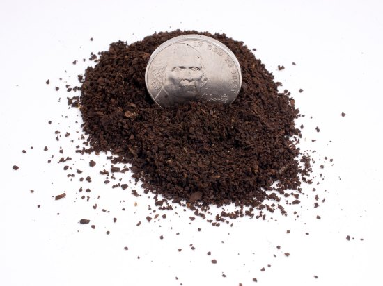
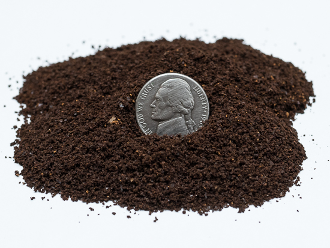
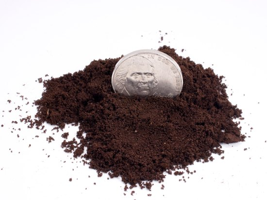
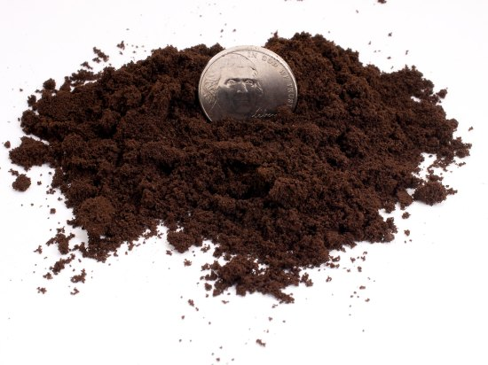

How do I Grind My Coffee? What Equipment do I need? What Grind Level? These questions sound like hell for the amateur and heaven for the Coffee Nerd. They mainly mean one more quantifiable way of measuring and another way to spend cash on another gadget.

Regarding equipment, you may have to replace that whirly blade grinder you got from the last divorce. The amount you spend depends on what kind of coffee you are making.

Drip Coffee isn’t too demanding, and $50 or so should get a nice grinder. French Press requires a consistently coarse grind, but shouldn’t cost you more than about $100 or so for something that will work nicely for both French Press and Drip. Now, if you are doing Espresso, and want to do it right, you will look at something in the $250-$400 range. Most of these grinders will also work nicely for Turkish or Greek coffee, the finest grind.

We are going to mention seven grind levels to get you started. Sure, there are probably more levels than that in practice, but this will give you visual cues to feel confident you are close. This article uses high-quality photographs of ground coffee against a U.S. nickel to visually explain these terms. For those outside the United States, the coin below is 21.21 millimeters in diameter and 1.95 millimeters thick.

### Extra Coarse Grind

-   Cold Brewing, like the [Toddy Brewer](/cold-brew-coffee-with-the-toddy-coffee-maker/).

  
*Extra Coarse Coffee Grind is used for Cold Brewing methods.*

### Coarse Grind

-   [French Press Pot](/press-pot-tutorial/)
-   [Cupping](/coffee-cupping-a-basic-introduction/)

  
*Coarse Coffee Grind is most commonly used for French Press coffee.*

### Medium-Coarse Grind

-   [Cafe Solo Brewer](/eva-solo-coffee-brewing-tutorial/)
-   [Chemex Brewer  
    ](/chemex-coffee-brewing-history-and-tutorial/)

  
*Medium-Coarse Coffee Grind is used in specialty devices like the Cafe Solo and Chemex Brewers.*

### Medium Grind

-   Drip Pots (like Bunn, Newco, Fetco)

  
*Medium Coffee Grind is used in Drip brewing methods.*

### Medium-Fine Grind

-   Pourover Cones (like [The Clever Coffee Dripper](/clever-coffee-dripper-review/ "Clever Coffee Dripper Review"), [The Bonavita Immersion Coffee Dripper](/step-step-bonavita-immersion-coffee-dripper-tutorial/ "Step By Step Bonavita Immersion Coffee Dripper Tutorial"))
-   [Vacuum Pots](/vacuum-pot-brewing/)
-   [Siphon Brewers](/the-coffee-siphon-the-simple-tutorial/ "The Coffee Siphon – The Simple Tutorial")

  
*Medium-Fine Coffee Grind used for Pourover Cones, Vacuum Pots, and Siphon Brewers.*

### Fine Grind

-   [Espresso](/rancilio-silvia-espresso-machine-tips/)
-   [Stovetop Espresso / Moka Pot](/stovetop-espresso-brewing-tutorial/ "Stovetop Espresso Brewing Tutorial")

  
*Fine Coffee grind used for espresso.*

### Extra Fine Grind

-   [Turkish Coffee (Ibrik)](/the-worlds-first-coffee-pot-turkish-coffee/ "The World’s First Coffee Pot: Turkish Coffee")

  
*Extra Fine Coffee Grind is used for Turkish coffee.*

### The AeroPress

Our article [The Upside Down AeroPress Tutorial](/upside-aeropress-coffee-brewing-tutorial/) explains how that brewer can use various grind levels.

### Conclusion

The grind levels presented here are just to get you in the ballpark. Experiment in small increments to get the flavor you want. Espresso will probably be the most crucial since it is a microcosm of coffee and is under pressure, so the smallest change in grind can result in a noticeable outcome in the cup. Happy Grinding!

*Editor’s Note: This article was originally published in April 2003. It was rewritten in July 2011, and new photos were taken. The original photos by Carl Melville from the 2003 article are listed below.*

-   [Coarse 723×600](/wp-content/uploads/2013/10/Coffee-Coarse-WEB.jpg) (79 K)
-   [Medium 735×600](/wp-content/uploads/2013/10/Coffee-medium-WEB.jpg) (94 K)
-   [Fine 712×600](/wp-content/uploads/2013/10/Coffee-fine-WEB.jpg) (87 K)
-   [Side-By-Side 800×562](/wp-content/uploads/2013/10/3-coffee-dimes-WEB.jpg) (110 K)

  
Coffee Grind Chart by [Chris Arnold](/by/chris-arnold/) is licensed under a [Creative Commons Attribution-NoDerivatives 4.0 International License](https://creativecommons.org/licenses/by-nd/4.0/). Feel free to use these photos on your website, provided you attribute them by linking back to [INeedCoffee](/) or [this article](/coffee-grind-chart/).
