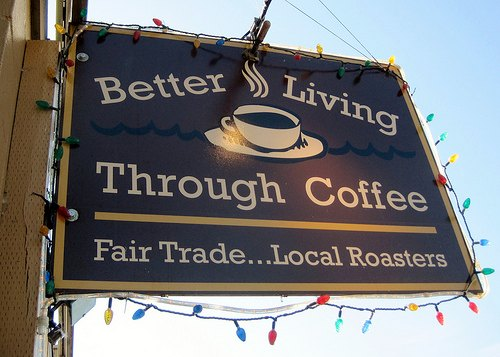

Coffee hot, coffee good  
Starbucks or Peet’s?  
Better Valu good enough for first cup.

Tea or coffee?  
Mother offers wisdom:  
“Tea just isn’t coffee”.

Wife has no coffee  
Things get broken  
Threats are made.

Coffee! Coffee! Coffee!  
Oh, so sorry  
Had a lot already.

Hotel ran out of coffee  
None at desk in a.m.  
Wife almost sets place on fire.

Coffee first  
Mind sometimes clicks on  
Then things get done.

Black or with cream?  
Or with cream and sugar?  
Violent debates ensue.

Pie, cake, other pastries  
Wife cannot eat them  
Without coffee.

Too much coffee  
Sometimes good thing  
Sometimes stay up too late.

Shade grown or free trade?  
Regular or organic?  
I must try them all to decide.

  
*Better Living Through Coffee in Port Townsend, WA*
