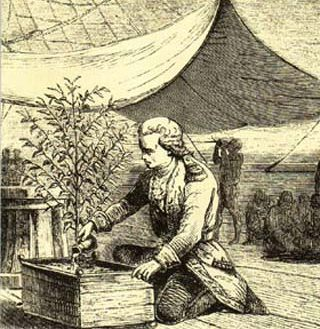

The history of coffee is perhaps richer than the beverage itself. A heroic cast of characters has developed from the initial discovery to the eventual worldwide distribution.

Coffee was first discovered in Northern Africa in an area we know today as Ethiopia. The most common legend refers to a goat herder by the name of Kaldi, who observed his goats dancing in a frenzy after eating berries from a bush. Curious, Kaldi tried eating the berries himself. He quickly found himself dancing alongside his herd from the renewed energy the berries gave him. The news of this energy-laden fruit quickly spread throughout the region.

Monks hearing about this amazing fruit, subjected it to many tests. They ended up drying the seeds of the fruits and making a beverage from the unroasted bean which was quite strong and pungent.

Coffee berries were transported from Ethiopia to the Arabian peninsula and were first cultivated in what today is the country of Yemen.

Coffee then traveled to Turkey, where coffee beans were roasted for the first time over an open fire. The roasted beans were crushed and then boiled in water, creating a crude version of the beverage we enjoy today.

Coffee first arrived on the European continent using Venetian trade merchants. Once in Europe, this new beverage fell under harsh criticism from the Catholic church. Many felt the Pope should ban coffee, calling it the drink of the devil. To their surprise, the Pope, already a coffee drinker, blessed coffee declaring it a divine beverage.

Coffee houses spread quickly across Europe becoming centers for intellectual exchange. Many great minds of Europe used this beverage, and forum, as a springboard to heightened thought and creativity.

In the 1700s, coffee found its way to the Americas by way of a French infantry captain by the name of Gabriel de Clieu who nurtured one small plant on its long journey across the Atlantic. De Clieu gave up his water rations so that the plant would survive. This one plant, transplanted to the Caribbean Island of Martinique, became the predecessor of over 19 million trees on the island within 50 years. It was from this humble beginning that the coffee plant found its way to the rest of the tropical regions of South and Central America.

  
*Gabriel de Clieu*

Not to shed its political ties, the Continental Congress declared coffee the national drink of the then-colonized United States in protest of the excessive tax on tea levied by the British crown.

The development of canned coffee was initially considered a luxury and more valuable than the whole bean coffee we value today. It was a convenience to have it roasted for you and then to be able to do nothing more than open a can, measure, and brew. Due to poor and lengthy shipping methods, this improved the quality for most consumers.

Coffee has played an integral role in society since its discovery centuries ago. As I can not imagine life without it, I hope this continues for centuries.

### Resources

[My Coffee Tis of Thee: America’s Patriotic Coffee History](http://ineedcoffee.com/my-coffee-tis-of-thee/) – More coffee history.

[Coffee in Israel](http://ineedcoffee.com/coffee-in-israel/) – Israeli coffee history.

[Costa Rica Coffee History](http://ineedcoffee.com/costa-rica-coffee-history/) – INeedCoffee article.