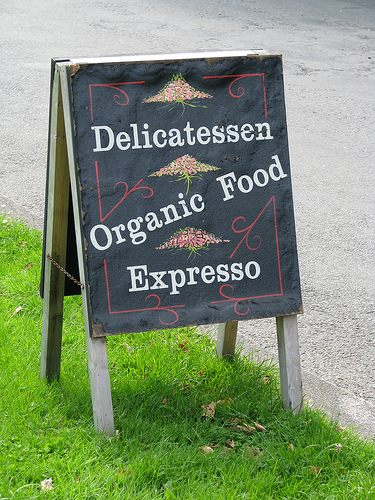

Can a book be judged by its cover? Sometimes. When it comes to sizing up the quality of a coffeehouse, appearances can usually convey a lot of information. Trying to find an excellent espresso or a damned fine mug of coffee is always a gamble. We often stroll into a new coffee house wide-eyed, eager, and believing that the proprietors’ expertise will deliver us from a tired haze into a jittery oblivion. We plunk down a few dollars and anxiously wait for a handcrafted beverage to slide. Instead, we’re handed a gut-wrenching drink you wouldn’t put in Hell’s break room.

How do we, the connoisseurs of quality, protect our taste buds and money? Insurance companies have actuaries to protect them from unnecessary risks statistically. We fellow espresso drinkers need similar guidance. I’ll be your guide as we walk through these mean espresso streets. In this article, I’ll detail some telltale signs of coffeehouses to stay away from without sampling their wares. Let’s get started.

### Spelling

Never, never, never buy anything from a coffeehouse that spells espresso with an ‘X. Don’t even buy a muffin. If you find yourself inside this caffeinated booby-trap, don’t panic. Slowly step back and run when you’re at a safe distance. This shop is run either by someone who thinks the ‘X’ spelling is cool or, more likely, a person who is an idiot. I’ve NEVER had even a mildly decent drink from a place that spells espresso with an ‘X. ‘ My **Espresso Golden Rule** is “If you can’t spell it, you can’t make it!”

  
*[“Expresso”](https://www.flickr.com/photos/kyz/2732787231/in/photostream/) by kyx*

### Bizarre Pricing

Have you ever been to a place that charged more for a straight espresso than a latte? It’s rare, but it happens. What about a place with a considerable price difference between hot and iced beverages? Does the menu show a lack of pricing logic? All drink prices should follow a general pattern; when they deviate too much, it is a sign that someone may not know a cappuccino from a Yoohoo. Cafe owners should know the industry very well. When somebody ignores the industry and prices menu items illogically, they may also ignore the standard for making the drinks.

### The Mall

Although there are exceptions to every rule, coffee places in shopping malls will almost always be subpar. A captive and non-sophisticated coffee drinker is the least demanding consumer, and these businesses respond accordingly. I still remember a certain large mall coffee chain selling leftover Christmas blend coffee for 50% off in June. If you need a jolt the next time you’re stuck in the mall, go to GNC and buy some diet pills.

*Editor’s Note: This article was written in June 1999. Since then, things have started to change. There are now quite a few micro-roasters operating in shopping malls that make excellent coffee. It should be easy to detect a quality roast-on-premises operation.*

### Eyeing the Equipment

In the great effort to get rich by serving espresso, a few tight-fisted cafe owners decide to go cheap when buying equipment. There is a difference between buying equipment for the coffee shop and home, yet some places don’t grasp that concept. I’ve seen cafes that use $12 drip coffee pots and $50 espresso machines. That may be OK for the homeless shelter, but I’ll be damned if I’m going to pay money for one of those drinks.

### Going the Distance

This method is directed at those swanky coffeehouses that have lots of space. They have so much space that they spread the drink operation to great lengths. By lengths, I mean physical distance. You order at the register, and somehow, your drink gets delivered to a barista 50 yards away. A simple order turns into the childhood game “Telephone”. Remember that game? It’s where one person whispers a story, and it gets passed around. When the last person hears the story, the message is all mangled. The same principle applies here. Your “double short soy latte” becomes a “frozen mocha with spoiled milk.”

The problem in this scenario is that you are paying for a professionally made drink. Yet the only person you can speak to hasn’t been trained on anything but the cash register. So, like an arranged marriage, you don’t even meet up with your drink until it’s finished at the other end of the coffeehouse. All you can do is hope that another customer doesn’t grab your drink by mistake first. The barista doesn’t know who ordered which drink, so he or she can’t stop the woman with the mustache from grabbing your latte and screaming “I don’t taste any Hazelnut” after she has added 12 packets of Equal to your drink.

To sum up, the further the distance between the place or order and the place or drink pickup, the greater the chance of errors in the drink. Proceed with caution and stay away if the cafe is busy.

### Cleanliness

If a cafe can’t keep the shop clean and looking good, then it probably can’t keep its coffee equipment clean and well-maintained. A clean shop will probably have better coffee. Enough said.

### Smoking Policy

Someone who loves and appreciates the delicate taste of quality coffee will not allow smoking anywhere near where the drinks are being made. Smoke will ruin the taste of coffee. I once knew a coffee shop run by a gentleman who loved coffee. Unfortunately, his first love was cigars. His shop was set up to be a cigar coffee shop. “Smoke the best cigars and drink the finest coffee” was the concept. The sad reality was “smoke the best cigars and drink the finest cigar-flavored coffee.”

Cigar smoke hung in the air and surrounded his beans. Within weeks of opening, his best Kona tasted stale and lifeless, and the shop went out of business rather quickly. Granted, this is an exaggerated case, but the concept is the same. The more a coffee shop does to protect the bean, the more likely the drinks will be good. Black coffee and black lung do not mix.

### What Gets Top Billing?

What is the first thing you see when you first look into a coffee shop? Is it ice cream, pretzels, flavored coffee, juices, regular coffee, or an espresso-based drink? Nine times out of ten, whatever is most prominently displayed is what they do best. When gourmet coffee or espresso looks like a side dish, look for the door.

### Summary

Finding a great coffeehouse in your neighborhood or while on vacation is always exciting. Coffee drinkers’ sense of adventure propels them to seek out great new blends of coffee or well-made lattes. Unfortunately, many poorly run cafes have turned this glorious adventure into the equivalent of navigating a minefield. Keep your wits and learn to develop your cafe stereotyping skills to protect you on your journeys. Good luck!
