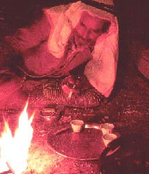
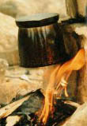
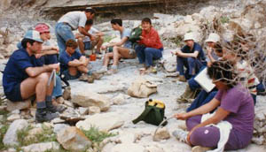
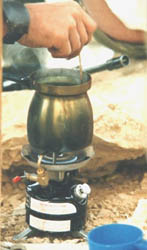

In a recent article in the Jerusalem Post, the Israeli English Language daily, Herb Keinon writes about “Culture in a Cup”, the growth of coffee shop culture in Israel during the past five years.

During the 1940s and ’50s, Israel (a young country now only 52 years old) used to have coffee shops that had a thriving business selling…soda water (flavored and unflavored). That’s what people could afford when they were looking for a quiet spot to sit and talk with friends or argue ideology (a great pastime amongst the ideologues and writers of this new immigrant society.) Coffee was rare in the country that had to ration food during difficult war times and had to invest in the very basics to absorb immigrants and post-WWII refugees.

  
*Preparing coffee*

Ironically, it may have been the harsh times and required military service (including reserve duty of one or two months a year for all adult males through the age of 50) that laid the cornerstone for a now striving coffee culture that includes espresso bars, outdoor cafes throughout the country.

In a recently published Coffee Table book about coffee itself, author Matam Shiram writes about the ritual of coffee preparation in the Israeli army:

> Coffee in the reserves is our exclusive invention. It is an Israeli institution that is difficult to describe…You have to imagine the dunes and the beating sun (or conversely the pouring rain), the sweaty uniforms, the smell of oil on the tank… And it is especially necessary to imagine the smell of the coffee cooking in the finjan…

  
*Brewing coffee over a fire.*

Coffee in the reserves is the best way to unify a group. People who are different and even strangers make coffee (Probably arguing about how many times the coffee should come to a near boil before it is perfect-MJ), sip it and for a minute are closer to each other than brothers. Coffee in the army…provides warm and sweet solace.”

The ritual begins when reservists report from their homes with a special toolbox containing a portable camping stove, finjan (actually an ibrik,) sugar, coffee, small glasses, and matches for use on patrol or in the barracks. This culture carries over into civilian life when families go out camping. In the middle of the night, in the middle of nowhere, a family get-together is not complete without the preparation of Turkish coffee at the campfire or over the portable stove.

  
*Campers enjoying coffee.*

This experience is where the Israeli learns to appreciate not only the drink but also the joy of hovering over a cup.

Observers claim that this is the reason that the Israeli attitude to coffee drinking is a sit-down, take it easy, and enjoy the company attitude unlike the “drink on the run” attitude prevalent in other countries. This attitude is rooted in the culture of the Middle East itself. The early Jewish pioneers appreciated the importance of the social aspect of coffee consumption they saw in the daily life of the Bedouin tribes and the local Arab population.

Now, modern Israeli society has added other contraptions to the finjan and portable stove: the espresso machine can be found at the coffee bar, at work, and at home. But this revolution only came about during the past five years.

  
*Stir campfire coffee.*

Nescafe was big during the ’60s and ’70s. The Hebrew word “nes” means miracle, and that is what people thought they discovered: a miracle. Hot water and some dark powder and voila, a cup of coffee. It couldn’t really be compared to Turkish coffee, known as “cafe botz” or “mud coffee”, but it was cleaner and simpler and seemed so-o-o-o American. The prosperous years ahead brought the oncome of freeze-dried, Taster’s Choice, etc. as Israel always likes to keep up with the Joneses from America.

As Israelis began traveling the influence of modern European culture became more prevalent. Israel has become a place where Mid-East, European and International cuisine are all growing alongside Mcdonald’s and Burger King.

These cosmopolitan (and “yuppie”) tendencies paradoxically combine with the root social experience of coffee drinking in the Israeli Army to create an atmosphere conducive to the widespread growth of espresso cafes throughout the country.
