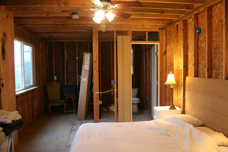

**2012 UPDATE:** INeedCoffee has received word that this particular coffee internship program is no longer active, but other internships on Hawaiian coffee farms are often available.

> *Thank you for your interest in Kona Earth work exchange opportunities.  Unfortunately, we have stopped taking interns and do not have any positions available.  The following is old information that is no longer accurate.  For other possible intern opportunities on farms in Hawaii, check out the WWOOF Hawaii website.  You can also visit Kona Earth for more information about this discontinued program.*

> *Kona coffee farm, 13 acres, family owned with two kids and pets. This is not a hobby farm, it is a working, productive coffee farm. Work includes planting, pruning, weeding, fertilizing, light construction, equipment maintenance and whatever other jobs need to be done. We are only partially organic but farm as responsibly as possible. We ask for 30 hours of work per week in exchange for lodging and food. Contact us for more details and visit KonaEarth.com for lots of pictures and stories about life on the farm.*

I recently gave a farm tour for a workshop about coffee farming. The class was attended by several Kona coffee farmers, some with quite a bit of farming experience. They didn’t believe me when I said I did all the work myself, and they unanimously decided that I needed some full-time help. Growing 13 acres of Kona coffee is just too much work for one person.

I tried to explain that I don’t do **all** the work myself – I hire out all the picking. Our coffee is picked by hand, which is very labor-intensive. The average picker can pick about 200 pounds of coffee cherries daily. A really good picker can pick up to 500 pounds in a day. I tried picking once. I picked as much as I could in a day but only got 40 pounds. So I don’t even try to pick coffee anymore; hiring a crew of professionals is my only choice.

In addition to hiring pickers, I also hire help for some of the really large jobs like pruning. I do about half the pruning myself and hire a crew for the other half. I’ve hired temporary crews for things like pouring concrete and other large jobs that one person can’t do. For the most part, though, I do everything myself, and that’s way too much.

The most obvious solution for us is to hire a full-time farmhand. I’m not sure we can afford it, and I don’t think I need quite that much help. I’d like to start with a part-time person and see if that’s enough.

Many farmers have had good luck advertising in the local newspaper for part-time help. Trading living space for labor is fairly common. That certainly would be easier on our pocketbook, but we don’t really have room for a permanent resident on our property.

Another option is interns and other “unpaid” workers. There are several programs that help willing workers find host farms. Willing Workers On Organic Farms (WWOOF) is a popular program. Despite the name, the farm isn’t required to be certified organic. That’s good because there are a lot of farms that practice responsible farming but aren’t certified organic.

There are plenty of applicants willing to work on a Kona coffee farm in Hawaii. Typically the WWOOFers will live on the farm for anywhere from a couple of weeks to several months. No prior farm experience is required, only a willingness to work and learn.

There are nearly 100 hosts on this island. Many of the hosts are small organic farms advertising things like “holistic living,” “excellent vibes,” “tent provided,” and “shamanism welcome.” One host is actually an “international collective of circus performers” located one mile from a clothing-optional beach.

We may seem like hard-nosed workaholics compared to some of the hosts. When looking for workers, I will certainly point out that we are not a hobby farm but a full-time working farm. I think it’s important that applicants know what they’re getting into. I don’t expect experienced workers, but I do expect individuals who are willing to get their hands dirty and learn about farming. I can’t teach much about “ecological mysticism” or “edible landscaping” but I can promise exposure to things like diesel tractor maintenance, barn construction, and all aspects of commercial coffee farming.

We’ll probably ask for about 30 hours of work per week in exchange for a place to stay and food. I was afraid that it would be too harsh, but other farmers assured me that there are plenty of applicants willing to live in a tent and shower under a hose in exchange for working on a coffee farm in Hawaii. We’ll offer a room with lights, a flushing toilet, a hot shower, and even a little kitchen area (once construction is completed). Is that a fair trade for lots of hard work? I’m hoping someone will think so because I could really use the help. If you know anybody that might be interested, let us know and we’ll see if we can work something out.

### Resources

[Hawaiian Coffee](/hawaiian-coffee/) – An island-by-island breakdown of Hawaiian coffee.

[Everything You Wanted to Know About Coffee From Hawaii](/everything-you-wanted-to-know-about-coffee-from-hawaii/) – Review of The Hawai’i Coffee Book by Shawn Steiman.

[Kona Coffee Confusion](/kona-coffee-confusion/) – An article covering Kona Blends, Kona Style, and 100% Kona labeling.

Willing Workers On Organic Farms (WWOOF)

[Flickr gallery of The farm](https://www.flickr.com/photos/konaearth/sets/72157604115710480/) by FarmerGary.
