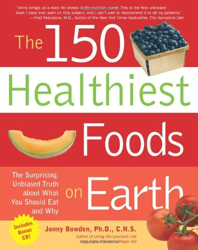

I always knew coffee had some antioxidants but was unaware it had more than tea. Antioxidants protect the body from free radicals. Dr. Jonny Bowden, in his book The 150 Healthiest Foods on Earth, lists Coffee as one of the top 150 foods. He even states that it has antioxidant power greater than tea or cocoa.

> …a study in the *Journal of Agriculture and Food Chemistry* in 2001 found that coffee has significantly more total antioxidant activity than either cocoa, green tea, black tea, or herbal tea.

What makes coffee such a rich source of antioxidants? According to Dr. Bowden, coffee has chlorogenic acid and caffeic acid. Both are strong antioxidants. The Coffee Science Information Center states 200 ml of arabica coffee (~6.7 ounces) can contain between 70 and 200 mg chlorogenic acid.

Wikipedia has this to say about chlorogenic acid and caffeic acid:

> Chlorogenic acid and caffeic acid are antioxidants in vitro and might therefore contribute to the prevention of Type 2 Diabetes Mellitus and cardiovascular disease. It is claimed to have antiviral, antibacterial and antifungal effects with relatively low toxicity and side effects, alongside properties that do not lead to antimicrobial resistance.

The Coffee Science Information Center also reports that the roasting time of coffee will impact the antioxidant levels.

> The roasting of coffee beans dramatically increases their total antioxidant activity. A roasting time of **10 minutes (medium-dark roast)** was found to produce coffee with optimal oxygen scavenging and chain breaking activities *in vitro* (6).

I think I’ll have a mug of antioxidants.

### Resources

[Coffee is the number one source of antioxidants](https://www.eurekalert.org/news-releases/560866) – 2005 study by the American Chemical Society.

[Understanding Free Radicals and Antioxidants](https://web.archive.org/web/20240606083518/https://www.healthchecksystems.com/antioxid.htm) – A Good primer on sharing electrons.
