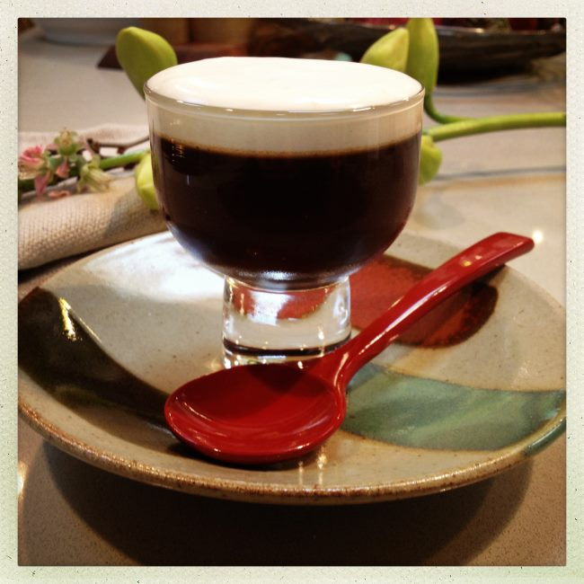

### Origins

Coffee Jelly was invented after westerners introduced coffee to the Japanese. The Japanese people found new uses for the coffee plant, one of the best is coffee jelly. This fantastic combination of coffee and gelatin is served as dessert, or sometimes alongside liquid coffee. Individually, coffee and gelatin have wonderful health benefits. Combined together, coffee jelly is a nutritious snack or dessert.

  
*Coffee Jelly Dessert*

### Health Benefits of Coffee

Studies have shown that drinking 2 to 5 cups of coffee daily can vastly improve your health. The natural caffeine in coffee contains serious health benefits. Coffee is good for:

-   Your Liver: Caffeine metabolizes in numerous ways that promote overall health.
-   Your Skin: Drinking three cups of coffee a day fights the most common form of skin cancer. In one study, women who drank three cups a day reduced their risk by 21%!
-   Your Brain: Aside from the short-term effects (better mood, more energy, sharper thinking), sustained coffee drinking has been shown to slow down the onset of Alzheimer’s.

A Few Tips:

-   Only drink organic coffee.
-   Don’t overdo it! Too much of a good thing has negative effects.
-   Listen to your body, and it will tell you how much coffee you need.

### Health Benefits of Gelatin

Gelatin is the building block of skin, hair, tendons, and bones. The proteins in Gelatin are beneficial in different ways than typical meat products.

Gelatin helps:

-   Reduce Inflammation: Gelatin eases the inflammation of bodily tissues, allowing faster recovery from injury.
-   Manage weight: Gelatin strengthens the body at the cellular level, speeds up your metabolism, and eliminates surplus water, trimming excess weight!
-   Take gelatin with water, add it to soup, or use the following recipe to make super tasty Coffee Jelly.

### The Recipe

You Will Need:

-   2 cups freshly brewed organic coffee
-   2 Tablespoons of cold water
-   3 Tablespoons of sugar (more is ok!)
-   1 Tablespoon Great Lakes Gelatin (personal favorite!)

Directions:

**Step 1:**

Put cold water in a small bowl. Sprinkle in gelatin. Let sit for 3- 5 min.

**Step 2:**

Heat 2 cups of coffee in a small saucepan on low heat.

Stir in sugar until completely dissolved.

Whisk the coffee into the gelatin mixture.

Stir until gelatin is dissolved.

**Step 3:**

Strain the mixture into a clean bowl.

Pour mixture into glasses for individual servings or a large pan for cubing.

Chill for 6 to 7 hours or until set. Serve with fresh or whipped cream, and enjoy!

  
*Coffee Gelatin Dessert*

### References

[The Many Benefits of Drinking Coffee](http://web.archive.org/web/20141029054042/http://blog.arkofwellness.com:80/the-many-benefits-of-drinking-coffee/) – Ark of Wellness article by Ann Rosen Korman.

[Gelatin: Reduce Inflammation, Promotes Healing and Aids in Weight Loss](http://web.archive.org/web/20150330073706/http://blog.arkofwellness.com/gelatin-reduces-inflammation-promotes-healing-and-aids-in-weight-loss/) – Ark of Wellness article by Ann Rosen Korman.
