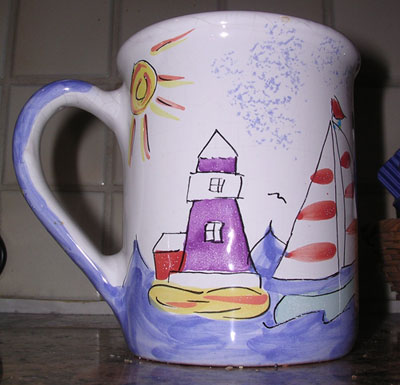
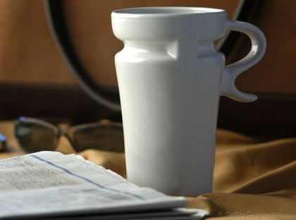
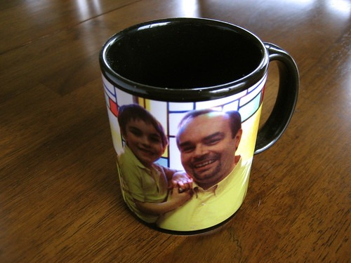
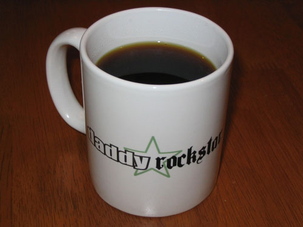
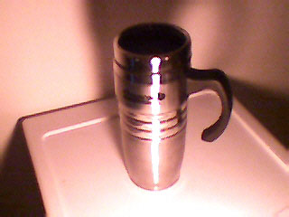

As soon as we released [Coffee Mugs of Coffee Fanatics](http://ineedcoffee.com/coffee-mugs-of-coffee-fanatics/), Both INeedCoffee and Paul over at the Caffination podcast received more mug submissions. I didn’t expect to have a Part 2 so soon. Without further introduction, below are **more** Coffee Mugs of Coffee Fanatics.

**Alex Scofield, Cape Cod**

> *During a transitional stage in life, this is my go-to mug. My wife and I moved from the Washington, D.C. area to Cape Cod several months ago. Ordinarily, I drink my coffee from a 20-oz. mug with the old-school New England Patriots logo on it. But that mug, like so many of our belongings, remains in storage as we look for a more permanent place to live. In the meantime, this mug does the trick — it may not be a design I’d pick out for myself, but it’s pretty appropriate for the Cape. More importantly, it also holds 20 ounces of coffee.*

  
*Alex’s Mug*

**Ryan Jacobs, Columbus**

> *My travel mug fits perfectly in my car, allows for great flavor since it is ceramic and gets cleaned without leaving a soapy residue. The only complaint is that the handle is a bit awkward.*

  
*Ryan’s Mug*

**Mike Rohde, [rohdesign.com](https://rohdesign.com/)**

> *This favorite mug was given to me on Father’s Day 2007, featuring a photo of my son Nathan and I in matching yellow shirts. This is a favorite for enjoying a cappuccino, alternating with my Penguin mug.*

Mike has more favorite mugs, which can be viewed on his [Flickr Coffee Stuff Set](http://www.flickr.com/photos/rohdesign/sets/72157604328114682/).

**Geoff Manning**

Geoff had the Daddy Rockstar mug made at the Cafe Press store for his Daddy Rockstar blog.

  
*Daddy Rockstar Mug*

**Michael Long, *Michael’s Technology News***

> *The story behind this mug is that it’s my favorite mug. I like it because it also comes with a heated warmer (not shown) that plugs into the cigarette lighter of your car/truck.*

  
*Michael Long’s Mug*