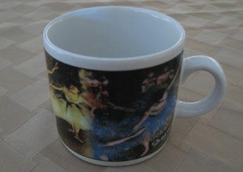
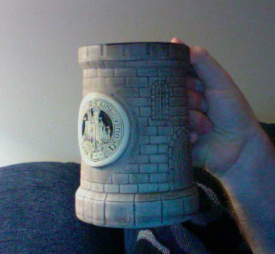
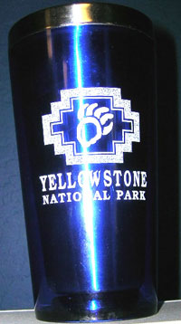
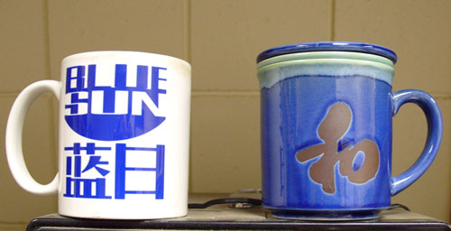
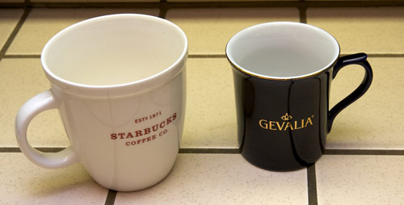

In a recent CaffiNation podcast, INeedCoffee contributor Paul Rj Muller developed an idea based on the article “Caffeine Consumption By Coffee Fanatics.” In that article, several contributors shared their caffeine consumption levels. Paul’s idea is to share a photo of the mug we use to assist us in reaching our caffeine goals.

Below are a few of the favorite mugs used by several listeners to the *Caffination Podcast*.

**Michael Allen Smith, Seattle**

> Since my drink of choice is espresso, my favorite *mug* is a little demitasse. On it is a Edgar Degas painting of ballet dancers. This is so not my style. I received the set as a gift, which I fully expected to throw into storage. Then I noticed that I could pull my espresso shots directly into the cup. It’s been my favorite ever since.

My favorite traditional coffee mug died on January 26th, 2000. That story is told in [Coffee Eulogy](https://ineedcoffee.com/a-coffee-eulogy/).

**Paul Rj Muller, CaffiNation USA (Philadelphia)**

> My Home mug is a hand thrown Stoneware mug from the Pennsylvania Renaissance Faire Circa 2001. It holds about two and a half 8oz cups of coffee. Its a pretty heavy mug even when empty so its harder to spill accidentally, which is good because I’m a clutz. This mug also has the special distinction of serving as a mic Stand on a couple of occasions when I needed an extra bit of height when recording.

**David Richards**

> I got this mug two years ago on a trip to Yellowstone. The bear paw and Yellowstone name drew me to the mug. I go to the park every few years and the mug is a daily reminder of the good times I have had there.

**Joe Wilson**

> The two mugs in the photo are my two main mugs that I use at work. The one on the left, with the Blue Sun logo, is my normal mug. Blue Sun is a bit of an obscure geeky reference: it was the ubiquitous egacorp whose logo was prevalent in the background on Firefly. The other mug, I bought from the Japan pavilion at EPCOT Center, in Walt Disney World, on the night that I proposed to my fiance’. The character on the front means “harmony,” and it has an internal strainer inside for steeping loose tea.

**Chris Arnold, San Diego**

> Though I do not drink Starbucks or Gevalia coffee, these are my two most used mugs. The larger mug is for those marathon work sessions, and the smaller for my morning cup. I really like the Gevalia cup for it’s fluted lip, which I believe gives a better aroma when sipping, and and thus an enhanced taste. I don’t believe in thermal mugs, but prefer to keep the coffee in a glass lined, vacuum insulated thermal carafe, and just pour as needed into the cup. Preheating the cups with hot water is an absolute necessity in my household, as it allows the coffee to stay hotter longer in the cup. Same goes for the carafe.

### Resources

[CaffiNation 195: The Grind](http://web.archive.org/web/20140407142816/http://www.caffination.com/podcast/caffination-195-the-grind-463/) – January 3, 2008, podcast.

[Coffee Mugs of Coffee Fanatics Part 2](http://ineedcoffee.com/coffee-mugs-of-coffee-fanatics-part-2/) – The sequel to this article.