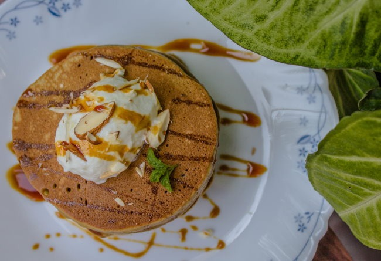
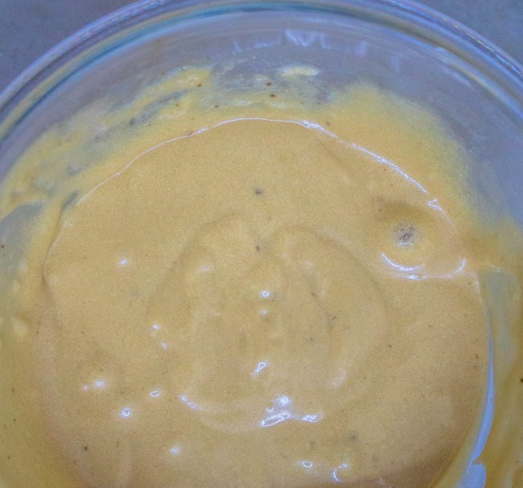
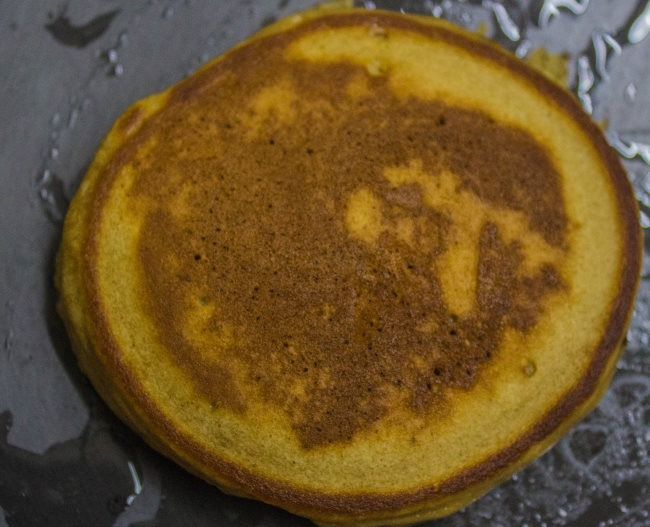
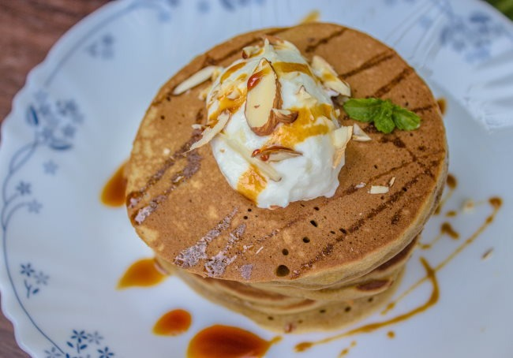

Pancakes are popular and the most loved breakfast preparations for people of all age groups. These fluffy discs are a quick and easy food option that tastes great. But, having the same kind of flavorings day after day may make even fun food preparations, such as pancakes, boring and mundane too…

Adding a variety of toppings may add an element of surprise, but creating a variation in the pancake recipe sounds more, doesn’t it? And, how about combining the two most loved breakfast preparations in one? We are talking about coffee and pancakes.

For this recipe, you simply need freshly ground coffee beans to add maximum aroma to your preparation, apart from basic pancake ingredients. You will be surprised how just by adding one simple ingredient, you can create such an interesting dish and get a break from the regular pancakes you are so used to having morning after morning!

As shared earlier, the key to getting a great aroma in this dish is by using freshly ground coffee beans and for that, a manual coffee grinder comes in handy. This means, you just need a small and handy device to savor a decadent breakfast dish without burning a hole in your pocket.

Now that we have made arrangements to get the best quality coffee grounds, let’s proceed with how we can create this amazing dish.

### Appliances

-   Manual coffee grinder
-   Large bowl
-   Spatula
-   Ladle
-   Cooking pan
-   Tablespoons

### Ingredients

-   1½ tablespoons coffee grounds
-   ¾ cup all-purpose flour
-   2 tablespoons powdered sugar
-   ¾ teaspoon baking powder
-   1½ tablespoons vinegar
-   ½ cup milk
-   2 tablespoons yogurt, beaten
-   1 egg
-   1 teaspoon butter
-   Honey, thick Greek yogurt, and sliced almonds, for garnish

### Directions

1\. In a large bowl, add flour, powdered sugar, baking powder, and coffee grounds, and mix it all well.

2\. To this, add vinegar, milk, and yogurt.

3\. Crack open the egg into the bowl and whisk everything well until no lumps are present and you see small bubbles rising at the top of the batter.

4\. Heat a pan on medium flame and melt butter in it.

5\. Now, add a ladleful of the pancake batter into the hot pan and cook it on low to medium heat until the bottom cooks to a light brown color.

6\. Flip the pancake and cook the other side until light brown in color.

7\. Repeat this process with the remaining batter.

8\. Serve delicious pancakes with a topping of thick yogurt, sliced almonds, and a drizzle of honey!

