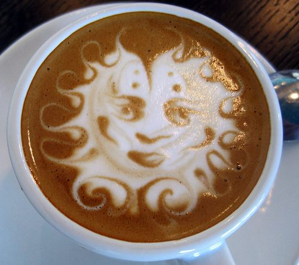

### My Coffee, My Book and Me

A misty, rainy morning and  
it’s back to bed for me.  
My coffee drips invitingly.  
My current book lies dog-eared  
at stopping place,  
from last personal quality time.  
What else can I do  
but plump my pillows  
and climb in?  
You would too.  
With hot libation,  
and mental laxation,  
peace is mine.

  
*Latte Art Etching*

### Air Freshener

Brown bubbles skate across  
the smooth, scalding surface,  
and cluster at the lip  
of the hot mug of dark brew.  
They jostle each other,  
and murmur steamy coffee stories.  
Each anxious  
to be the first to burst,  
and flick her rich, pungent scent  
into the crisp, clean air  
of early morning.

(c)1999 Holland Writing & Publishing “My Coffee, My Book and Me” from *Sweet Aromas* “Air Freshener” from *Rich Flavors*