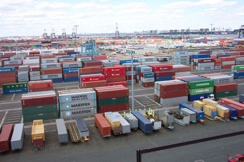
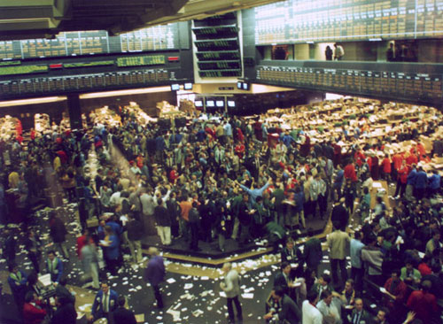
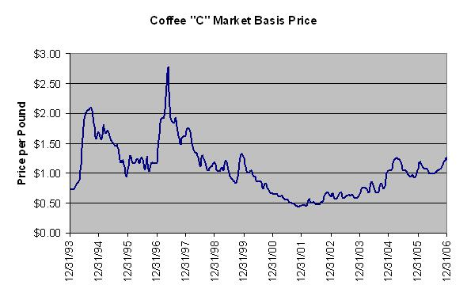
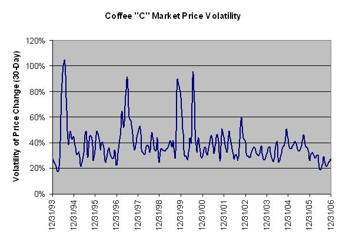

Coffee is an interesting thing. Aside from the aroma, flavor, and allure of a good cup, understanding some things about coffee economics can be its own interesting lesson. If nothing else, (the stunning economics lesson to follow) will hopefully help you understand some of the things that help determine the price of the coffee in your cup and possibly appreciate its value.

So class, with caffeine-laden coffee close by (generally needed when discussing the science of economics) please open your macroeconomics textbook and we’ll jump right in . . .

First, it’s important to realize that coffee is a globally traded commodity just like oil. Coffee is the second-most traded commodity, oil being the first. Coffee is generally traded in financial instruments known as futures contracts, and this is mainly done through the New York Board of Trade. A futures contract is a standardized contract to buy or sell a certain underlying instrument at a certain date in the future at a specified price. In the case of coffee, each futures contract involves the control of 37,500 pounds of green coffee (250 bags, which is what usually fits in a typical shipping container for overseas transport).

  
*Shipping Containers*

The New York Board of Trade is the designated futures market and exclusive global marketplace for Coffee “C” futures contracts. In these futures and options contracts, the global price for coffee is discovered on any given day. Truly, the price of coffee is a daily, even minute-by-minute discovery process.

  
*Trading floor at the New York Board of Trade*

The “C” contract pricing is driven up and down by variables like changing weather conditions in the major producing countries, political turmoil, speculation about production levels, changing transportation costs (back to that pesky oil!), and other unexpected factors. That word “unexpected” is key. For example, news of a possible drought or freezing conditions in coffee-producing areas would likely reduce global supply and thereby increase prices. Assuming demand stays the same, the decreased supply would drive up prices in order to achieve a market-clearing price.

The “C” looks at washed Arabica coffee produced in several Central and South American, Asian, and African countries to establish the “basis” for the contract. Coffees judged better are at a premium and naturally, those judged inferior are at a discount. Of course, this all primarily relates to green coffee prices. Roasted coffee, whether bought directly from a roaster, the grocery store, or in the form of a beverage, is a different product that has other factors affecting its ultimate price.

Since coffee importers and large brokers primarily sell against replacement prices (the price to pay in order to replace coffee sold to end-consumers), similar to how gasoline vendors do, when the “C” goes up, so do coffee prices. These commodity markets can be quite volatile (referring to the magnitude of price movements), which is why you often see fairly significant moves in the price of gas at the pump. The same thing happens with green coffee when the variables affecting the market price get a little crazy. So, the prices coffee suppliers pay to make coffee available to consumers are greatly affected by the global coffee trade in the same way local gas prices are affected by the global oil market.

The economic principles at work are the same whether the commodity in question is gasoline or coffee. For some perspective, I’ve included a graph of the history – back to 1994 – for the “C” historical monthly contract price as well as the monthly volatility just to show how much global coffee prices can fluctuate (data from www.nybot.com).

  
*Coffee “C” Market Basis Price*

  
*Coffee C Market Price Volatility*

Coffee importers tend to price their green coffee based on the going market rate. However, as the coffee makes its way through the layers of middlemen, whether green coffee vendors supply home roasters or commercial roasters supply ready-to-brew products, the prices generally become more rigidly based. In other words, the coffee the end-consumer purchases doesn’t move around in price quite so much as the coffee exchanged at the earlier phases of the coffee delivery mechanism (at the export/import level).

The market rate pricing method is naturally more transparent than the steady, rigid pricing. The coffee market can be very volatile, even over very short periods. However, expecting all coffee consumers to accept dramatic price fluctuations would likely be a very poor decision on the part of the coffee suppliers, particularly because people don’t like or accept rapid change all that well. Leaving coffee prices paid by end-consumers to fluctuate at market prices would no doubt lead to confusion and annoyance similar to what many people feel when stopping to fill up their vehicle with gas these days when the gas price changes are very obvious.

Overall, there are many moving parts in the process of getting coffee off the farm and into your cup. Each part represents a unique and frequently changing price component as well. Even with all the moving parts and middlemen, the value of a fresh cup of coffee can be great – often well beyond the 15 cents or so that someone roasting their own coffee might spend to have a wonderful sensory experience.

UPDATE: After this article was released, the New York Board of Trade (NY BOT) changed its name to ICE Futures U.S. (ICE).

### References

ICE Futures U.S. – Formerly known as the New York Board of Trade (historical “C” futures contract pricing)

Wikipedia, the Free Encyclopedia (photos used are in the public domain)
