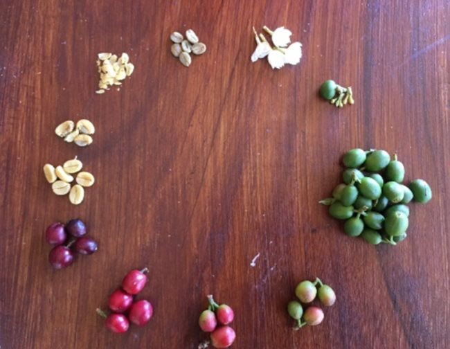
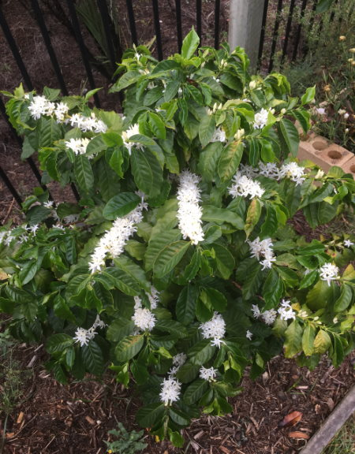
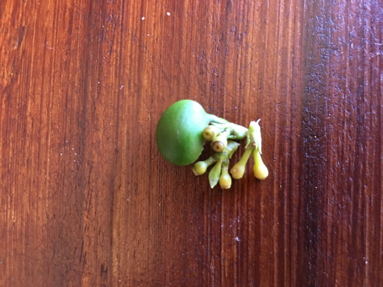
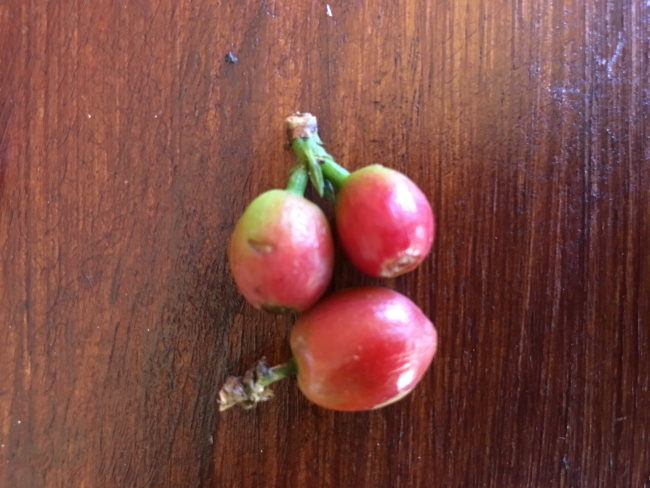
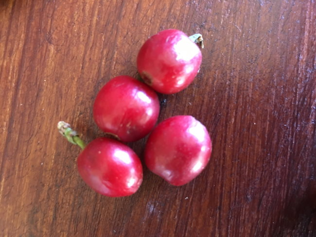
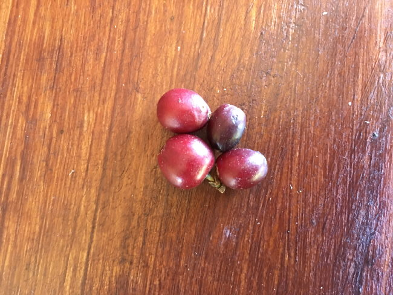
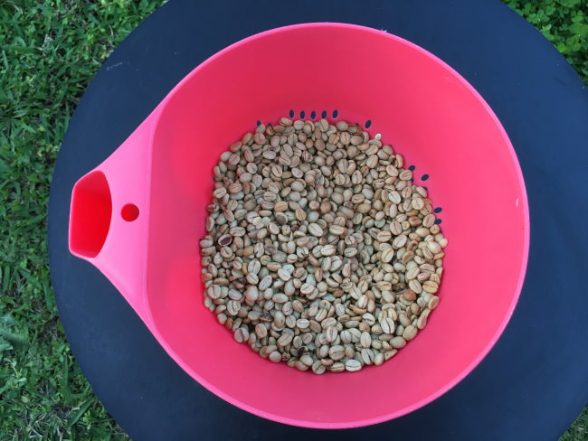
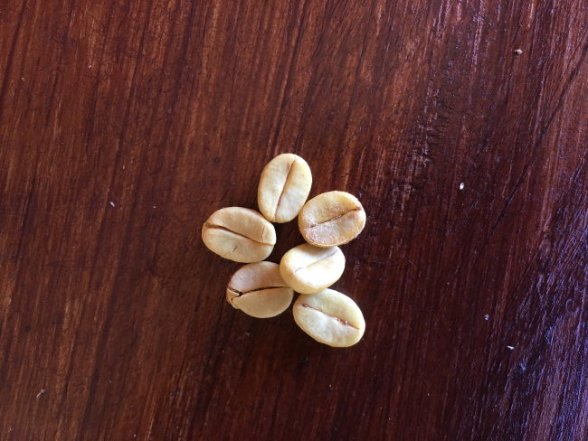

This article will serve as a basic guideline for the different stages a coffee plant goes through as it makes its way from plant to ready for roasting.

Depending on your climatic condition and elevation, you can expect your picking time to be 7-9 months from the date of your first blossom. This will happen after you have picked your coffee, pruned your plant, and experienced the first rain with a substantial blossom.

*Note: The blossom to picking dates may differ between various countries, we have typical experience between India and Queensland, Australia.*

### Coffee Bean Plant to Cup Cycle

#### #1 Blossom

The blossom takes place in the month of February or March each year in countries like India and lasts for 3 to 4 days. The sight of blossom is beautiful with the plants covered in lovely white flowers that are fragrant.

#### #2 Green Cherry formation

The blossom flowers after pollination will then slowly turn into small green cherries in the month of April or May and then will start growing into firm green cherries. During this time the coffee farmer will be pruning his plants. The pruning method is to remove only the non-productive parts of the plant so as to divert the energy into the productivity parts. Overgrown trees will have a few branches cut to provide the plant with sunlight.

Weeding and manuring will be carried out during this time when the soil is moist after a few showers.  
Arabica farmers will be berry borer tracking during this time. Coffeeberry borer is an insect that lives in a coffee cherry and has to be eliminated. Robusta is less subjective to berry borer attacks.

#### #3 Orange Cherry Formation

The green cherry will start changing its color into orange-pinkish in the month of June to August. During this time the coffee farmer will be weeding around the plants and de-suckering.

De-suckering can be done twice a year, which is the removal of branches arising from the main trunk. Coffee farmers will take this opportunity to plant new plants all around where there is sufficient space to protect the plants with mild shade.

#### #4 Red Cherry Formation

Gradually the cherry will turn into a blood-red color in the month of September to November. During this time the coffee farmer will continue with centering work, borer tracking (Arabica plants), weeding, and manuring.

The centering method is the removal of the vegetative growth up to a 15 cm radius from the center and up to the first notch of all primary branches.

#### #5 Coffee Cherries ready for harvesting

During the months of December to January, the coffee cherry will be fully ripe and ready to pick. This is the time the coffee farmer will be busy preparing for picking by continuing to weed the area so it is clear to start picking.

#### #6 Wet pulping

Once picking has been completed the coffee farmer has to decide how he will process the picked coffee beans. He can use the dry method or the wet pulping method. The dry method uses the sun to dry the coffee cherry. Wet pulping is the other option.

Wet pulping is mechanized and the process is faster than sun drying. The disadvantage of sun drying is the bean loses weight. The advantage of the wet method of pulping is a higher weight but it is more expensive than sun drying due to the motorized equipment used in the pulping process.

#### #7 Sun-drying coffee beans

After the cherry skin has been separated from the bean manually, washed and the slimy coating is removed, the bean is sun-dried for 2 to 3 days on a clean surface.

In large-scale pulping, the washing of the bean is part of the pulping process.

Each day the beans have to be either covered or removed to a shaded area so that the dew moisture does not get into the coffee bean. After three days, the coffee beans are ready for removal and storage.

#### #8 Hand milling-removing of the parchment cover from the bean

Once drying is complete, the next step is hulling. This process removes a thin membrane on the bean known as parchment. The parchment can be removed manually by using a pestle & mortar manually by gently rotating the pestle over the beans.

This process is mechanized on a large scale and is done faster in large quantities, under the process of hulling.

#### #9 Ready for Roasting

Once the coffee beans are polished (Milling) and clean, they are ready for roasting.

### Article Video

[Coffee Process Method](https://www.youtube.com/watch?v=ZokSPwn28N8) (YouTube 6 minutes)

### Last Words

I hope you all have enjoyed this article. I’d like to dedicate this article to my late mother Mrs. Dorothy Phelomena Pais (1944-2005).

### Resources

[EcoFriendlyCoffee.org](https://ecofriendlycoffee.org/) – INeedCoffee’s sister site that goes into greater detail on the agricultural side of coffee.

[How to Hand Pick Coffee Cherries](https://www.youtube.com/watch?v=f0wTAxDin4w) – YouTube video

[How to Hand Pulp Coffee](https://www.youtube.com/watch?v=ep9e-YLsWrk) – YouTube video

[How to Sun Dry Coffee Beans](https://www.youtube.com/watch?v=tKhr33dFrK4) – YouTube video.