Just the mention of a West Bend Poppery or Poppery 2 sent shivers up my spine when I first started to look for poppers in which to roast coffee. The information I surveyed on the internet seemed to point only in one direction. One could roast in other poppers, but if you did not roast in the proper popper you were either from Missouri or just plain backward.

As I started to seriously study the roasting blogs and the results people were getting with other popcorn popper roasters, the shivers diminished. I slowly came to realize that most of the WB Poppery articles were written a few years ago when the good, old, proper poppers were still readily available.

Contrary to the advice of Tom of Sweet Maria’s, some folks were using the bottom-hole poppers and getting great roast results. I tried using a few and learned by trial and error what had to be done to get them to work. I also started a search for all the poppers that were available in the current market at the local thrift stores and at a cost of fewer than ten dollars. Many vintage poppers are available on eBay, and they have an average price of around $50.00. If I had been sure of what I needed and how to roast coffee, the price would have been a bargain. Since I was just learning to roast, I could not justify the expense. I decided to see what I could buy in a two-month period for fifty dollars.

*Below are the results of eight weeks of hunting (July, August, and September 2014) for a suitable coffee roasting popcorn popper.*

### The Popper Crop

1.  **Hamilton Beach Popaire 2** $3.99 at Saver’s 1250 watts 7/15/2014, used, $4.00, screen bottom in chamber 4.5”, Modified: by-passed thermostat and fuse
2.  **West Bend** at Saver’s $4.00 Model 309H or 5209 1450 watts 7/22/2014, near new, $4.00, solid chamber 4.5”, Modification None: Very Good Roaster
3.  **Pesto PopCornNow Plus** at Salvation Army $3.50 Model 482004 1440 watts 7/24/2014, near new, $3.50, center hole, chamber 4.5”, Modifications None: Great Corn Popper
4.  **Presto Orville Redenbacher** at Goodwill $4.00 Model 4821 1440 watts 7/25/2014, new in box, $4.00, center hole, chamber 4.5”, Modified: screen in the chamber, by-passed thermostat and fuse
5.  **Presto Hot Air Popper “Little Red” Model** 4848 $4.00 1240 watts Steven’s Creek Thrift Store 7/25/2014, new in box, $4.00, center hole, chamber 3.5”, Modified: separated the main coil from fan and coil, two plugs
6.  **Nostalgia** at Saver’s $6.00, 1040 watts, 8/4/2014, near new, $6.00, solid chamber 4.5”, Modifications none: slung popcorn all over
7.  **WindMere**, Saver’s Redwood City, $7.00, 8/12/2014, new in box, $7.00, solid chamber 3.5”, Modified: by-passed thermal fuse and thermostat
8.  **West Bend Poppery 2**, 1200 watts, $7.00 at Saver’s SJ 7/22/2014, very used, $7.00, solid chamber 4.5” Modified: separated the main coil from fan and coil, two plugs
9.  **Sunbeam 5052**, Savers SJ, $5.00, 1200 watts, 8/25/2014, near new, $5.00, solid chamber 3.5”, Modified: removed chamber thermostat
10.  **Rival PP25**, 1200 watt at Salvation Army, $2.99, 8/27 (had no top for popper), new (no lid), solid chamber 4.5”, Modifications: Removed the bi-metal tab from the thermostat. This unit is as good as the WB Poppery 2.

Total Cost of All Poppers: $47.50. All of the poppers above will roast coffee. Most will roast without modification.

From the listing above, you can see that some poppers have to be modified to roast coffee. If the popper has a thermostat on the inside chamber wall, more than likely it will have to be removed. Popcorn only needs about 350 degrees F to pop. Coffee needs to get up to about 480 degrees F to roast. Some poppers have a thermostat in the circuit above the heating coils, if the thermostat trips to cut short your roast, the bi-metal disk has to be removed. If the popper overheats and the thermal fuse blows, it will need to be bypassed or replaced.

A router speed control can give you control over the roasting time by lowering the speed of the fan and the heat from the heater coil. More complicated modifications can split the fan and heating coils into two separate circuits and independently control each to give still more roasting control. These modifications take more experience to use and achieve a good coffee bean roast.

When choosing a popper, attention should be given to the depth of the roasting chamber, doing so can save you from the blowout problems. A chamber that is 4.5 inches deep will normally roast 90 grams of green beans and have enough room for the roasted beans to expand without blowing out of the popper. A 3.5-inch chamber is more than likely going to need a soup can chimney extender to keep the beans from blowing out. A chimney extender is an empty soup can with both ends cut out and placed on top of the roasting chamber. I made a custom extender out of aluminum flashing that allows my thermometer to be placed on the inside wall of the roasting chamber. I added a chaff catcher made from screen wire to fit on top of the aluminum extender. It works very well and makes cleanup a lot easier.

### Learning To Roast

With any new popcorn roaster one uses to roast coffee, you have to learn to use it. If the beans do not move when you put them in the roasting chamber, stir them with a wooden spoon or use fewer beans. If the temperature rise is slow, partially cover the top of the roasting chamber. Carefully observe the beans. Look on the internet for answers to your roasting problems and adapt your techniques to get the very best out of your new popper.

No modifications were necessary at first for roasting with the Rival PP25. But in time, the popper thermostat did start to shut off the popper after a roast. This can be avoided by allowing time in between the batches or cooling the popper by placing it in front of a fan for a few minutes between roasts. I solved this problem by removing the bi-metal tab on the thermostat. If you remove the bi-metal safety tab, just remember that **YOU** are now the safety feature of the roaster. Safety precautions and procedures are now in your domain for the safe operation of the roaster.

### Maintenance

An occasional cleaning and vacuuming of the roaster chamber will reduce the collection of chaff debris in the fan and heating elements. Disassembly and inspection of the heating and fan elements should also be performed periodically.

### The Wacky One Star Popper

One thing I have come to notice about popcorn popper reviews is that the worst popcorn poppers may make the best coffee bean roasters; for example, the Rival PP25 I purchased for $2.99 was lampooned by an eBay reviewer as the worst popcorn popper ever made. Another reviewer said you needed to wear body armor to use this popper, as it slung hot popcorn kernels all over the kitchen and scared the dickens out of the dog. Any popper that can do that is made for roasting the heavier green coffee beans. The Rival PP25 I purchased did not have a top cover, so I got a little extra discount. I did not need the top cover as I use the poppers without a top cover. I imagine that was why the new popper was donated to a thrift store, as it could not be sold without the top cover and measuring cup. It was brand new but had no box.

I have learned to shop very slowly when looking for poppers. The Rival PP25 was on a top shelf and did not look like a popcorn popper. I passed by it several times and started to leave the store, but my curiosity pulled me back, and I picked up the unit. I had assumed it was some kind of facial mister since it did not have the classic popper top and was surrounded by hair dryers. I was surprised when it turned out to be a popcorn popper. I enquired about the top and got a discount because it was missing.

Getting back to the reviews on the Rival PP25, there was not one positive review on this popper. Hot popcorn all over the kitchen was the cry. This popper works as good as or better than the West Bend Poppery 2. A powerful fan with 1200 watts will move 90 grams of green coffee from start to finish very proficiently. It confirmed my suspicions that the worst hot popcorn-throwing poppers make the best coffee bean roaster. Take what you read in reviews with a grain of salt; it might just savor your coffee roasting.

I consider the Rival PP25 as one of the four best poppers I have. The Popaire2, the West Bend 5209, and the West Bend Poppery 2 rank up there with it. All four poppers work without modification. Getting past the second crack and wanting more control over the roasting time and temperature would be the only considerations for modifying these poppers.

### The Top Four Poppers in My Crop

My favorite will probably always be the Popaire 2. It was my first good find and led me to many successful roasts. The West Bend poppers are without a doubt great coffee bean roasters. The Rival is right up there with them. These poppers are worth the investment of time and money to acquire and get a good roast. The payoff is in many good cups of freshly brewed coffee that easily fit into your lifestyle. Roasting coffee should be a joy, not a burden.

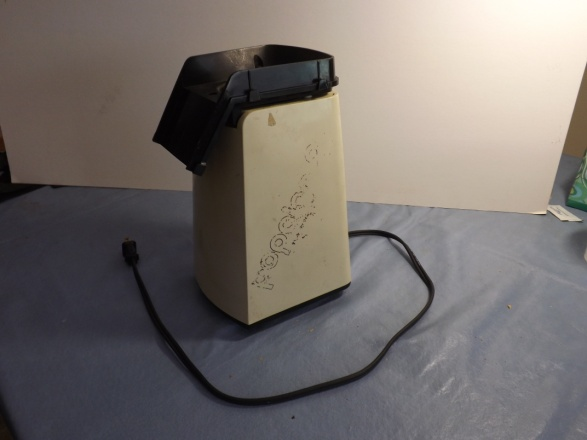

*Popaire 2*

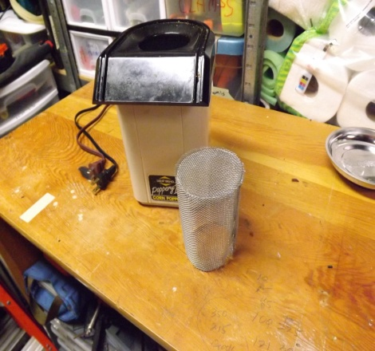

*West Bend Poppery 2*

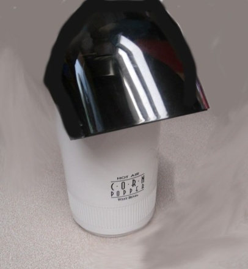

*West Bend 5209*

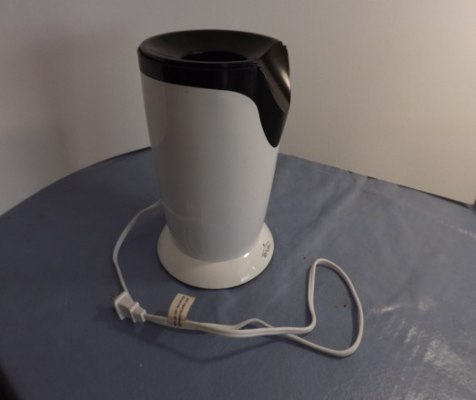

*Rival PP25*

### Three Strong Contenders

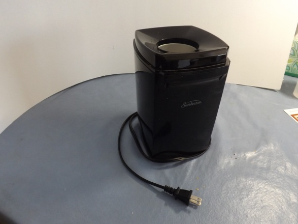

*Sunbeam 5052 has a 3.5” chamber*

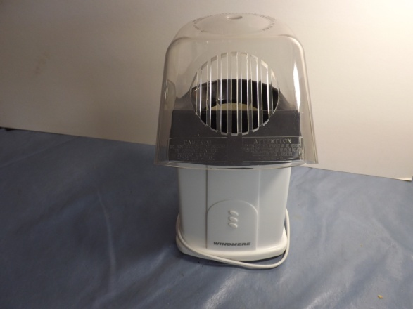

*WindMere has a 3.5” chamber*

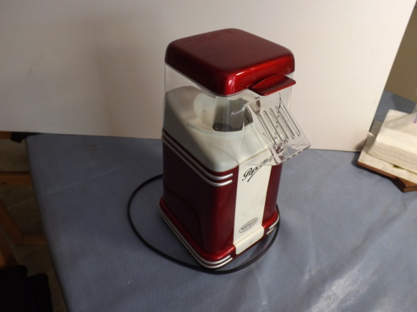

*Nostalgia*

The only drawback to the Sunbeam and WindMere is the depth of the roasting chamber. A chimney extender is needed to keep the beans from blowing out. The same goes for the Nostalgia; even though it has a deeper chamber, the fan is very strong and popcorn flies all over the place. With a little ingenuity and modification, these poppers will perform many good roasts and produce coffee that will make you wonder why you did not start roasting sooner.

### Hole in the Bottom of the Roasting Chamber

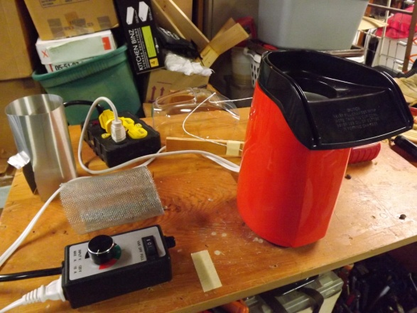

*Presto Hot Air Popper “Little Red” has a 3.5” chamber*

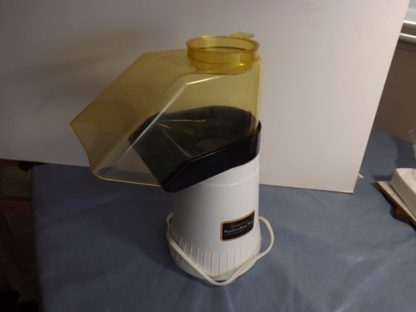

*Presto PopCornNow Plus*

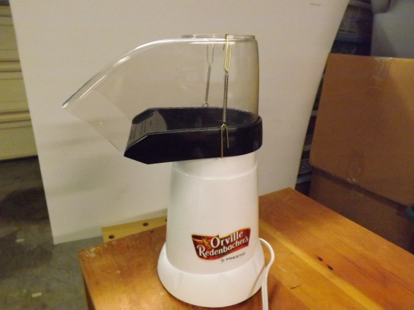

*Presto Orville Redenbacher*

The three poppers above are on the most “NOT RECOMMENDED” lists for roasting coffee. The Orville Redenbacher is just about identical to the Presto PopLite and both are really strong coffee roasters. I did a modification to the Orville Redenbacher popper by adding a screen to the bottom of the roasting chamber to prevent scorching the beans in early roasting. I was trying to roast too many beans; scorching could be minimized by roasting only 90 grams.

The Presto “Little Red” was modified by separating the fan from the main heating coil. The alteration works perfectly. It is a great popper with both fan and heat control if used in conjunction with a router control and dimmer switch. The PopCornNow popper has a different heating element and fan unit than the PopLite and Orville Redenbacher poppers but performs the roasting function with style. I have limited coffee roasting experience with the PopCornNow as a coffee roaster; it is so good at popping corn, we designated it to the corn popping role exclusively.

### Temperature Is a Bonus to a Roasting Profile

I am absolutely opposed to modifications or drilling holes in anything unless it is absolutely necessary. I use a thermometer to judge how well my beans are roasting. I made a small wooden jig to hold my pocket thermometer in the chamber when I started roasting. I got a better temperature registering system using a multi-meter with a digital readout. The type K probe makes it easier to keep the probe in the chamber and is much more accurate than a one-inch pocket thermometer. Making a hanger for a K probe only requires an old wire coat hanger. It is easy to attach before roasting and to detach before dumping when the roast is over.

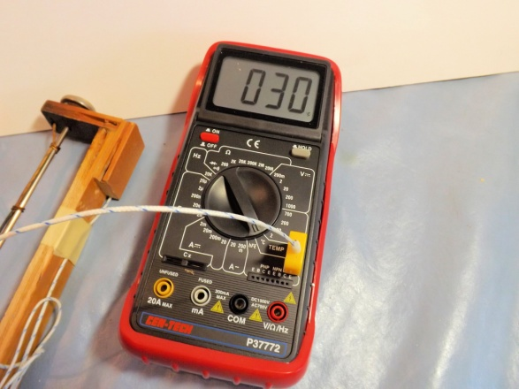

*Multi-meter with K probe attached*

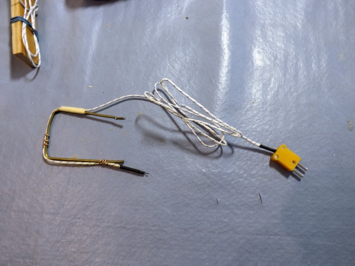

*K type temperature probe attached to wire clip*

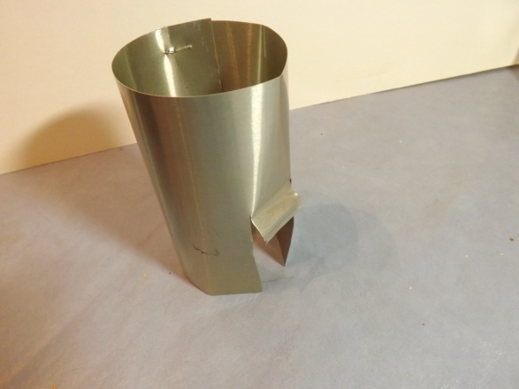

*Chimney made from flashing bottom*

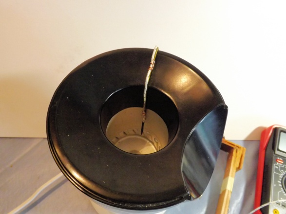

*Wire clip with K-type probe in the roast chamber*

When I look back at this collection, I have stopped shivering. Many good roasters are on the market and readily available for a nominal cost today. My $50.00 was well spent, but hold on a second. I still have $2.50 left in my budget. Does anyone know where I could pick up a West Bend Poppery 1 for $2.50?

Happy roasting, and thanks for your attention. S.H.

### Resources

[Hacking the Orville Redenbacher Hot Air Popper to Roast Coffee](http://ineedcoffee.com/poplite-coffee-roaster/) – Tutorial on modifying the PopLite to roast coffee.

[Roasting Coffee in a Popcorn Popper](http://ineedcoffee.com/roasting-coffee-in-a-popcorn-popper/) – Tutorial on the roasting process for a popcorn popper.