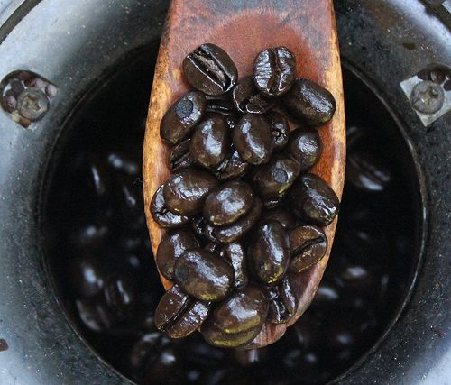
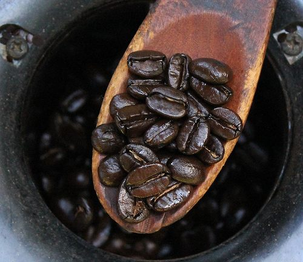
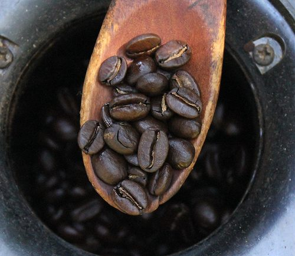
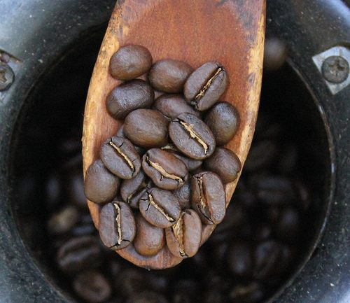
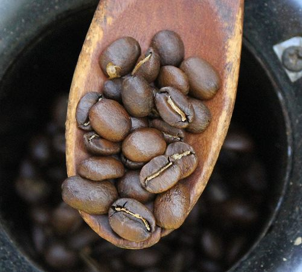

I’m going to rant and rave a little bit here…

The best way to judge a coffee roast is with your own eyes. There is no real uniformity in terminology associated with roast colors. Coffee culture evolved simultaneously around the world and no two French Roasts developed with the same exact darkness. Until recently there has never been a definitive chart to say, to what color or roast degree, a roast of a certain name must subscribe to.

The Specialty Coffee Association of America (SCAA), in an effort to add some uniformity to the industry, has put out a roast color chart. But that doesn’t affect the brand new roaster who knows what they used to drink in a little Cafe in France and starts roasting a medium dark French Roast, nor does it affect the old time family-owned roaster who never even heard of the SCAA. If they have a coffee that has been their Italian Roast for 50 years, then it doesn’t matter if the proper name of said roast on the SCAA chart is French or Viennese or Full City or whatever, it’s still Italian Roast to them. So the confusion isn’t likely to dissipate soon.

This isn’t anyone’s fault and shouldn’t be cause for consternation. It just means you’ll have to look at the Roasts of your neighborhood coffee joint and figure out for yourself if their French or their Italian is darker.

### Impressions of the Names and the Roasts

Some of the darkest roasts I’ve ever seen are simply burnt, resembling charcoal more than coffee beans. If the beans are black with no oils on the surface I call it Burnt Roast – no matter what the roaster calls it.

### Darkest Roasts

The best examples of the Darkest Roasts are very shiny and oily and might as well be called black in color. They are often called Full City Roast, Italian Roast, or Viennese Roast (and sometimes even French Roast). These beans are almost black and if they go too far (read – roast too long) they lose the oils completely and just look like burnt carbon, bean-shaped material (see above). A lot of new roasters let this happen, thinking only that dark is what’s “in.”

### French Roast or Viennese Roast or Full City Roast

The next level down is most often known as French Roast. With a bean surface that’s oily but less shiny, the beans are close to black but are more often an extremely dark brown. In some circles, this is referred to as a Viennese Roast or a Full City Roast. Many consumers wrongfully believe French Roasts to be the darkest available and in some places, it is, so the web of confusion just gets deeper and deeper.

### Medium-Dark Roasted or City Roast

A Medium-Dark Roasted coffee is sometimes called City Roast or just Dark Roast. These beans are slightly oily and dark brown in color. This seems to me to be one of the best-tasting roasts, as it has the taste of a dark roast, but isn’t dark enough to have burned away the flavor characteristics of the particular bean.

### Medium Roast

A Medium Roast is a rich brown color, somewhere between dark chocolate and milk chocolate. I’ve also seen these called Half City Roast.

### Light Roast or American Roast or Cinnamon Roast

A Light Roast is like the color of Milk Chocolate or lighter. Sometimes this is called American Roast or Cinnamon Roast. This is the Roast most often used for cupping (tasting) coffee samples, the general consensus being that the darker the Roast the more of the bean’s taste profile that is lost.

I’m not a Roaster, I’m just a picky coffeehouse owner. I use 7 different Roasters to supply my needs. That’s how I first became aware of the disparity between the names and colors of Roasts. It has since become a little sideline study of mine wherever I go to note the differences in Roast name and Roast color from one cafe to the next.

To do an adequate job of roasting coffee one only needs some green beans and a roaster. To do a great job, one needs an awareness of the chemical changes the bean is going through, a good ear to listen for the different “pops,” and a creative touch.

Coffee is a science and an art. Science is logical, art is subjective.

### Resources

[The Home Roaster Color Chart](http://ineedcoffee.com/the-home-roaster-color-chart/) – An 8-color chart of different coffee roast levels.