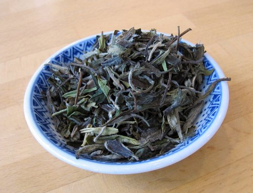
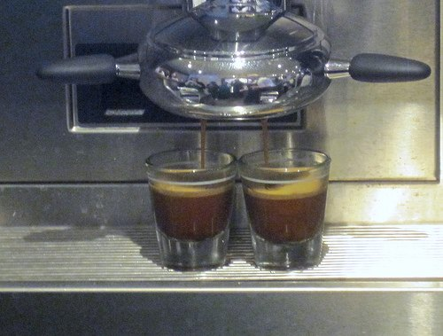

I just saw a news story about Starbucks asking its customers for ideas to be a better company. Well, good ideas are no fun if you can’t share them with your friends. So I asked a few of our contributors to pitch their ideas on how they would fix Starbucks.

Below are some Starbucks ideas from some of our contributors.

**Winter, StarbucksEverywhere**

Winter is a computer programmer and the subject of [Starbucking](http://ineedcoffee.com/starbucking-honest-artistry/), a documentary that chronicles his mission to visit every Starbucks in North America. He has visited more than 7,800 company-owned Starbucks locations worldwide, including 7,190 (91 percent) of the active Starbucks cafes in North America.

1.  Curtail store growth. The announcements about cutting back on new store openings and closing 100 stores are positive, but Starbucks can go further. When I start to encounter a multitude of baristas who do not know what a “short” coffee is, that is a sign that store growth might be affecting the company’s ability to hire and train quality staff.
2.  Since music has become almost as important to Starbucks as coffee, the company should allow baristas more control over what is played in the stores. Sure, guidelines need to be in place to ensure that customers are not offended by explicit lyrics, for example, but if there is only one customer in the store, what is the harm in letting the baristas play what the customer wants to hear?
3.  The recent announcement of closing 45 licensed locations in the West was a great sign. Starbucks should go further in closing down licensees who are not up to standards and severely curtail the granting of new licenses that dilute the brand.
4.  Don’t be evil. Starbucks should start playing nicer and stop being so rabid about pursuing trademark infringement cases on any name or logo that might resemble Starbucks.

**Ryan Jacobs, Columbus**

1.  Use cups that don’t routinely leak around the lid due to bad seals. I have no idea why this is a problem with Starbucks, but it doesn’t seem to be the case with other places.
2.  Ensure that all Starbucks locations are complete Starbucks operations. A Starbucks in the grocery or Target is misleading and lowers the bar for true operations. Fix them or shut them down. The same goes for selling your beans in groceries or even your store with expiration dates six months past the roasting date.
3.  Hire some of McDonald’s masters to streamline your cafes and develop consistent plans. They are the masters of consistency and efficiency.
4.  Narrow the focus of your ideas site. Baristas donating kidneys, while a nice gesture, has little to do with the quality of my beverage. Paying people to sort through this cruft is not the best use of resources.

**Michael Allen Smith, Seattle**

Although I could probably write a book on things I’d like to change about Starbucks, I will list two easy ideas.

1.  Stop serving espresso in tall cups with lids. Not only is it a waste of paper, but the drink also gets cooled too fast. Instead, use those little sample cups that nobody can ever seem to locate.
2.  Better quality tea. I know the immediate goal is to improve the coffee. Believe it or not, your tea quality is in worse shape than your coffee. Peets, Coffee Bean, and Tea Leaf have much better tea. This means pitching that Tazo tea dust for real loose-leaf tea. Be sure to include at least one oolong tea. And while you are at it, do some research on the proper brewing temperature of the tea. I can assure you it is not boiling.
3.  Don’t offer Free WiFi. Free attracts freeloaders. People arrive early, buy maybe one drink, and then camp out all day. Other customers quickly learn there are no places to sit among the sea of laptops and stop coming.

  
*Offering better tea is an easy fix.*

**Paul Rj Muller, CaffiNation USA (Philadelphia)**

1.  Ditch the malformed sizing information. Call a small a small. Put it on the menu. Have small, medium, large, and extra if you really need to. Even McDonald’s shifted back from a large being a medium. Or, as a compromise, stick to one language when detailing sizing information.
2.  Stop suggesting that a cappuccino can be made correctly as anything more than a 6-oz serving. It isn’t possible to froth the milk to that volume for long enough to create a true cappuccino, anything bigger than a tall is a milky coffee.
3.  Please rethink what you call iced coffee. It should only consist of ice and coffee. This faux pas extends to all major chains. I’m looking at you, Dunkin Donuts. What you are serving is an Iced latte with milk in it. As someone who drinks coffee black, I can’t get a decent true iced coffee without ordering a black coffee and a cup of ice. Try two menu items: Iced Coffee and Iced Lattes. Everyone wins.
4.  Remove the small mall kiosks, the people you hire there tend to trend more towards the teenager looking for a nighttime gig, and his buddies always hang out near the condiments. (I sound like an old man…)
5.  Perhaps deploying five stores in three blocks isn’t a good idea.

**Chris Arnold, San Diego**

1.  Get rid of the super-autos, and train their people to be REAL baristas. It’s called investment.
2.  Get more comfy chairs and sofas. There is always someone hogging the one soft purple chair that I desire.
3.  Have some smaller, specialty single-origin beans freshly roasted onsite to accompany the Clover machines.
4.  Please change the names of the cup sizes to Small, Medium, and large so I don’t have to learn Latin to order.
5.  Reduce the variations on Commuter mugs being sold by 6 or 7. It might save some landfill space.
6.  Sell some real espresso machines and grinders, not those colorful things that belong in a toy chest.
7.  Tell us exactly what is inside the “Breakfast Blend”. I loathe ambiguity.

  
*These super-auto machines produce tasteless espresso. Ditch them.*

**Mike Rohde, [rohdesign.com](https://rohdesign.com/)**

1.  Create a truly “light” drip coffee roast. My wife won’t drink the drip coffee because it’s too burnt for her taste, but I must admit that I would sometimes enjoy a light, refreshing blend.
2.  Create an exclusive, free club for regular visitors to earn them free drinks, WiFi time, goodies, and private events.
3.  I second the motion on size naming. Small, Medium, and Large, please.