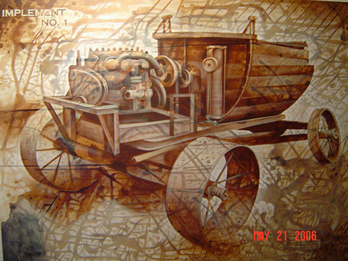

Derek Hobbs of *Coffee Spills* creates paintings using coffee as his medium. Below is a collection of some of his artwork.

  
*Coffee Spills – Ascending Hammers* 36″ x 48″

  
*Coffee Spills – Firefly Fairy* 30″ x 42″

  
*Coffee Spills – Frail Wings of Time* 48″ x 60″

  
*Coffee Spills – Implement No. 1* 42″ x 60″

  
*Coffee Spills – Death of a Virgin* 30″ x 42″