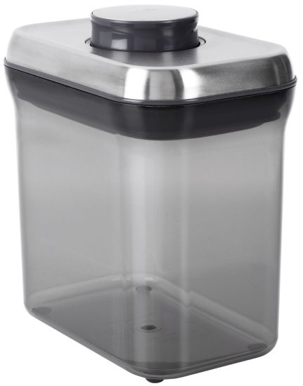

Imagine the following scenario:

You have just come home from your favorite coffee shop with two pounds of Jamaica Blue Mountain Coffee, freshly roasted. Normally, you wouldn’t buy so much at one time, but it was a steal at $20 a pound! Realizing that you won’t be able to drink this within a week, you must find a better place to store your highly prized (and priced) coffee to best preserve its flavor. What will you do? This particular situation is one where your coffee will have both long-term and short-term storage needs.

### To Freeze or Not To Freeze

Oftentimes, it would be suggested to store your coffee in the freezer. After all, at colder temperatures, molecular activity (including flavor molecules migrating) slows down, right? This is true. But does slowing molecular migration down preserve the flavor of the coffee? Not necessarily.

You see, there are other variables at work in a freezer.

-   A frozen environment will allow water molecules to attach to the coffee beans and/or packaging.
-   A freezer has other flavor molecules floating around in it (remember that fish sale 3 weeks ago?)
-   A freezer door opens and closes very often under normal use.

*OXO Good Grips Airtight Coffee POP Container*

### What does this mean for your coffee?

This means that water will contact the surface of the bean, and ice will form. When the water melts, that water will find its way into the porous bean, and the bean will begin to deteriorate the quality of the coffee. Secondly, you should keep in mind that roasted coffee is porous. This is the property of coffee that allows roasters to make Hazelnut flavored coffee. (It isn’t grown that way.) So, if you put your Jamaican Blue Mountain coffee in the freezer, it needs to be well protected against the possibility of tasting like liquid salmon.

### Wrap It Up

Your goal should be to keep the coffee’s contact with water to a minimum. Moreover, the coffee should thaw only once – right before it is brewed. I would suggest keeping the beans in the original packaging. Then, place the package in a zippered storage bag. You can draw out the excess air by using a straw to suck out the air while you close the bag. If you do not have a zippered bag, you can wrap the beans using plastic wrap. I use even more layers! After this initial wrapping, I place the coffee bean bundle in another paper bag. Again, wrap the bag with plastic wrap, then I cover it with foil. It may sound like overkill, but it is worth it. If you’ve invested money in this gourmet coffee, you need to protect your investment.

### Freezing, In A Nutshell

Freezing coffee is applicable for storage of coffee that won’t be used within 1-2 weeks of roasting. It is not optimal for everyday use.

### No Refrigerators!

If you are wondering about the refrigerator, it is a no-no for coffee. Since the temperature is generally around 37 degrees, the water that is inside doesn’t freeze. It is a cold mist that lingers on the coffee and there are even more scents and flavor molecules floating around. Liquid water is coffee’s worst enemy during storage. Under no circumstance would I ever recommend using the refrigerator for storing coffee.

### Room Temperature Storage

Storing coffee at room temperature is the most convenient method of storage. It works well for coffee that will be consumed within one to two weeks of purchase.

### Eliminate The Negative

When storing at room temperature certain environmental factors are minimized and eliminated if possible.

-   Oxygen
-   Water
-   Excessive Heat
-   Direct Sunlight
-   Other flavors

All of these factors will destroy the coffee’s flavor. A great device for mitigating these factors is a ceramic canister that holds 1/2 lb. to 1lb. of coffee. The canister should have some sort of sealing mechanism that does not allow air to circulate. There is a fundamental rule of physics that states that matter can not occupy the same space as other matter. So keeping your coffee filled to the rim of this container will minimize the possibility of negative elements corrupting your coffee.

Additionally, a ceramic canister will protect the coffee from sunlight, water, and flavor migration. Flavor migration happens when the container harbors flavors. Plastic containers are great examples of this concept. Plastics allow flavor molecules to penetrate and metallic canisters allow metallic flavors to migrate. Ceramic containers, on the other hand, are sealed and baked. Consequently, they will not corrupt the flavor of the coffee.

### Bottom Line

Short-term storage (within one to two weeks of purchase) should be done in a ceramic container with a good sealing mechanism. Fill the canister to capacity.

### Conclusion

If you find yourself at a coffee shop that has a sale on Jamaican Blue Mountain and if you buy more than you can brew in a week or two, store the coffee properly.

-   Determine which portion of that coffee you will consume within one week.
-   Put the amount you can consume that week into a ceramic canister.
-   Divide the rest of the coffee into ‘one-week packages’ and store them in the freezer, as I’ve described in this article.
-   When you need more coffee, pull another ‘one-week package’ out of the freezer and transfer the coffee into short-term storage.

### Resources

[How to Store Coffee Beans (Tips and Recommendations)](/how-to-store-coffee-beans-tips-and-recommendations/) – Our updated article on storing coffee beans.
