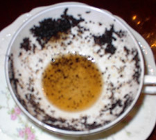

Did you know that your coffee cup holds clues about yourself, your present, and your future?

Tasseography, sometimes called tasseomancy, is a branch of divination. It has been done for more than a thousand years in many areas of the world. The most common form of tasseography that is done today is tea leaf reading. Normally, I prefer to do tea leaf reading. I think that the tea leaves are a little bit bigger and it is a less messy process. Sometimes, however, people will specially request coffee-ground reading. Both work the same way: after drinking the liquid, the grounds of coffee or leaves of tea that are left behind in the cup create the symbols that, interpreted well, might be the psychic key to a person’s future.

This activity requires at least two people. Although some people believe that they can read their own fortune, many do not. I don’t even bother trying to do my own. To me, it’s only entertaining as a group activity.

  
*Coffee Cup Grounds Fortune Reading*

Many people consider this an occult practice. Personally, I don’t think that there is anything supernatural or evil about it, but I also don’t recommend putting much faith in it either way. I advise that it be enjoyed as entertainment only. Please don’t make important decisions based upon fortune-telling of any kind.

### Setting up

Choose the old-fashioned kind of coffee cup, similar to a teacup. It should be rather shallow and wide. You should choose a white or light-colored porcelain cup; never use a black mug.

### Preparing the Coffee

Normally, by the time you drink your coffee, there are no grounds in your cup. So I’ll tell you how to go about preparing the coffee.

Boil water. Use the same amount of coffee that you normally use. You should not attempt to do this with pre-ground, canned or instant coffee – the coffee will probably taste unbearable and you may end up drinking too many coffee grounds, leaving you with nothing to work with.

Measure your coffee. 1 tablespoon for every 6 oz. of water is a good ratio, but you make it to your own taste. Boil the coffee on the stovetop. This doesn’t make the best tasting coffee, but if you don’t boil the coffee grounds, the grounds will float in your coffee cup and make it difficult for you to drink the coffee.

Pour the coffee into the cup without filtering the coffee grounds. Most of the coffee grounds should settle to the bottom of the cup. If you don’t have enough to obscure the bottom of the cup, you can manually add a spoonful of grounds from the coffee pot into the cup. Add sugar and milk to taste. You can stir the drink as much as you’d like. This will stir up the grounds, but they’ll re-settle on the bottom of the cup a moment later.

### Drinking the Coffee

Drink the coffee and enjoy a good conversation. As you near the bottom of the cup, try not to swallow the grounds. You can use your lips as a sieve to strain the coffee. One technique that I recommend is to try to stay ahead of the coffee grounds. When you are trying to consume the last of the liquid, turn the coffee cup slowly while you are drinking so that you can strain the liquid from the grounds. Drink as much of the liquid as possible.

### The Ritual

People seem to like a certain amount of ritual to their entertainment, so I’ve created one, although I don’t think that it is required. After drinking the liquid, I have the subject turn the coffee cup over onto the saucer, then turn the coffee cup three times to the right. The subject should then put his or her hands on the cup and make a wish.

  
*Margaret reading the coffee grounds*

### Vibes

Part of “fortune-telling” in general, and coffee cup reading in particular, is tuning in to the “vibes” of the subject. For me, it’s a pulsing of my blood and a feeling of warmth, as if a wave is running through my arm. If you don’t feel anything, you might try to jumpstart the process. Ask the subject to concentrate on his/her wish, and to send that message to you through his/her arm and hand into your body.

### Symbols and Significance

The interpreter (or psychic, as the case may be) should hold the cup in one hand, and hold the left or right hand of the subject. The interpreter will be looking for images in the coffee grounds. The process is similar to gazing at clouds and “seeing” symbols and images in your mind’s eye.

When I read a person’s cup for the first time, I usually see some sort of a tree. Sometimes it is an oak, sometimes a willow or palm. I interpret this to be the person’s tree of life. A heavy root structure (or lack of it) tells me that about the person’s relationship with the family. Sometimes I’ll see a tree that leans to one side or that is lopsided, indicating that the subject is concentrating too much energy in one area of his/her life.

Other symbols can be interpreted, with varying significance. I usually use my imagination and past experiences to interpret the symbols. Here is a (very) shortlist of my interpretation of some common symbols.

-   **Apple**: Fertility and creativity.
-   **Arch**: Money in business matters.
-   **Bread**: Nurture your desires, hopes, and dreams.
-   **Bridge**: A major decision needs to be made – which way should you go?
-   **Camera**: Someone is attracted to you.
-   **Coins**: Money is on the way.
-   **Diamonds**: A marriage proposal is expected? If the person is married, this may be a symbol of money and material wealth.
-   **Flowers**: Flowers indicate happiness.
-   **Genie Lamp**: Your wish will be granted.
-   **Harp**: Traditional romance.
-   **Heart**: A love affair, if the heart is broken or misshapen then the person is broken-hearted.
-   **Knots**: Concern over something, take care that it does not negatively affect your health.
-   **Road**: Creative opportunities are bringing you to another level.
-   **Ship**: A business opportunity is presenting itself.

### Meaning and Time

Not all cups tell the future. If the subject is wary of “fortune-telling,” the cup will be a general cup, and often the cup will be general if this is the first reading for the subject. Sometimes too, the cup may not be about what will actually happen, it will instead reflect what the subject wants or fears will happen in the near future. If the cup holds overwhelmingly negative symbols: symbols of death and treachery, the cup is probably a manifestation of the subject’s fears, not what will actually happen.

If the cup is about the future, however, the placement of the image in the cup is important to understand. I believe that the cup relates to only about 4 months into the future. The images at the bottom of the cup relate to something that is farther away, while the rim represents the present time.

### Conclusion

I don’t believe that events are predetermined; I think that people make their own reality and future based upon a series of everyday actions and decisions. The reading merely represents an opportunity for the subject to examine the way that subject spends his/her energy. Thus, fortune-telling gives the subject insight into him/herself in a new way. Your coffee clutch will really enjoy this fun little exercise, and it can start some unusual discussions that give you great insight into the hopes, dreams, concerns, and fears of friends.