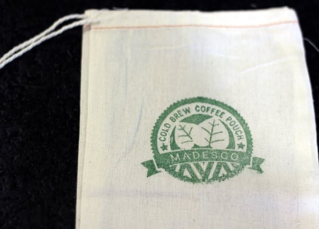
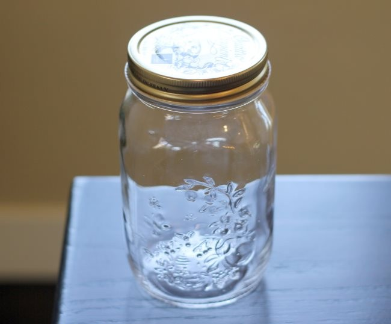
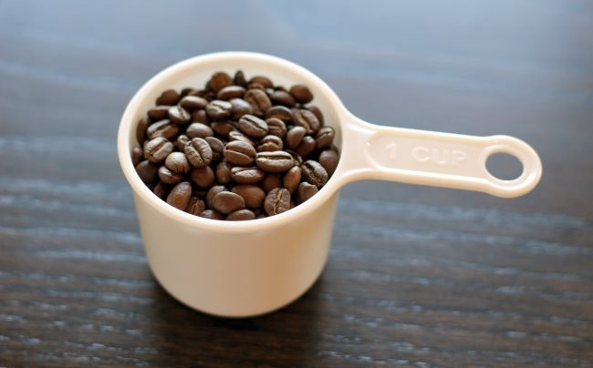
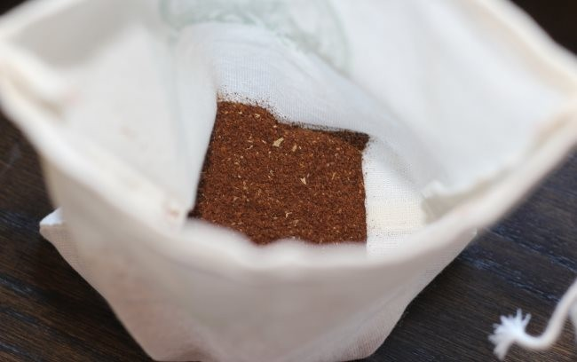
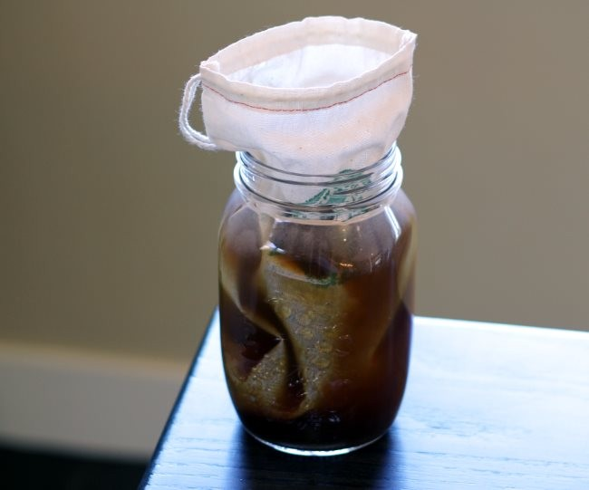
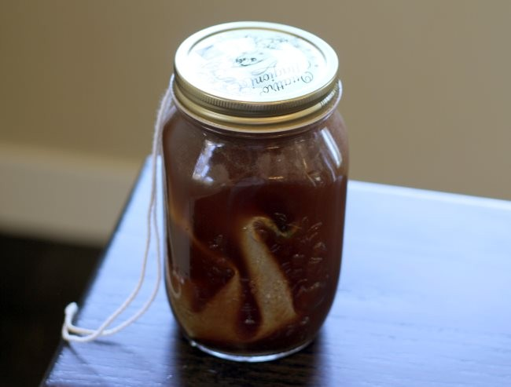
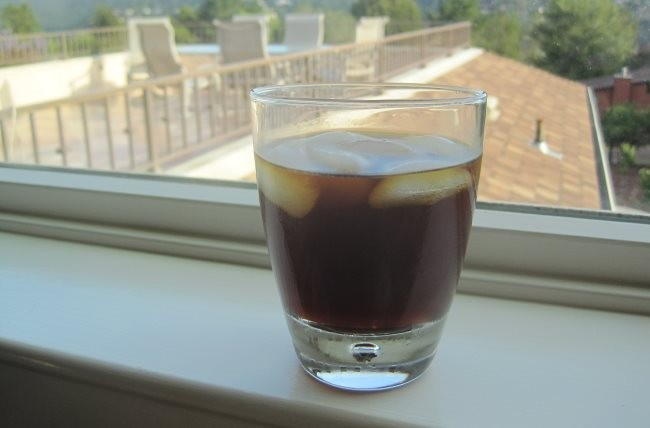

It is that time of year again when coffee shops start selling overpriced cold-brewed coffee. Paying $4 or $5 for a cup of cold-brewed coffee is ridiculous once you know how easy it is to make your own. Cold-brewing a coffee concentrate is not rocket science.

1.  Place ground coffee in contact with cold water for several hours.
2.  Filter out the coffee.
3.  Done.
4.  At this point, you can add more water, milk, or even Baileys Irish Cream.

The only question is how do you want to filter the coffee? You could use the classic [Toddy](http://ineedcoffee.com/cold-brew-coffee-with-the-toddy-coffee-maker/), the [Primula](http://ineedcoffee.com/making-cold-brew-coffee-with-the-primula-coffee-maker/), or you could [build your own](http://ineedcoffee.com/cold-brewed-coffee-on-the-cheap/) on the cheap. In this tutorial, we are going to use the Reusable Cold Brew Coffee Filter Pouch by Madesco and a glass jar. No plugs or drilling or special filters. This is about as easy as coffee brewing can get.

For this tutorial, we are using Madesco’s Reusable Cold Brew Coffee Pouch in its basic size, which is perfect for a quart-sized container. If you need to make much larger quantities, Madesco also has a 5-gallon option.

### What Coffee To Use?

You do not need a special coffee to make cold-brewed coffee. Use the coffees you normally like. Some roasters are making special blends for cold brew and iced coffee. Typically, they tend to be lightly roasted. They are also often a blend of African coffees with fruity notes and Central American coffees with chocolate notes. But again, any coffee that you already like will work.

*Reusable Cold Brew Coffee Filter Pouches*

*1-quart glass jar. You can go larger, add more coffee.* 

*1 cup of coffee beans. Be sure to grind them before adding them to the pouch.*

### #1 Grind Coffee and Add to Pouch

Add one cup of ground coffee to the cold brew pouch. Some brewing recipes say to use coarse ground coffee, and others say to use medium ground coffee. Both work. Madesco advises a medium grind in the instructions, so I used a medium grind. Cold brew is super forgiving.

*Add ground coffee to the cold brew pouch.*

### #2 Place Pouch Inside Jar and Add Water

Place the cold brew pouch’s bottom into the glass jar’s bottom. Don’t close the pouch drawstring yet. Slowly add cold water, enough to fill the jar. Don’t pour the water in quickly, or the coffee might float up and out of the pouch.

### #3 Close the Pouch and Seal the Lid

Pull the drawstring. Push the pouch down into the jar and then close the jar. I kept the drawstring outside the jar to keep it dry, but you don’t have to.

*The lid is closed and the drawstring is outside the jar. If you keep the drawstring outside the jar, put a plate or saucer under the jar because little drops of coffee will escape down the string onto whatever you place your jar on.  
*

### #4 Let Coffee Steep for 12 or More Hours

You can “cold brew” in the refrigerator or set it on the counter overnight. I use the counter. How long you steep the coffee is up to you. Most cold brew recipes use a 12-24 hour range. The longer you steep, the more concentrated the brew will become. So it all comes down to personal preference. My brews with the coffee pouch all fell into the 12-16 hour range.

### #5 Remove Pouch and Place Coffee Concentrate into Refrigerator

Take the pouch out slowly, letting all the coffee drain into the jar. Seal the jar and place it in the refrigerator. The concentrate is finished.

### #6 Quick Clean Up

Empty the grounds inside the pouch into a compost container or your garden. Turn the filter inside out and rinse the pouch. Then hang it up somewhere to dry, ready for the next brew.

### #7 Serve the Coffee Concentrate

This is where the cold brew gets fun. You can decide how strong you like it based on your tastes. I experimented with adding 2/3 of a mug filled with concentrate and 1/3 water. You can drink it cold or heat it up on a stove or microwave. You can also use cold brew concentrate for blended iced coffee drinks and [coffee martinis](http://ineedcoffee.com/the-coffee-martini/).

### A Word on Ratios

The standard advice for those that weigh when they make a cold brew concentrate is to use a 4 to 1 brewing ratio. That is 4 parts water to 1 part coffee. This is significantly stronger than hot brewed coffee which is often in the 15-17 to 1 range.

Because cold brew is a concentrate, you’ll need to add water and/or ice to dilute the coffee when you serve it. If you don’t add the water, you’ll not only get a strong coffee but also a tremendous amount of caffeine.

### Initial Guidance

If you don’t have much experience with cold brew, you may want to purchase a quality cold brew and have it on hand when you make your own. Comparing side-by-side will help you calibrate your tastes when you dial in your own recipe.

### Last Words

Cold-brew is this simple. Cold brew coffee is not rocket science.

### Resources

[Coffee Brewing Guide](http://ineedcoffee.com/coffee-brewing-guide/)  – INeedCoffee has several cold brew coffee tutorials.

*Disclosure: INeedCoffee received a Cold Brew Coffee Filter Pouch from Madesco to complete this tutorial.* 

*Title photo by [Matt Hoffman](https://unsplash.com/@__matthoffman__)*