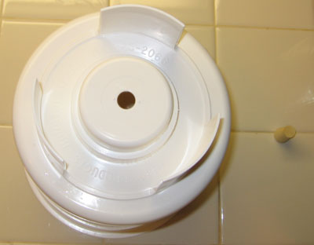
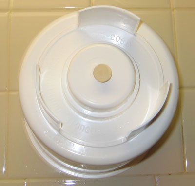
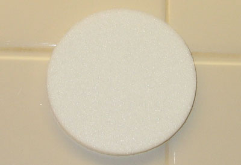
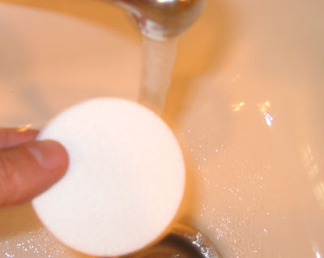
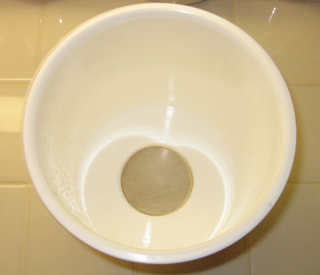
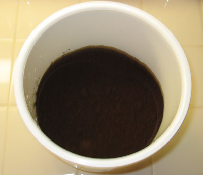
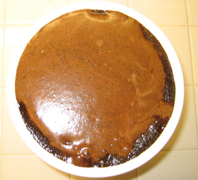
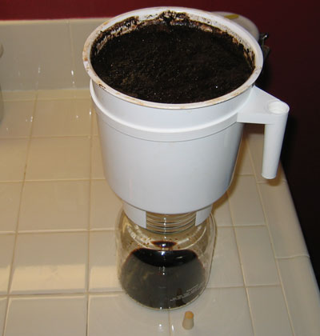

Many years ago, I attempted my first cold brew coffee when I knew far less about coffee than I do today. It was a disaster. The coffee was so vile that I threw it out after a single sip. I assumed it was an inferior brewing method at the time and never gave it another chance. Recently, I met some fellow home coffee roasters whose opinions I respected. They told me of their love for the cold brew method. It was time to give the Toddy another chance.

The first thing you learn is that you aren’t brewing coffee. You are brewing a coffee concentrate. The coffee concentrate brews at room temperature and stores cold. According to Toddy, a cold-brewed concentrate will remain in the refrigerator for 14 days.

To make a cup of cold brew, pour one part of concentrate into a mug with three parts of water. Then microwave. In the age of dedicated machines whose sole function is to brew a single cup of coffee with little or no cleanup, the cold-brewed method may be the simplest.

### Must it be the Toddy?

Toddy started cold brewing in 1964. Before that, it was done for who knows how many years in Central America. You don’t need a Toddy to make cold-brewed coffee. There are other methods. See our [Coffee Brewing Guide](http://ineedcoffee.com/coffee-brewing-guide/) for more cold brewing ideas.

The Toddy Brewer’s design makes it easy enough to get started. It’s an inexpensive brewing system that costs around $30.

### Reasons To Cold Brew

Is this the right brewing system for you? Below is a short list of the situations that would be best suited for cold-brewed coffee.

- Coffee drinkers that find coffee too acidic. Toddy says their cold brew system produces “67% less acid than coffee made by conventional hot brew methods.” This is a big plus for coffee drinkers with acid reflux.
- Less Caffeine? An MSNBC article stated Toddy claims their coffee has “up to two-thirds less caffeine than regular coffee.” I’m a bit skeptical of this claim. UPDATE: Toddy has informed me that MSNBC made a mistake in its reporting. From Toddy: “Our claim is cold-brewed coffee has approximately 33 percent less caffeine than coffee brewed (using regular caffeinated beans) by conventional hot water methods.”
- There are households where everyone drinks coffee at different times. It’s hard to know when to make a full pot if everyone drinks coffee at different times. Moving to a single-cup solution solves that problem.
- Camping. Use a campfire to heat your water to add to the concentrate.
- Iced coffee drinkers. Add ice and water, and you’re done—no more need to chill hot brewed coffee.
- Power Outage. The grinding may require electricity, but not the brewing method.
- Coffee that is getting old. I’ve learned it is common practice for coffee shops to use their oldest beans for cold-brewed coffee. When it comes to flavor, slow-brewed concentrates don’t require as fresh coffee as other brewing methods.

### Reasons to NOT Cold Brew

- French Press and espresso fans. Fans of the coffee oils may find the flavor weaker and less interesting.
- Small-batch Home Roasters. The Toddy works best with a full pound of coffee, which can be a lot of roasting (and grinding) to do at one time for home roasters.

### Equipment Checklist

- Brewing Container – This is the big white plastic thing.
- Reusable Filter – A white circular sponge that fits inside the brewing container.
- Stopper – A little rubber wedge that fits snugly outside the Brewing Container.
- Glass Decanter – What we will use to store the coffee.
- Decanter Top – The lid to seal the Glass Decanter.
- Ring with Handle – An Optional piece can be used as a handle.
- 1 pound of Coffee Ground Regular (aka Drip or Vac-Pot).

### #1 Secure Stopper into Brewing Container

Turn the brewing container upside down and from the outside, and wedge the stopper into the open hole. The fit needs to be tight, but do not forcefully wedge the stopper too far. It will hold the coffee for 12 hours and will need to be removed at that time.

### #2 Wet and Insert Filter

Take the Reusable Filter and wet it. Then place it snugly into the inside bottom of the Brewing Container.

### #3 Add 1 pound of coffee into the Brewing Container

Cold-brewed coffee requires an extra coarse grind. See the [Coffee Grind Chart](http://ineedcoffee.com/coffee-grind-chart/) for a visual explanation.

### #4 Slowly and evenly add 4 cups of water, then wait 5 minutes

Do not stir the coffee mixture.

### #5 After the 5 minutes, add 5 more cups of cold water slowly and evenly.

This should take the mixture to the top of the Brewing Container. **Again, do not stir.**

### #6 (optional) Cover top with plastic wrap

Keep dust or insects from landing on the coffee while it brews for 12 hours.

### #7 Allow 10-12 hours for coffee to steep

The coffee steeps at room temperature. The “Cold” portion comes when the final product is stored.

### #8 Release coffee into Glass Decanter

Use the Ring with Handle to assist you when you lift the Brewing Container over the Glass Decanter. When the coffee is above the Glass Decanter, reach under the Brewing Container with your free hand and remove the Stopper. A slight turn of the Stopper should free it, and coffee will trickle out of the Brewing Container and into the Glass Decanter.

### #9 Allow 20-30 minutes for the coffee to flow into the Glass Decanter.

When complete, remove the Brewing Container. Then seal the Glass Decanter with the Decanter top and store it in the refrigerator.

### #10 Clean the Brewing Container and put it away for future use.

According to Toddy, the filter will be stored in a _Ziploc-type bag_ inside the refrigerator. Why a filter needs to be cold-stored is not clear. A filter can be used for 10 brews.

### Preparing a Hot Cup of Coffee

Now comes the quick and easy part. Heat three parts water. After heating the water, add one part of the coffee concentrate. Adding the coffee before heating the water will result in a hotter coffee, but it may come at the expense of flavor. So, heat the water first, and then add the coffee.

### Making Cold Coffee

Add one part concentrate to two parts water over ice. You could even get fancy by making coffee concentrate ice cubes.

### Troubleshooting

#### Coffee Brews Too Fast or Too Slow

The coffee should take 20-30 minutes to fall into the Glass Decanter. The best way to ensure this is to have a consistent grind. Even though I have a decent bean grinder at home, I will have my local coffee roaster grind for me before making cold-brewed coffee. When grinding a full pound at once, it’s best to do it with a commercial-grade machine.

#### Coffee Tastes Weak

It shouldn’t, as this is a concentrate.

#### Coffee Taste Too Strong

Add more water to the concentrate.

#### Hot Coffee Isn’t Hot Enough

If you use a kettle to heat water and then pour that hot water into the cold coffee concentrate, the temperature will NOT be as hot as it would be with other brewing methods. When I use a kettle for the water, I still warm the concentrate in the microwave.

#### Coffee Tastes Bitter

Bitterness is usually caused by one of two things: either the grind is too fine or the beans are stale. If the beans taste fine using another brewing method, then the problem is the grind.

#### Coffee Tastes Thin

If you are used to drinking coffee where the filter allows the oils to be added to the brewing process, such as espresso, press pot, or gold-filter drip, then getting used to cold brew could take a while.

### Last Words

I now know it’s possible to make an excellent cup of coffee using this brewing method.

### Resources

[Make Concentrated Cold Brew Coffee With the Penguin Coffee](https://ineedcoffee.com/make-concentrated-cold-brew-coffee-with-the-penguin-coffee/) – A better way to make cold brew coffee.

[My coffee is cold](https://www.today.com/news/my-coffee-cold-wbna5728227) – MSNBC article by Jon Bonne.

[Low Acid Coffee](https://web.archive.org/web/20191102144508/https://toddycafe.com/cold-brew/low-acid-coffee) – Toddy’s page on coffee acidity

<a href="/files/poplite-3-amps.pdf" download>ICB.Toddy</a> (PDF) – Acidity analysis by Intertek Caleb Brett
