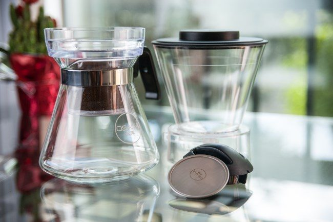
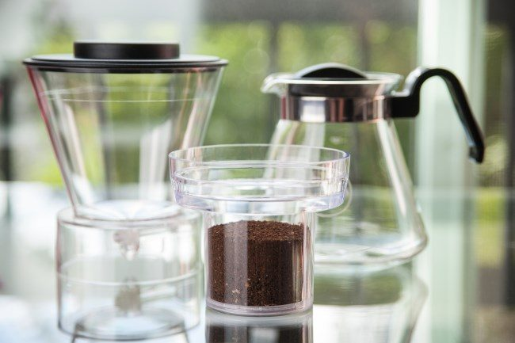
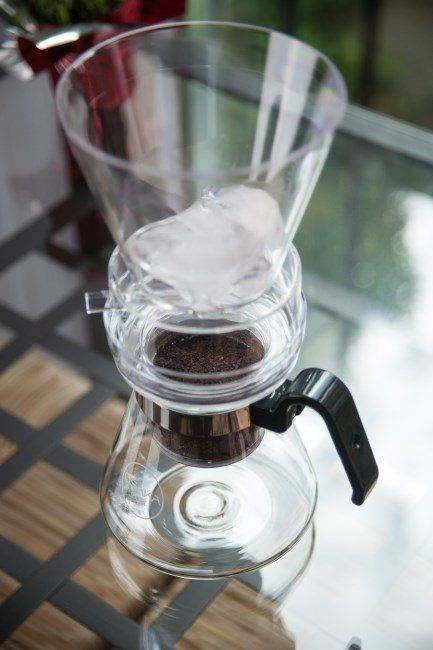
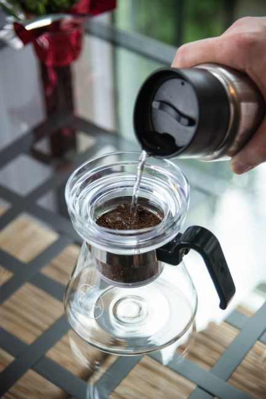
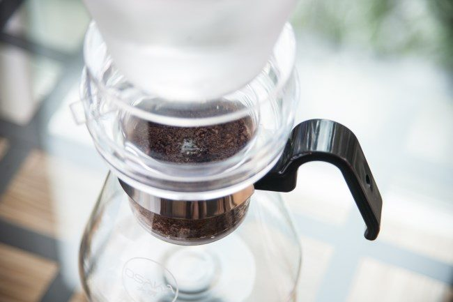
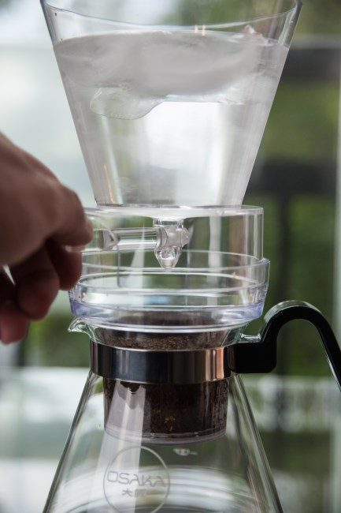
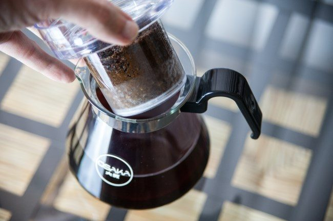
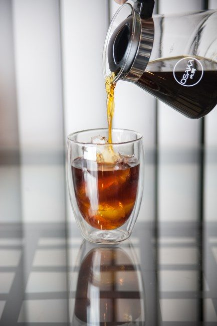
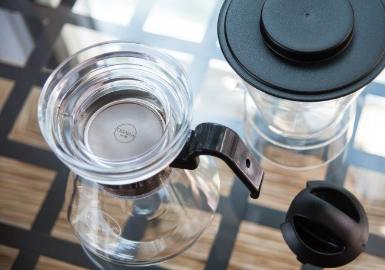

Some fancy coffee shops have these large, beautiful brewers that make coffee one drop at a time. A top chamber holds very cold water, sometimes mixed with ice. That water is set to slowly release onto coffee grounds drop by drop, maybe one drop every 1-3 seconds. The coffee passes through the grounds into a container holding the finished brew below.

Brewing takes a long time, but the taste is bright and wonderful. It highlights attributes of coffee that are more difficult to taste when served hot. The good news is that you do not need to seek a fancy Japanese Oji Water Dripper to try this brewing method. You can brew cold drip coffee at home.

### Not Cold Brew or Iced Coffee

Cold Drip coffee is different from cold brew or even iced coffee. It is its own style. Cold Brew coffee is a full immersion brewing method. This means the coffee makes contact with the water the entire brewing cycle. It is more like a very long French Press. To learn more about Cold Brew coffee, see the article [Cold Brew Coffee is Not Rocket Science](/cold-brew-coffee-is-not-rocket-science/).

Contrast this with drip immersion, where the water makes contact with the coffee and passes through.

Iced coffee can be either full or drip immersion, but in most cases, the brewing time equals that of its hot brew equivalent. The coffee is brewed hot using a smaller amount of water and is then released onto the ice. If you get the ratios right what you get is a rich cup of coffee that is not watered down and cool to cold in temperature. For an example of this brewing method see the article [A Clever Way to Make Iced Coffee](/clever-way-make-iced-coffee/).

#### Cold Brew Coffee

-   12 – 36 hours
-   Brews using room temperature water
-   Full immersion

#### Iced Coffee

-   2-4 minutes (same as hot coffee)
-   Hot water passes through the coffee onto the ice.
-   Full or Drip

#### Cold Dripper

-   2-4 hours\*
-   Cold (some ice is optional)
-   Drip

*\* Some large commercial drippers will take 12-24 hours to brew.*

### Flavor

To me, the flavor of Cold Drip Coffee is much closer to Iced Coffee than Cold Brew. The cold dripper highlights delicate flavors that are sometimes harder to detect or lost in hot brewed coffee. Whenever I begin experimenting with a new coffee brewer, I grab the oldest coffee I have for the first few batches. I expect a learning curve and that the first few brews won’t be the best. Why not put my old coffee to good use?

For my initial brews, I used a somewhat flat older Tanzania that I thought was a little over-roasted when I made it in an [AeroPress](/upside-aeropress-coffee-brewing-tutorial/). When I made it with the Cold Brew Dripper, I was shocked. It was bright and lively. A coffee I planned on throwing away tasted amazing with the cold dripper.

The cold dripper will not make all flat coffee taste great, but this brewing method will benefit those coffees on the edge.

### Tutorial Setup

We will use the Cold Brew Dripper by Osaka Coffee for this cold dripper tutorial. It consists of three parts. The top part is the chamber holding the cold water and ice. It also includes a lid. The middle part is the filter, which holds the ground coffee. It will rest on the third part, which is the glass carafe.

### #1 Dosing the Coffee

As with all brewing methods, we start by finding our ratio. This means parts water to parts coffee. I often use a 17-1 ratio (water to coffee) for hot coffee and a 4-1 ratio for a cold brew. Osaka recommends a 14-1 ratio. I liked that ratio for African coffees but found it a little weak for Latin American coffee. I got better results when I strengthened the ratio to 12-1. I was using lighter roasted coffees. The ideal ratio ranges from 10-1 to 15-1. Experiment.

This tutorial will use 35 grams of coffee brewed at a 12-1 ratio.

### #2 Grind Coffee

The coffee will be ground medium coarse. See our [Coffee Grind Chart](/coffee-grind-chart/) for a visual explanation. Place the ground coffee inside the filter.

### #3 Measure out Water and Ice

The top chamber will hold a mixture of ice and water. Two things can go wrong here. If you use too much ice, the brew can’t finish until the ice is melted. You don’t want to be staring at a chamber of ice for an hour or more, waiting for it to melt.

On the other hand, if you don’t use enough ice and the finished product isn’t cold, you can always add ice later. It’s not ideal either, but it’s not a problem. The perfect outcome is that all the ice melts and the finished coffee is cold.

What is a good ratio? It depends on whether the water you use is already cold and how warm the room where you are brewing is. For a cool office with chilled water, you won’t need any ice at all. For a warm kitchen using room-temperature water, start with 40% of the water weight as ice.

Using cold water at a normal kitchen temperature of 68-72°F, I got the best results using 10% ice.

-   35 grams of ground coffee
-   35 \* 12 = 420 grams total water
-   420 \* 10% = 42 grams ice
-   420 – 42 = 378 grams cold water

Weigh 42 grams of ice and place it in the top chamber. Also, weigh 378 grams of cold water into something you can use to pour.

#### No scale?

You can still make the coffee if you do not have a scale. Fill the filter with ground coffee until almost the top. Then in the top chamber fill it to the line with cold water and ice. Unless the brewing environment is warm, use very little ice. Just a few cubes. If you use this as a starting point, you can adjust in subsequent brews to make the coffee stronger or weaker to your liking.

### #4 Wet the Ground Coffee

You will not start brewing directly on the dry ground coffee. Before placing the top chamber above the filter, gently pour just enough water over the coffee to wet the beans. You will be pouring cold water from the container.

By wetting the beans, you ensure that all the grounds contact water. If you don’t wet the beans, the water drops can tunnel straight down, leaving the coffee around the top edges dry. This means your coffee could taste weak.

### #5 Commence Dripping

Now that the coffee grounds have been soaked, place the top chamber on the brewer. Add the remaining cold water to the ice, and place the lid on top of this chamber.

At this point, you will dial in the dripper. By turning the handle, you can control the flow of coffee into the bottom chamber. Osaka recommends aiming for two drops every 3 seconds.

### #6 Adjust Dripper After 60-90 Minutes

As the water weight in the top chamber drops, so will the flow rate. After about 60-90 minutes, adjust the flow to bring the dripper back to two drops every 3 seconds.

### #7 Serve and Enjoy

The brew is complete when the last drop of water has left the top chamber and passed through the coffee. Remove the top and middle chambers. Pour and enjoy. If it is not cold enough, add ice or place it in the refrigerator. If it is too strong, you can add more cold water. And if it is too weak, you can try again with more coffee, less water, or a little finer grind.

### #8 Clean Up

The clean-up is super simple. Empty the grounds into a compost bin or garden. Rinse all the parts and set them aside to dry. The Osaka Cold Brew Dripper is dishwasher safe, but other drippers may or may not be. Check first.

### Troubleshooting

If your coffee tastes weak and you can see the drips have made a tunnel directly into the center of the beans, there is a fix. Place the second filter on top of the ground coffee just after you wet the grounds in Step #4. This will diffuse the water evenly across the beans. I did not need to do this trick for most of my brews, but when the coffee I used was older or darker, having the second filter on top evened out the water flow through the ground coffee. No more tunnel.

### Not for Everyone

The Cold Dripper is not the ideal coffee brewer for everyone. It has a very long brew cycle. However, I think it would be perfect for someone with a desk job. Come into work with a hot coffee and then set up the dripper. A few hours later, you have your next delicious coffee waiting for you. No electricity is required.

In my article [The Quest for Good Coffee in the Office](/the-quest-for-good-coffee-in-the-office/), I told the tale of how my office had a strict policy against bringing in any electrical appliances, so I had to break the rules. What I didn’t cover in the article was my rebel coffee lab was eventually shut down. With the Cold Dripper, I could have had great coffee without breaking any rules.

### Resources

[Coffee Brewing Guide](/coffee-brewing-guide/) – INeedCoffee brewing guide resource.

*[Title photo](https://flic.kr/p/Wekkgw) by arbyreed.*

*Disclosure: Osaka donated a Coffee Dripper brewer for this tutorial.*

*Brewing photos by Joseph Robertson of Extracted Magazine, a digital coffee magazine published for iOS and Android.  
*
