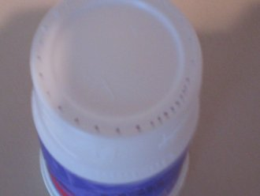
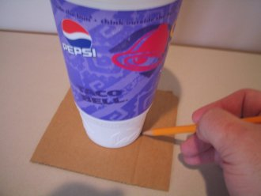

If you are a regular visitor to this site, you are probably already aware of the cold-brewed coffee drink. At least two other articles go into the advantages/disadvantages of the cold brewing method compared to the many hot-brewing methods available. Because it’s already been done, I won’t go into it here. This is simply a how-to for people who would like to try cold-brewed coffee before shelling out the money for a commercially available system – or for those who, like myself, are just too cheap to break down and spend $30 when they don’t have to.

### What you will need

Below, you will see the things you will need to make your own cold brewing system. They are as follows:

  
*Cold-brewed Coffee Supplies*

1.  32 oz plastic beverage cups ( 2 of the same kind that nests inside one another)
2.  Something to make the holes with. (I have a 1/16 drill bit, glued into a wire nut) See fig 2.
3.  Pencil
4.  Scissors. (Any other instrument suitable for cutting cardboard will work.)
5.  a piece of cardboard cut to a square of about 6×6.
6.  A plastic bottle suitable for storing beverages you plan to drink.

  
*Figure 2 – the drill*

### Getting Started

Take one of the cups, turn it bottom side up, and start making holes. Lots of holes, don’t be shy the more you drill, the faster it will drain when it’s done brewing. Spacing is not really an issue, either. I should point out that although I am using a finger drill here, that doesn’t mean that that is what it takes. I use one because I already have one. If I didn’t, I would probably use a pushpin or T-pin, or something else on that order.

  
*Using the drill on the cup.*

The cup after you’re done drilling.

  
*Drilled holes in the cup.*

Make sure that you don’t have any little pieces of plastic in the cup, and you are ready to do the next part, the spacer. To make the spacer, just take the piece of cardboard, set a cup on it, and trace around it with the pencil. Don’t get this too tight. You want the cup to fit down into it a little way.

  
*Tracing the Cardboard*

Once you have the circle traced, cut out the circle, throw it away, and keep the rest. So you know what we’re going for here, this is how they will be used.

  
*Cup inside the cutout* *cardboard*

### Making Coffee

The hard part is over, we’re ready to start brewing. What you need now, is your two cups, the one with the holes in the bottom, inside the other one.

Next, you will need three pre-measured bags of auto-drip coffee… or at least that is how I do it. That comes to about 4-4.5 oz. or approximately 11/2 Cups of ground coffee.

Pour in about a half cup of water:

Then add one of the packets (or about one-third) of the coffee,

Then, more water, another packet of coffee, more water, the rest of the coffee, and enough water to fill the cup. Like so:

If you do this just right, you shouldn’t need to stir it, but if you notice that the grounds are not getting all soaked just give it a gentle stir with a spoon. Then put the lid on and let it soak overnight.

When the morning comes lift the top cup out of the bottom one and slide the cardboard spacer under it, and let the coffee drain.

*Bottom cup with coffee*

*The top coffee is now empty.*

This will take anywhere from a few minutes to over an hour, depending on several factors, like:

-   how coarse the coffee is ground
-   the size of the holes
-   the number of holes
-   how thoroughly do you want to drain the grounds?

You can then pour concentrated coffee into the bottle. Just don’t pour all the dregs into it. Leave a little bit of the coffee behind, and you will have a bottle of pure coffee concentrate. You can keep it in the refrigerator for up to two weeks.

  
*Store cold brew coffee*

### Enjoy your coffee

Add about one ounce of concentrate to a cup of hot water, and now you are ready to sample cold brewed coffee. Not strong enough? Add more concentrate. It’s all up to you. Too strong? Add more hot water. That is one of the selling points of this method. You can brew it once and make it just the right strength for everyone in your house (or office) who drinks coffee. Or get some cold milk, flavored syrup and ice to add to your concentrate and make some great cold coffee drinks.

### A Few Notes

First about coffee selection. I have read criticisms of this method from some people who describe the result as being rather bland and lacking in flavor. I was rather surprised by this, since my first exposure to it was very favorable, even though I like strong coffee. This first attempt of mine was made with standard store brand pre-ground auto-drip coffee. I later tried making this coffee with the pricier Arabica beans and was completely disappointed in the results. Experiment yourself, and let me know what your results are.

Secondly, about the cardboard. It can tend to get soaked when sliding it under the dripping cup. If you want to mitigate this, cover it with packing tape so that the drips don’t soak in. Or, if you prefer, you could use more waterproof material, like the foam trays that are used for packaging produce.

Thirdly, regarding temperature. You may notice that adding cold concentrate to hot water gives you a coffee that is not quite as hot as you are accustomed to. If that is the case, there are two things you can do. The first is to nuke it. Put it in the microwave until it is as warm as you like it. The second is to pre-warm your cup. This works great if you have a ceramic mug. Just fill it with hot tap water for a minute or so, then dump that out and fill it with the hot water and concentrate. The temperature will be as hot as coffee from the pot.

Fourth, concerning quantity. If you have smaller cups, use what you have and adjust the amount of coffee you use. For example, two 20-ounce cups would be about right for two bags.

You may be wondering about the durability of this no-cost soft drink cup brewing system. Does it matter? It doesn’t cost anything to make a new one, but as you must know, I have used the same system for nearly a year and only made another to take the pictures for this article.

That’s all. Try some cold brew coffee and see if you like it. If not, you aren’t out the $30 for a brewing system. If you like it, you still aren’t out $30 unless you want to be.

### Resources

[Cold Brew Coffee with the Toddy Coffee Maker](/cold-brew-coffee-with-the-toddy-coffee-maker/) – An alternate cold coffee brewing method.

[Greek Frappe Recipe](/greek-frappe-recipe/) – A cold coffee treat.
