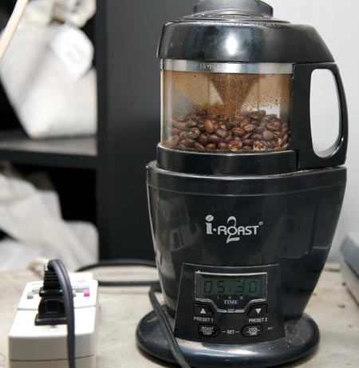
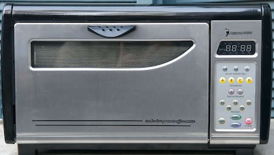

I just had to leave Southern California, didn’t I? I have been home roasting coffee from San Diego for the past seven years without any problems. Unless my attention drifted during the roast, it was almost a sure thing the coffee would turn out great. Then I moved to Seattle, and I experienced something I almost forgot about: winter. It was not a Minnesota winter, but roasting just got 30-40 degrees F colder for me.

Roasting coffee can be done indoors or outdoors. With my current pad, roasting on the outdoor patio is the only option. My smoke detector is hypersensitive and requires an acrobat to disable it. As the months went by and the temperature dropped, my roast times got longer and longer. A long roast where the temperature doesn’t get high enough results in a baked, tasteless coffee.

### A Tale of Three Cold Roasters

I use three coffee roasters: [I-Roast 2](/roasting-coffee-in-a-popcorn-popper/), [Behmor 1600](/behmor-1600-coffee-roaster-tutorial/), and the [Westbend Poppery](/roasting-coffee-in-a-popcorn-popper/). When the temperature dropped, I was still learning to use my new Behmor, so I leaned towards using the I-Roast. The roasts got longer and longer, and in the end, I gave up trying to get a consistent roast that didn’t taste flat.

  
*iRoast 2*

After I gave up on the I-Roast, I considered using the Westbend Poppery. Several years ago, Ryan Jacobs taught us how to trap heat in the Poppery using a box in his article [Winter Home Roasting](/cold-weather-coffee-roasting/). Popcorn popper roasting requires a higher level of *hands-on* attention. Add a flammable box; you should not step away from the roast the entire time. The problem with this strategy was that I was cold. This was my first winter in eight years. I still needed time to acclimatize, but I needed freshly roasted coffee first.

  
*West Bend Poppery*

This left me with the Behmor 1600. Fortunately, Chris Arnold had an excellent tutorial, Behmor 1600 Coffee Roaster Tutorial, to get me started. Things were going great until the temperature dropped below 45F. Then, the machine started throwing ERR 1 codes. When the machine throws an ERR 1 code, it will not roast. After getting the ERR 1 codes multiple times, I gave up.

  
*Behmor 1600 Coffee Roaster*

### Surrendering to Seattle

During my roasting frustration, I remembered my early home roasting days. It was the summer of 1998 and I was living in St. Petersburg, Florida. The coffee there was dreadful. Ryan Jacobs came down and gave me a hands-on roasting tutorial for my Poppery 2. That tutorial eventually became the [Roast your Own Coffee](/roast-your-own-coffee/) article. Suddenly I had great coffee.

Fast forward to the present. Seattle is nothing like St. Petersburg, Florida. There are so many outstanding coffee roasters in the area. So, I decided not to fight the cold weather on my balcony and embrace roasted coffee. I stopped home roasting. Between Caffe Vita, Victrola, 49th Parallel (from Trabant), and Zoka, I had lots of great coffee to keep me warm during the winter.

### The Cold Weather Coffee Comeback

With no offense intended to the great roasters of Seattle, I found myself missing the one thing I couldn’t guarantee when buying roasted coffee: [freshness](/why-home-roast/). Don’t get me wrong, all those roasters sell fresh coffee. But after a decade of home roasting, my definition of fresh is different than that of roasted coffee consumers. As a home roaster, I often throw out 7-10 days old beans. If I buy beans from a local roaster that are 5-7 days old already, my freshness window is closing fast.

I needed to go back out to the balcony and tackle winter.

The I-Roast would be my first challenge. I tried setting the machine in a box to trap heat, but that didn’t work. The I-Roast was losing heat from the top, so I blocked some airflow using black electrical tape. Not a good idea. The tape got hot and started to melt. It was a mess to clean up. Don’t use electrical tape to block airflow on the I-Roast. Although the tape was a bad idea, going after the airflow was the correct thinking. Digging through my cabinets, I found a small saucepan lid. Leaning the saucepan lid over the top trapped the air, and the roast time dropped.

It was working well until the winds picked up. Then it was back to under-roasted coffee. The I-Roast went back into storage.

That is when I decided to try the Behmor 1600 again. I needed to see if I could overcome the ERR 1 codes. The user guide’s description of ERR 1 says:

> *Indicates the thermostat is damaged. Call tech support for immediate service.*

I knew the machine was fine. It was just like me – it didn’t like cold weather. That got me thinking. When I don’t like cold weather, I go inside to warm up. Perhaps the Behmor just needed to sit inside the toasty warm house for an hour? I let it warm up inside and then take it back outside, and the ERR 1 code might go away.

That worked. Once back outside, the electronics in the Behmor were warm enough to start the roast. The only additional thing I needed to do was increase the roast time by a few minutes to compensate for the cold weather.

### Happiness is a Warm Roaster

If you are roasting in 35- 45F temperatures with the Behmor 1600, take the roaster inside an hour before you need to roast. Just before you take it back outside, plug it in and try to start an empty roast. It will either start or throw an ERR 1. If it works, hit the cool button, wait a few seconds, power it off, and then take it outside. You are ready to roast. If the ERR 1 still appears, wait another hour and try again. If it continues to throw ERR 1, you may have to call tech support.

UPDATE: The most recent manual for the Behmor 1600 states that storing the roaster in an environment under 45F can cause the ERR 1 code.
