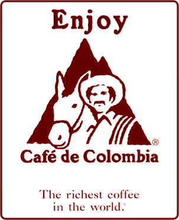
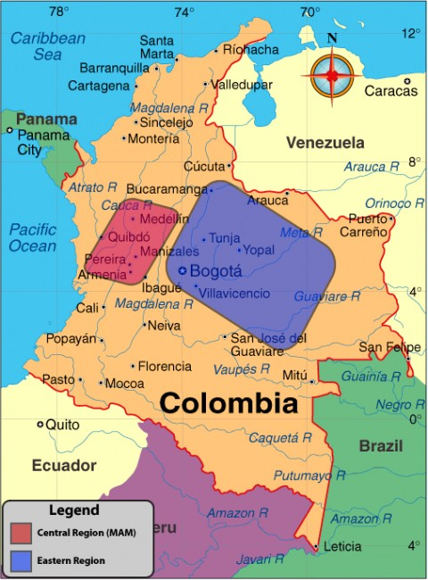

Nothing represents coffee in the American psyche more than Juan Valdez and his mountain-grown Colombian coffee. In 1959, we were introduced to the fictional character, complete with sombrero and poncho for effect, alongside his trusty donkey, or burro. Of course, this marketing campaign resurrected the idea of 100% Arabica coffee after many years of the big coffee can companies slowly slipping in more and more low-quality robusta, along with the prevalence of the percolator. I think this was a good thing, and perhaps was one important step in the resurgence of specialty grade coffee in America, worthy of proper preparation. No doubt, it was a great first step on a long road for American coffee drinkers in the last 50 years, piquing with none other than Starbucks coffee.

  
*Juan Valdez*

Colombian Coffees are thought to have reached Colombia in the 1500s along with Jesuit priests. Export of the first Colombian coffee bean began in 1835 with just over 2000 bags. Now exports of Colombian coffee beans worldwide are in the millions, making up about 11-14% of the world’s production.

You can find mainly Maragogype, Caturra, Typica, and Bourbon cultivars grown in Colombia today. While Brazilian coffee is #1 volume-wise, and Colombian had held the #2 spot for a long time, recently Vietnam slipped in ahead of Colombia pushing it to the #3 spot. Of course, Vietnamese coffee is the lower quality robusta, so the quality difference between the beans is clear. I would much rather have a cup of Colombian coffee than Vietnamese robusta coffee any day.

Sometimes incorrectly spelled *Columbian coffee* or *Columbia coffee*, it is known for perfect balance and heavy body. Exclusively arabica coffee, it is grown at high altitudes, in the shade of native trees. The volcanic soil and dry climate provide excellent growing conditions.

There are two main coffee-growing regions in Colombia: the Central Region and the Eastern Region. The Central Region of Colombia is known as “MAM”. MAM stands for Medellin, Armenia, and Manizales. The Eastern Region of Colombia is a mountainous area around Bogota and Bucaramanga. They are all known for their heavy body and richness, but the Eastern Region tends to have lower acidity than the MAM area.

  
*Colombia Map*

Maybe you grew up on *Folgers Colombian Coffee* like me, and of course realize now that just because something is 100% Colombian, does not mean that it tastes good. In fact, due to efforts to increase volume, the quality of the Colombian coffee bean has gone down substantially in recent years. This has to do with both the processing and the fact that more and more coffee out of Colombia is not Specialty Grade.

While the monikers of Colombian Supremo and Colombian Excelso may have meant something at one time (they are screen sizes), they have come to have a watered-down meaning and are largely irrelevant. Many grocery store-grade coffees will use these terms, but their coffee is palatable at best. The real Colombian coffees now will tout their very specific growing regions, and even then, there are many average coffee lots to be had. Some of these regions are Huila, Santander, Popayan, and Narino, to name a few.

What can you expect to do with Colombian coffee? Well, that is what is great – Colombian coffee is very versatile. I hate to use the term “Classic Cup”, but it fits Colombia to a tee. I enjoy it as a 100% drip after dinner or as a blend as an espresso shot. In fact, before the recent rise in Brazil’s coffee quality, many coffeehouses used Colombian coffee as a large part of their espresso blends. And of course, the French Press is where this stuff shines. Many coffees are a little too bold for me in the French Press, but Colombian is great. And for the home coffee roaster who wonders, I tend to take the Colombian just into 2nd crack a few seconds, and it generally works out perfectly.

Are you interested in seeing this coffee-growing region firsthand? Although Colombia has been known in the past for cocaine and kidnapping, a lot has changed in recent times. Coffee tourism in the region is on the rise. Many trips include guided tours to Colombia and several surrounding areas such as Brazil, Ecuador, and Panama. Hikes provide an up-close view of the coffee trees. Other activities include coffee roasting, coffee cupping of freshly roasted premium coffee, and of course meeting the people who work so hard to make our cup of coffee affordable and enjoyable.

Do yourself a favor and book a Colombia coffee tour now. And if you do get kidnapped, look at the bright side – maybe you will get some of the best coffee on the planet, straight from the source while in captivity. On a serious note, Kidnap and Ransom Insurance is never a bad idea when traveling to certain countries. Always check the latest US Government Travel Warnings and use good common sense.

Oh yeah, say hi to Juan for me…if you see him!

### Resources

[Coffee and Brazil – How Coffee Molded the Culture of a Country](/coffee-and-brazil-how-coffee-molded-the-culture-of-a-country/) – INeedCoffee article.

[Buying a French Press – Picking the Right One](/buying-a-french-press-picking-the-right-one/) – Our French Press guide.
