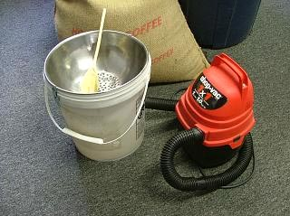

The process of roasting your own coffee beans is easy once you have a basic understanding of how it works. Home roasting is catching on rapidly and has been touted as the fastest-growing hobby in the United States today. While simple, it does require some knowledge to produce roasts that are truly great. Understanding the entire process is mandatory in order to deliver the ultimate cup of coffee.

### The most overlooked part of home roasting

The number one problem in producing great coffee roasted at home is the failure to cool the roast quickly after roasting. Coffee is “roasted” rather than “baked” and for good reason. When roasted properly at high heat quickly allowing convection between the heat source and beans as well as from bean to bean you will avoid “baking” your beans. The baking of coffee beans renders them flat and void of the brightness and zip they should have. Baking occurs when the beans are roasted too slowly or allowed to remain in a slowly decelerating heated situation. When this happens the coffee is losing the zip it has at peak of roast.

The manufactured home roasters that I have seen or heard of all have the same problem; they lack a good cooling system. It is virtually impossible to cool your roast quickly enough in the same chamber that they were, moments ago, roasting in.

We in the industry use sample roasters which are all outfitted with a separate cooling pan built to cool the roast as quickly as possible. We watch the roast checking it with a small scoop we insert into the roasting chamber about every 15 seconds when the roast is nearing the profile we desire. When the roast hits the desired profile we immediately dump it into a cool and operating cooling pan and generally stir it to speed the cooling along further. It is easy to build a very efficient cooling pan which I highly recommend.

### Building a Cooling Pan

To build an in-expensive, simple cooling pan that works very well, you will need:

-   One of those 5-gallon buckets like at the bakery or Home Depot WITH THE COVER.
-   A large stainless steel mixing bowl
-   A couple of draw hasps (National Hardware # N208-512 V35) (Bungee cords will work – if you’re less mechanical)
-   A 1×1 (1 gallon/1 hp) shop vac. I bought one yesterday at Wal-Mart for $19.99
-   Wooden spoon

Cut the top of the bucket so the steel bowl fits snugly on top of the bucket. Drill several hundred little (1/8″ or smaller) holes only in the bottom of the bowl (colander will not work because the holes go up the sides). Cut a little hole 3 – 4 inches from the bottom into the side of the bucket so the vacuum cleaner hose will fit into the bucket SNUGLY. With the steel bowl snugly fastened on the top and the shop vac snugly in the hole, you will have a very strong downward draft through the holes in the bottom of the bowl. This makes an excellent cooling pan!

  
*Cooling Coffee Bean Setup*

There are other, even easier ways including a 12-inch box fan blowing downward with a colander resting on top. Next time you roast, make an effort to cool your roast as quickly as you can and taste the difference. When everything is done right, your coffee will be noticeably better in the cup and that is why we roast our own.

### Resources

[Roasting Coffee in a Popcorn Popper](http://ineedcoffee.com/roasting-coffee-in-a-popcorn-popper/) – Tutorial on using a Westbend popcorn popper to home roast coffee.

[Building a Chaff Collector For Popper Roasting](http://ineedcoffee.com/building-a-chaff-collector-for-popper-roasting/) – For those roasting indoors that need a way to collect the chaff that blows off during roasting.