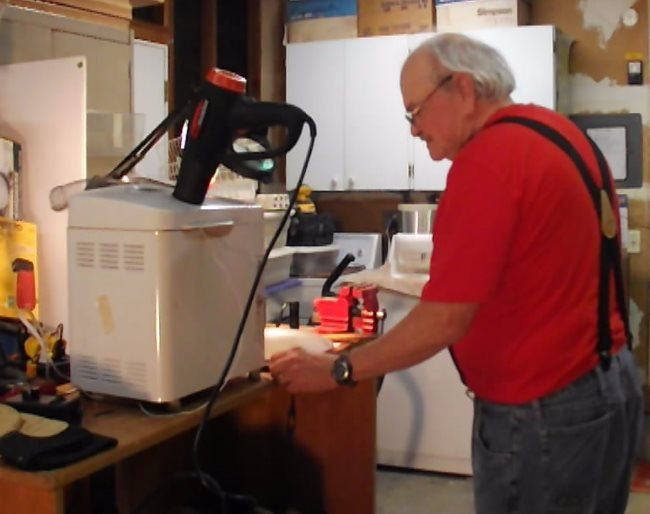

The various devices used to roast coffee beans provide heat to roast the beans in different ways. The three methods are convection, conduction, and radiation. Listed in the chart below are some of the differences in the effect of these devices.

There are at least three ways to determine the differences in the heat transfer process in coffee roasting.

WAG, EG, and SP.

WAG, aka wild-ass guess, is perhaps the least reliable but gives one at least a starting point to understand the heat transfer process.

EG, aka educated guessium, is an assessment of a WAG after having thought at length about it and researching the internet extensively until one’s eyes will not focus any longer to find an answer. SP, aka scientific process, is the most reliable, but it is a little too time-consuming and costly in order to collect enough data to be accepted as a valid presumption.

The chart below is EG certified.

### A Brief History of Time and Coffee

And thanks to a real “SP” kind of guy, Stephen Hawking, for giving us an insight into time and coffee.

Coffee beans in the green, stable state contain about 10% to 12.5% water, internally and externally. When roasting, the process to rid the beans of this moisture should occur in about three or four minutes and be completed before reaching a BT (bean temperature) of 212° F or 100° C.

The Maillard reaction starts when the beans start to turn white and then yellow nearing 130° C. The Maillard reaction is the process when the beans start changing from yellow to tan to light brown. This period changes the sugars and other compounds into a state that will allow the beans to become roasted enough to be an almost palatable beverage. The Maillard reaction usually takes about three to four minutes and is usually complete when the BT reaches 170° C.

The final elimination of water and maturing of the roast occurs after the Maillard reaction is known as the Development Stage. This is when the beans roast enough to become a drinkable coffee and are at the commonly known point of the 1st crack stage of roasting; the 1st crack lasts from one to three minutes. The first crack is the final definition of the roasting process and most roasters agree that coffee beans should not be roasted into the 2nd crack for more than a minute.

_The Corretto roaster in action, with average roast times of 10 to 12 minutes._

### The Crocodile Dundee Connection

My first roast was with a [heat gun](http://ineedcoffee.com/roasting-coffee-with-a-heat-gun-a-top-down-approach/) and a dog bowl. I quickly graduated to the [popcorn popper](http://ineedcoffee.com/roasting-coffee-in-a-popcorn-popper/) and amassed a [menagerie of poppers and modified poppers](http://ineedcoffee.com/coffee-roasting-popcorn-poppers/) that lasted a couple of years. I was roasting up to ten batches of four ounces each (40 ounces) per session about every two or three weeks. I roasted so many times I finally started to understand the roasting process. After two years, roasting so many batches in about two or three hours of sessions gave me an insight into the nuances of roasting but exhausted my desire to roast.

I had to have a shorter process of roasting more beans at a time and in less time. I looked around and settled on the “Corretto” style of roasting, which was promoted and invented by a group of Coffee Snobs in Australia.

The process used a bread machine and a heat gun, which I already had and cost $10.00. I found a bread machine at the Salvation Army resale store. I waited for the Friday discount and picked it up for $3.50. After a few sample roasts, which were only six inches above the dog bowl roasting process, I modified the bread machine with switches ($10.00) that made the paddle work all the time and rewired the heating element (that I never use) to work at the flip of a finger.

_Chris Bound of Texas has an elegant setup to roast his beans._

### Corretto Roasting Overview

Now Corretto roasting does not require anything but a bread machine and a heat gun (and the nerve to roast a pound of green beans). The bread machine does not need to be modified, as I described above, to roast green coffee beans as long as it has a “dough” cycle that does not turn on the heating element.

The dough cycle can be activated and will agitate the beans so they have enough motion to roast evenly and not scorch or burn them. The heat gun can be turned on high, and the temperature can be regulated by moving the nozzle closer to or farther away from the beans as they roast. Placing the nozzle about six inches from the swirling beans is a good place to start. The roasting process will produce a lot of chaff and smoke, so it is recommended as an outdoor project.

Over the past two years, I refined my Corretto roasting by writing an Excel spreadsheet template to log my roasting data and give me information on the ROR (rate of rise), and also a neat graphic chart of the various roasting stages. I added a K type thermometer to give a real accurate bean temperature. l kept the lid on because it helped control the chafe.

_A K type temperature probe records a very accurate bean temperature, and the router control allows an adjustment of the airflow and heat from the heat gun._

### With Corretto Roasting, I am Getting Great Results

I have read many articles that downgrade any coffee roaster that is not a big, round drum as being valid. I dare say that I can roast with the precision of any large drum roaster and get just as good a roast, if not better. Knowledge is in the expertise of understanding what you are doing, not in how you are doing it. Ansel Adams used a simple Brownie box camera to make some of his greatest photographs.

I have often wondered why more roasters are not using the Corretto style of roasting. I finally figured it out. No one is making money off this style of roasting, and many think that nothing good or innovative could possibly come from the land down under. But note with the exception that Mick Dundee, along with an unforgettable rear-end view of Linda Kozlowski, as she is almost eaten by a real crock, are from down under.

Even I used to refer to this style of roasting as BMHG (Bread Maker Heat Gun), but you have to give the Corretto guys their due. It is a great style of roasting and gets the job done of turning green beans into great coffee.

_A completed roast of Kenya AA._

Best of Luck and Good Roasting ….SH

### Resources

[A Fireside Chat](https://www.youtube.com/watch?v=ofFAdnhEu7c) – Trout Doc YouTube channel that includes photos of both Corretto and popper roasting.

<a href="/files/Green-Bean-Loggers-both-versions.zip" download>_The Green Bean Coffee Logger_ and the _New Minute Green Bean Coffee Logger_</a> – Excel (XLSM) file in Zipped format.
