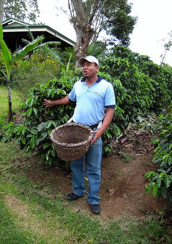
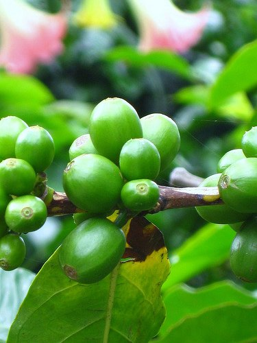
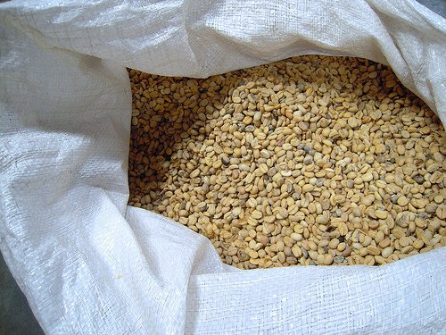
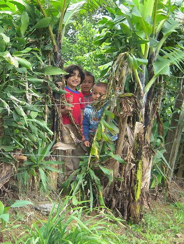

Seeing the lush, green valleys and beautiful mountains of Costa Rica from the air as we were landing in San Jose’ was not even the tip of the iceberg concerning the richness of this country. Home to roughly 5% of the world’s biodiversity and having the most number of species per 10,000 sq km in the world, hundreds of birds, mammals, reptiles and amphibians can be found here, along with a staggering 10,000 plant and tree species!

Costa Rica is also the habitat of a number of rare and endangered flora and fauna species such as the Scarlet Macaw, the resplendent quetzal, and the West Indian Manatee. ¹  The rich volcanic soil, cool, moist climate, and high altitude of the mountains, just part of the 12 different ecological zones, is the perfect place for growing excellent coffee.

In the past, some Costa Rican coffee was said to be too clean, too balanced, too mild, and the “classic cup,” possibly just boring. However, today there are many farmers and micro-mills that take extreme care in every part of the process and produce a variety of excellent, diverse coffees.

  
*Costa Rica Coffee Farmer*

The coffee Arabica plant was brought to the Central Valley of Costa Rica in the late 1700s. Cultivation spread slowly, and Costa Rica became the first Central American country to have a coffee industry. Coffee growing soon surpassed cacao, tobacco, and sugar in importance, and by 1829 it had become the major source of foreign revenue.

As a nonperishable commodity in an age of slow and costly transport, coffee proved an ideal product. It shortly thereafter became the nation’s major export, a position it has maintained until recent years. It created a producer’s wealthy elite that dominated the governmental circles all through the second half of the 19th century. ²

  
*Costa Rica Coffee Plant*

Exports to Panama began in the 1820s, and around 1832 Chile became a major customer. Chile re-branded and exported the Costa Rican coffee to England under the name of “Cafe Chileno de Valparaiso.”

In 1843, a shipment was sent directly to the United Kingdom by William Le Lacheur Lyon, captain of the English ship The Monarch, who had seen the potential of directly cooperating with the Costa Ricans. He sent several hundred-pound bags, and following this, the British developed an interest in the country.

They invested heavily in the Costa Rican coffee industry, becoming the principal customer for exports until World War II. ³

  
*Costa Rica Coffee Beans*

Costa Rica was then known around the world for its coffee. The growing and trading of coffee changed the face of this humble colony. The country was modernized and young Costa Rican intellectuals could now continue their studies in Europe and return as doctors, engineers, and entrepreneurs, contributing to the improvement of Costa Ricans’ lifestyle. The economic bounty that coffee production and trade gave birth to allow the country to build the first railroads to the Atlantic Coast in 1890, “Ferrocarril al Atlantico.”

  
*Kids on a Costa Rica Coffee Farm*

The awed inhabitants of the capital of Costa Rica, San Jose, attended the memorable inauguration of the National Theater seven years later. The National Theater is the cradle of Costa Rican culture and a monument to the foresight of the first coffee farmers. 4 Costa Rica is an example of a country that, through the ingenuity of entrepreneurs, was transformed by something as simple as a coffee plant.

### Resources

¹ [Scarlet Macaws prove to be one of the more vibrant residents of Costa Rica](https://www.govisitcostarica.com/travelInfo/flora-fauna/vibrant-scarlet-macaw.asp)

² http://www.infocostarica.com/business/eco\_coffee.html (site down January 2015)

³ [http://en.wikipedia.org/wiki/Coffee\_production\_in\_Costa\_Rica#cite\_note-ted-1](https://en.wikipedia.org/wiki/Coffee_production_in_Costa_Rica#cite_note-ted-1)

4 http://www.aventura-cafe.com/costarica-eng.htm (site down October 2014)

[My Coffee Tis of Thee: America’s Patriotic Coffee History](http://ineedcoffee.com/my-coffee-tis-of-thee/) – America’s coffee history.