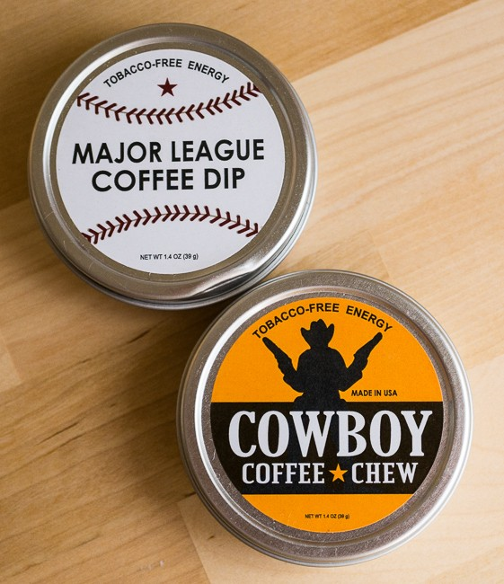
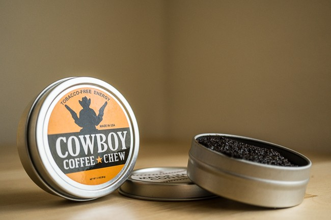

Thoughts of the old west often conjure up images of cowboys sitting around the campfire drinking [Cowboy Coffee](/cowboy-coffee-backpacker-style/) and chewing tobacco. Those tough old cowboys would probably laugh at us today with our latte art and the fact that spittoons have all but disappeared.

Cue the laughter and enter Coffee Chew/Dip, a Tobacco-free & Nicotine-free alternative to chewing or dipping smokeless tobacco from Chew Coffee Dip.

They currently offer “Cowboy Coffee Chew” and “Major League Coffee Dip”. They are actually the exact same product inside, only the container is different. Each 1.4oz/39g tin contains Freshly Ground Coffee, Honey, Sugar, and Cream, and has been commercially manufactured in the USA, and tested and verified for consumption.

Chew Coffee Dip suggests that you can use their product as a replacement for chewing or dipping smokeless tobacco, or can be mixed into your current brand of smokeless chewing tobacco dip.

Not being a smokeless tobacco user myself, I decided to pack some in the side of my mouth as the “pros” do. I didn’t find much satisfaction in leaving it there, and within a minute, I was already starting to chew and eat the product. It is delicious, and it should be; it’s got ground coffee, honey, sugar, and cream. Who wouldn’t find that delightful?

NOTE: It is recommended to use the product warm, by placing it in your pocket, but I found no difference in the flavor or consistency.

Within a few minutes, I felt a slight buzz from all those ingredients, and I took another hit. This stuff is addictive.

If you are trying to quit smokeless tobacco, this might be the ticket. Maybe for some, just having something flavorful in your mouth will be enough to wean yourself from dipping. Or maybe you will need to combine the two for a more effective program.

At about $6 per tin\*, this stuff ain’t cheap but could be an important step in your path to better health, or as a quick and convenient pick-me-up.

*\*The price is closer to $4.30 a tin when you buy 6 or 12 at a time.*

### Resources

[Cowboy Coffee, Backpacker Style](/cowboy-coffee-backpacker-style/) – INeedCoffee article.
