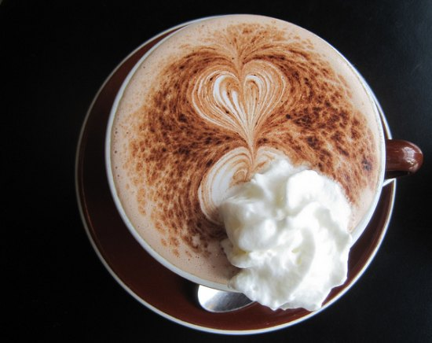

This delicious coffee drink combines the best of hot chocolate with coffee. Then comes the ice cream and whipped cream.

  
*Creamy Chocolate Coffee*

### Ingredients

-   2 cups hot chocolate (extra chocolate)
-   1 cup of hot coffee
-   1/2 cup milk
-   2 tbsp powdered sugar
-   2 scoops of vanilla or chocolate ice cream
-   Whipped cream

### Step-By-Step

1.  Mix all the ingredients above in a saucepan
2.  Heat until bubbling
3.  Serve in mugs with whipped cream
