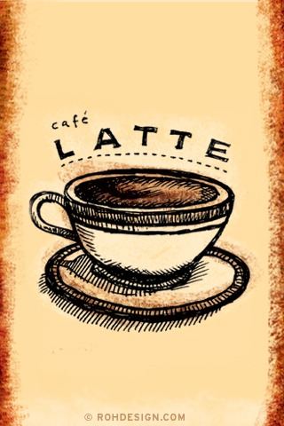

A few years ago, my wife and I went looking for coffee-themed calendars to be used as gifts for coffee-loving friends. We were very surprised to find none in the calendar kiosks at the local malls or coffee shops and very few to choose from online.

Being creative people, we decided to create our calendars and print them on Cafe Press. Our first calendar used black-and-white photos and was received very well by our two friends.

About the same time, I’d been working on a drawing style I had created called [*Sketchtoons*](http://www.flickr.com/photos/rohdesign/sets/737758/) where I mixed loose sketches with hand-written notes in my Moleskine sketchbook. I decided to do a new calendar, creating *Sketchtoons* for 12 coffee drinks.

In this article, I’ll document how I came up with the ideas, drew, scanned, and colorized them for use in calendars and other items, and then marketed and sold the calendar with no budget.

  
*[Sketchtoon Coffee Calendar](http://www.flickr.com/photos/rohdesign/2111160077/in/set-72157600161864325/) by Mike Rohde*

### Concepts and Research

The first task was to select which coffee drinks I would feature for each of the 12 months of the year. I had the classics settled (espresso, latte, mocha, cappuccino, iced coffee, cafe au lait) but needed several more unique drinks, which were not available on any other calendar, to round it out.

For this I turned to Wikipedia, searching first for classic coffee drinks, then following links on those entries to find unusual drinks like the [Flat White](https://en.wikipedia.org/wiki/Flat_white) and [Greek Frappe](https://en.wikipedia.org/wiki/Frapp%C3%A9_coffee).

This worked wonderfully, as there was good historical and technical information I could use to create customized text for my *Sketchtoons*.

### Sketching

Once I’d selected my 12 drinks and had reference materials gathered, it was time to start the sketching process. Using a Moleskine Pocket Sketchbook, I first penciled out the structure of each drawing and then created the illustrations on the page. The last step: drawing the title of the drink and writing in the text on the left and right sides.

### Scanning and Colorization

Once the illustrations were complete, I scanned each drawing from the Moleskine, then created a master high-resolution Photoshop file, with each illustration on a separate layer.

Next, I created a common background image of rough, dark brown texture on the top and bottom of each drawing, and created 4 background colors to cycle through the 12 months.

Each illustration was then colorized, using layers above each background color for the white tones, cup, and coffee colors, and lightened areas behind the descriptive text:

Once the colorization was completed, I exported each illustration, with colorized layers, to a single, high-resolution PNG file (created to specs provided by Cafe Press for the calendar).

Each PNG graphic was uploaded to Cafe Press, and finalized with a description and pricing choices. Cafe Press items have base prices, on top of which you may add a specific dollar amount for your profit.

[Sketchtoon Coffee Calendar (Cover)](http://www.flickr.com/photos/rohdesign/2111160077/)

[Sketchtoon Coffee Calendar February (Espresso)](http://www.flickr.com/photos/rohdesign/2111161013/)

### Marketing and Sales

I didn’t have a budget for marketing, though I do have my [Rohdesign blog](https://rohdesign.com/) with a fair number of readers. I shared details of the calendar: drawings, and when the calendar went up for sale as well as follow-up postings.

I also added a link to the Cafe Press page for the calendar in my email signature and [uploaded images of the calendar](http://www.flickr.com/photos/rohdesign/sets/72157600161864325/) to my Flickr account.

INeedCoffee.com also provided exposure, as I had been a contributor on the page, I was able to submit a small ad for the site and on my [contributor profile page](/by/michael-rohde/).

I’ve recently purchased an iPod Touch, and one of the options is to install your wallpaper on the startup screen. I decided to take the artwork from the calendar and create [vertical wallpapers](http://www.flickr.com/photos/rohdesign/sets/72157603305471752/) for each illustration.

Being a former Palm PDA user, I realized a square format version would be nice to offer to Palm and classic iPod users, so I created a [square set](http://www.flickr.com/photos/rohdesign/sets/72157603340996811/) too.

The free wallpapers were popular, and though I can only connect one download of the wallpapers to a sale, I think it helped expose the calendar to more people.

Finally, I chose two local coffee shops I frequent and gave each of them a calendar as a thank-you. This also may work as exposure to other coffee lovers who see the calendars hanging in their shops.

### Conclusion

In the end, I sold 80 calendars through Cafe Press and received many compliments on the calendar from those who bought them for others or themselves. Our friend who started this project was very pleased with hers.

Based on this year’s calendar project, I would change a few things, mainly getting the calendar ready in September rather than November, allowing buyers to see it sooner.

All in all, I found the project a very interesting experiment, which I think went quite well. I’m planning a revised version of the same calendar design for 2009, and am considering a new calendar with different designs and possibly a different theme.

If you’re considering creating your calendar, check out Cafe Press. It’s free and pretty easy to set up an account, and you might even earn enough money to take your friends out for a coffee.
