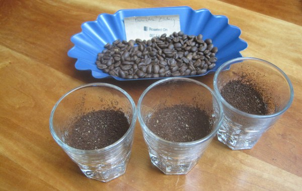

Many factors are involved when determining what coffee to buy and roast is good. A cut-and-dry approach that works for all beans does not exist. Different beans have different qualities and different palates will discriminate. The purpose of this piece is to open the eyes of home coffee drinkers in a few categories:

1.  An understanding of what happens in the cup when a bean is processed differently.
2.  The importance behind the age of a coffee.
3.  Cupping in the home and in the roastery.

### Claims

Anyone reading whom adamantly follows the coffee-based newsgroups, such as alt.coffee and rec.food.drink.coffee may be familiar with the running threads involving the Mexican coffee “Capulin.” As touted by its sales staff of one, the Capulin coffee is a naturally processed (dry-processed as I will discuss below) and manually harvested bean. Because of its method of processing and the care given to its harvesting, Capulin claims that it is perhaps the best coffee one will ever taste. It’s a claim that is difficult to live up to in this day and age of gourmet-this and specialty-that. As you’ll discover in this article, my preference is now for dry-processed coffee.

Dry-processed coffees are harvested when ripe and then left to dry with the fruit still intact. Many claim that this contributes to the sweetness and fruitiness of the bean and increases the body. When dry, the fruit is removed through a shelling process; then the beans are inspected and graded. Washed or water-processed coffees are soaked when harvested, and the fruit is left to ferment. The beans are then dumped and rinsed. What happens after these two processes is not relevant to this article.

### Testing

It’s in my nature to look at both sides of the coin. The Capulin representative was more than generous and willing to provide a sample from last year’s crop of the Capulin coffee. The sample, unroasted, was to be pitted against an earlier crop of the same as well as a new crop of a washed Mexican coffee bean. The purpose of the comparison was not only to find the character traits of each but also to show the differences between similar species of coffee. Additionally, I was comparing two dry-processed coffees to a washed coffee.

I set up a cupping per SCAA (Specialty Coffee Association of America) standards. Following one guide, I set up the cupper’s table mid-morning, away from distractions. I measured 7.25 grams of each bean. The beans were roasted just into the second crack (finishing at an Agtron of 45/50) and ground to a medium grind. I then added the beans to 6 fluid ounces of water at approximately 195F.

  
*Preparing for a coffee cupping.*

### Results

Simply put, the results of my cupping weren’t startling, but they are informative. The oldest of the crops had a wet-cardboard fragrance and aroma, something I attributed to a defect of the bean. The oldest beans lacked any pleasurable taste/flavor and aftertaste, had a moderate body, and had low acidity.

All in all, it was not an entirely great-tasting cup of coffee. I had higher expectations for the newer crop. However, the new crop also fell short in the taste category but had a more “fresh” acidity and medium body. It was, to me, about as average a Mexican coffee or any other Central-American coffee as one might find.

The surprise came with the last cup — The washed Mexican Coatepec. In the nose, the Coatepec had a distinctively strong and sweet wine fragrance attributed to fruits. In the cup, it had a much more pronounced flavor and a delicate and pleasurable aftertaste. It, like the newer crop of Capulin, had a medium-medium high acidity and a balanced body.

### Why Cup?

The results of this experiment should not constitute a general rule for all Mexican coffees, regardless of the process. So why bother? Because as a coffee consumer, I need to know for myself what I am drinking.

Any information I can add to a bean’s portfolio will aid in my education towards coffee in general but will also help me discern my tastes for future coffee purchases. In other words, this cupping helped me discern what taste characteristics I prefer. It also helped me refine my senses for future coffee cupping sessions.

### More Cuppings (Experiments) Necessary

But what does this tell us about the coffees in particular? Again, this does not tell us much on a wide scale. Does this totally destroy the claims of Capulin? Not necessarily. A larger sampling would need to be cupped against itself and the standards set up by the coffee’s producers.

The experiment opened my eyes to the differences in processing. Furthermore, I realized that the final truth rests in the original quality of the bean itself. I am confident that dry-processed coffees can have a greater degree of body.

To prove this, I might expand a cupping experiment to include dry-processed Mexican beans from another region as well as newer crop samplings of Capulin; then pit those coffee beans against washed coffees from other regions.

### Age Matters

And what of the age issue? Again, from this experiment alone, I can not declare “old” coffee as bad coffee. Take for example Monsooned Indian Malabar, which is deliberately left to sit and age before export. With many food products, the results of aging are diminished flavor and taste. In coffee, while this is the case to some degree. However, in some cases, the acidity, body, and some taste characteristics are diminished when the bean gets old. Whether or not diminished acidity and body constitute bad coffee is up to the consumer.

### The Roast

My friend, a new small-shop roaster learned, by taste, the degree of complication associated with coffee. He prefers to roast his coffee West-Coast style: dark, carbony, and smoky. I challenged him to roast lighter and to note the advantages/disadvantages of a light roast. As it would happen, a customer came in looking for… what else? A lightly roasted Mexican coffee. And what did this roaster have on hand? He had a dry-processed Mexican coffee (of unknown origin).

We brewed his traditionally roasted Mexican and compared it to the lighter roast. In the cup, the darker Mexican exhibited a high acidity, a low body, and no particular flavor that stood out. It was an average Mexican coffee. Lightly roasted, the bean (surprisingly) exhibited increased body, similar acidity, and a delicate nuttiness, which the whole table appreciated. The roaster was happy to see that the results were positive. I think his eyes have been opened. Thus, the experiment led to an increase in knowledge and experience. The experiment advanced the cause for quality.

### Conclusion

I’ve shown you how large and complicated the equation of taste can be. Bean age, quality, processing, and roast all determine the final taste of the coffee. I feel it is important to begin experimentation on your own if you have not already. While it may take many tries before your palate and nose become more refined, you will soon see and taste the benefits. Thus, you will appreciate coffee more and more with each cup!

### Resources

[Coffee Cupping: A Basic](/coffee-cupping-a-basic-introduction/) [Introduction](/coffee-cupping-a-basic-introduction/) – A guide to get started with Coffee Cupping.

[Coffee Cupping – A Sensory Experience](/coffee-cupping-a-sensory-experience/) – INeedCoffee article by John Carrier.

[Espresso Blending Techniques](/espresso-blending-techniques/) – Use your cupping skills to develop an espresso blend.

[Coffee Grind Chart](/coffee-grind-chart/) – A visual chart demonstrating the different grind sizes for coffee.
