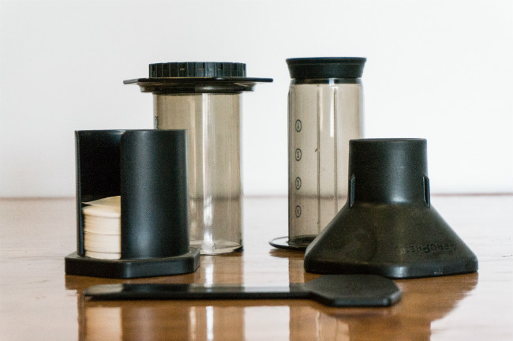

No matter what the occasion, it is sometimes hard to come up with coffee-related gift ideas, especially if you already have a budget in mind. Here is a gift-buying guide for all budgets that should help you satisfy the coffee aficionado in your life, whether they be a Dad or a Grad.

### Under $25

A drip cone. Melitta cones are the most well-known. There are other options like the [Clever Coffee Dripper](http://ineedcoffee.com/clever-coffee-dripper-review/) that allow you more control over the brewing time before you release it into your cup. Bonavita makes a ceramic version. With the correct temp water, you will have an easy and delicious cup of coffee.

Coffee Storage with a proper one-way valve is key to keeping your beans fresh. The Friis Coffee Vault is the one I own, and it works great. About $20 for the Stainless Steel model.

Cups. They can be espresso cups, latte cups, cappuccino cups, or just regular coffee cups. My previous favorite, Illy cups are a little harder to find these days, but there are other brands like Konitz that are very nice, and quite a bit less expensive starting at about $20 per set.

### Under $75

Basic French Press. The French Press needs a coarse grind, so hopefully, your recipient has a grinder that is up to snuff. These can be well under $25, but the nicer ones start around $40 and go up from there.

Aeropress by Aerobie. Yes, the same guys who made the frisbee. They have this very cool little coffee gadget. It makes coffee somewhere between an espresso machine and a Vac-pot. Around $30.

  
*Aeropress Coffee and Espresso Maker  
*

How about a mug that doesn’t fall over when you bump it? The Mighty Mug has a slight suction on the bottom that will grip smooth surfaces.

### Under $150

Fancy French Press (Press Pot). There are some that are decorative, some that are thermal carafes, and others that boast a special filter. In the end, they do just as well as the basic models when it comes to the results. These range from about $50-$100.

French Press and Grinder to match. The Baratza Encore grinder is a great little grinder for the price. If you want to get your special someone the complete package on the way to better coffee, nothing is better than a quality grinder and a French Press of your choosing. About $130.

An electronically controlled hot water pot. I like the Zojirushi Electric Dispensing Pot which is the one I own. They have 3 temp levels (175F, 195F, and 208F). Perfect temps for Green Tea, Coffee, and things like soups and regular tea. I know folks who have had them for going on 10 years. Around $125 for the 4 Liter model.

### Under $500

A small-batch hot-air coffee roaster. The FreshRoast makes a nice little roaster, though the batches will be pretty small. About $175.

A decent drip coffee machine that brews at the right temperature. The Technivorm was the go-to, but Bonavita has given it some serious competition at a much lower price point than the Bonavita BV1800. No fancy electronics on either, but a great cup of coffee to be sure. Choose a Thermal Carafe model from either make, and you should be served well. About $200-300.

A real blender for those summer cold coffee drinks or that hot morning brain food concoction with coffee, oil, and butter. I have owned a BlendTec for over 3 years, and I don’t think I would own anything else. About $350-400.

### Under $1000

A consumer-grade drum coffee roaster. The Gene Cafe is a very nice roaster that will not break the bank. Some nice programming features and a compact design make it a nice choice for someone who needs larger batches than something like FreshRoast offers. About $600.

A consumer-grade espresso machine. The [Rancilio Silvia](http://ineedcoffee.com/rancilio-silvia-espresso-machine-tips/) is a great machine in this price range. If you really want to be a hero, include a grinder. The Rancilio Rocky is a great match. About $1000 total ($650 for the machine, and $350 for the grinder).

### Under $2500

A prosumer espresso machine. I have owned the IZZO Alex Duetto 3 Espresso machine for over two years now, and this thing is the real deal. Dual boilers, PID temp control, tank or plumb-in, quiet rotary pump, beautiful looks, and much more. Oh yeah, it makes a damn fine (and consistent) shot of espresso. About $2500.

### Under $5000

A prosumer fluid air bed coffee roaster. I have owned the Sonofresco 1100-R 1 lb coffee roaster for years now, and it is truly a one-press operation. They now offer a 2 lb model, as well as Propane and Natural Gas options. Replacement parts are easy to get, and everything is made to last.  Around $3500-$5000, depending on the model.

*\*Disclosure: INeedCoffee received a Mighty Mug to test.*