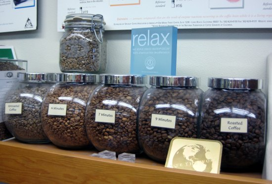

Consider the last time you bought a bag of coffee. Perhaps it’s wrong of me to assume, but would I be correct in guessing the coffee you purchased was a “dark roast”?

By watching coffee commercials and reading the ads, without hesitation, one would easily believe the dark roast is a superior coffee. When it comes to the roast of your coffee, while a great deal of it simply has to do with personal taste, don’t believe mass marketing that says the dark roast is the ultimate expression of quality coffee. It’s not.

There are reasons the dark roast has become so popular. For one thing, the coffee industry is extremely large, the second largest industry next to oil. Think of the massive volume of coffee that hits the consuming market each year. Then consider this: only 10 percent of that coffee qualifies as excellent in quality. The remaining 90 percent is considered somewhere between average to poor. Meaning there’s nothing very special about it, no inherent flavors that set it apart from any other coffee. And if there are intriguing flavors, most likely they aren’t desirable. For instance, a typical low-grown Robusta coffee can taste medicinal, even rubbery.

So, if so much of the coffee grown is of mediocre quality, why is it that people so happily consume so much each and every day? The answer: The Ubiquitous Dark Roast. (Well, and a lot of cream and sugar too. I’ll cover that some other time.)

  
*Light to Dark Roast Progression*

Dark roast simply means that the coffee bean has been roasted to a higher temperature and typically for a longer period of time. This causes all of the flavor molecules stored within the coffee beans-both the good and bad flavors-to be burnt away. By roasting so dark, the end consumer (you) can’t tell whether it’s a good bean or a bad bean because all the natural flavors have been turned to charcoal.

Think of it this way: a fine filet mignon and a strip of utility beef; if they’ve both been very overcooked, even a culinary expert would never be able to tell the difference between the two. Same with coffee.

So if you’re a large coffee company, what do you do? You roast dark, then market the heck out of it and try to convince the mass market that it’s a wonderfully rich and complex coffee. You can’t really blame them now, can you? What else are they supposed to do, tell you that because they’re so big they are unable to guarantee the quality, they do you a favor and roast dark so you can’t taste how bad it is?

Not to be misunderstood, I’m not saying a dark roasted coffee is always a poor coffee. There are some wonderful dark roasted single-origin coffees and blends out there. Just don’t assume the dark roast is as “rich and flavorful” as many roasters say it is. Most of the time there is a reason it’s roasted so darkly.

Instead of going with a dark roast next time you’re picking up your bag of coffee, consider trying a freshly-roasted bag of something slightly lighter, perhaps a city roast or even a full city roast (almost a dark roast) if you’re not feeling terribly adventurous. When shopping, keep in mind that the lighter the roast, the more confidence the roaster is showing in the quality of the raw bean.

There’s a whole world of coffee out there (quite literally) and so many natural flavors to experience, don’t settle for the mediocre stuff. The darker the roast, the less likely you’ll experience the subtle apricot flavors in a great Ethiopian Yirgacheffe, or the blueberry notes in a wonderful Harrar, or the earthy, ripened notes of a great Sumatran Mandheling.