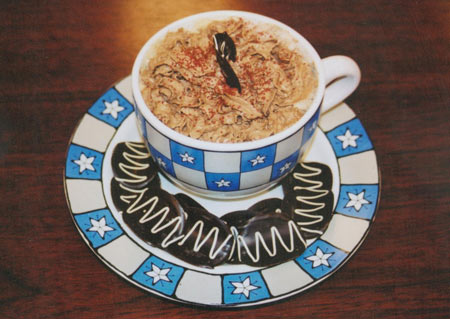

When I first started working at *Saeco USA* all the new employees were challenged to create an original coffee recipe. At the time I wasn’t a very big coffee drinker and I was just learning about espresso. I decided to think about my favorite flavors in order to come up with a great coffee drink.

Chocolate, chocolate, and more chocolate came to mind.

So I started experimenting, and the *Death By Chocolate Cappuccino* was born. I took my drink to the Saeco USA coffee recipe contest, where I won for presentation and overall recipe. Inspired by my win, I’m now a coffee lover, and I teach others how to love coffee, too.

  
*Death By Chocolate Cappuccino*

### Ingredients

-   Large coffee mug
-   1oz Vanilla Syrup
-   2-2oz Shots of espresso or 4oz of strong coffee
-   4oz-6oz of Chocolate Milk (Milk may vary depending on the size of the coffee mug)
-   Chocolate Redi Whip
-   Sprinkles-any color
-   Chocolate pieces

### Directions

First, pour the vanilla syrup into a large coffee mug. Next, add your freshly brewed coffee to the vanilla syrup and blend the two ingredients together. Then steam your chocolate milk to 160 degrees F. You can use a beverage or candy thermometer to test the temperature of the milk. Once the milk has been steamed, add it to your coffee. Finally, top your cappuccino with whipped cream to your desired amount. Add sprinkles and chocolate for decoration.