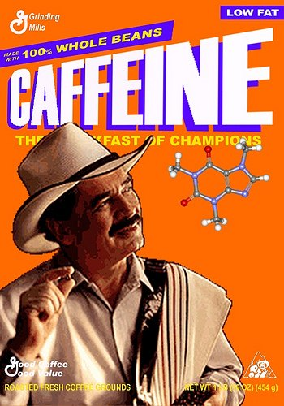

Can decaf taste just as good as regular coffee? Is it processed with chemicals? Can it be decaffeinated without chemicals? Is there a coffee plant that does not contain caffeine at all? After it is decaffeinated does it still contain some caffeine? The answer to all of these is yes!

There are many various methods used to decaffeinate regular coffee and there is development underway to improve the taste of coffee plants that contain a low amount of caffeine or none at all. Many people assume that decaf coffee can not possibly taste as good as regular, but it can. It depends on the original quality of the coffee beans, the method used to decaffeinate them, and then the time between roasting and consumption. Often decafs are not top sellers and so they tend to sit on the shelf longer; just make sure the one you choose was freshly roasted.

### The Solvent Method

The process starts with dried, green (unroasted) coffee beans which are soaked in water. After swelling, they are processed with a solvent, which can be plain water or a chemical. After the beans are moistened, the solvent is circulated through the beans, evaporated and condensed to clean the solvent, and then circulated through the beans again. After the desired caffeine level is reached, the beans are rinsed with water, sometimes steamed to remove the remainder of the solvent, and then dried. Some solvents are more precise than water at removing the caffeine while leaving behind the other elements, which means in the end it will retain more of its flavor.

The solvent ethyl acetate is an ester that is found naturally in fruits and vegetables such as bananas and apples, and it is found in coffee. Coffee that has been processed with ethyl acetate is labeled as “naturally decaffeinated” because the solvent is naturally found in these food items. However, other solvents, such as methylene chloride, may be harmful and possibly carcinogenic.\[1\] Because of this, it is very important to know which solvent is being used, and if methylene chloride is used, the label can not say “naturally decaffeinated.”

  
*[Caffeine – Breakfast of Champions](http://www.flickr.com/photos/23502889@N04/2967172494/in/photostream/) by Fun in NH*

### CO2 – “Naturally Decaffeinated”

A newer method uses carbon dioxide (CO2) as the solvent to extract the caffeine. CO2 is the gas that makes sparkling mineral water and our favorite can of soda bubbly, and it is a highly selective solvent for caffeine, leaving behind the remainder of the bean that will ensure a great taste. The green beans are moistened with water and put into a pressurized container of liquid CO2. After the circulation process to remove the caffeine the beans are dried again to their initial state. This produces “naturally decaffeinated” beans since the substances, CO2 and water, are naturally occurring and evaporate completely.\[2,4\]

### Swiss Water Process

The water method uses only water as the solvent to remove the caffeine, but depending on the process, the taste can vary from okay to great. The problem with water is that not only does it remove the caffeine, but it also removes other flavor elements in the coffee beans. One water process that reduces the problem is this. First, a batch of green beans are soaked in water, removing some of the caffeine and some of the flavor elements; these are the sacrificial beans because they are then tossed after they have been soaked.

The liquid they were in is the important part; it is filtered through activated charcoal that has been pretreated with a carbohydrate and this charcoal is used to remove the caffeine, leaving behind the other coffee particles. The liquid is now the water that another batch of green beans is placed into, and because the water is already saturated with flavor elements, mostly the caffeine is removed and not the flavor.

This process is repeated, filtering out the caffeine from the water and recirculating it through the beans until the desired levels are reached. The beans are then rinsed and dried. The water process is considered all-natural, but it can only remove 94% to 96% of the caffeine.\[1\] The Swiss Water(R) Process, a special patented water process, was developed to remove up to 99.9% of the caffeine while still retaining the coffee’s flavors. \[3\]

### Low Caffeine or No Caffeine Plants

Lastly, scientists and plant breeders are working on developing a coffee plant that does not contain caffeine or has lower amounts of caffeine. One of 2008’s “most interesting new species discovered by scientists” is the first known [coffee plant that contains no caffeine](/the-naturally-caffeine-free-coffee-plant/). It is known as Charrier coffee and was discovered in Cameroon.\[5\] They are hoping to use this new species to breed more naturally caffeine-free coffees.

There are currently a few other coffee plants that are low in caffeine, but none of these have met the taste standards that consumers demand.\[6\] Other scientists are going down the genetic engineering road and have discovered the enzymes that are involved in the caffeine-making process. Currently, their genetically modified coffee plants have 70% less caffeine.\[7\]

Decaffeination is a hot topic and generally misunderstood, but now maybe I have cleared a few things up. Decaf coffee can taste just as good as regular, but it depends on the process that is used, the overall age of the coffee, and how long it has been since it was roasted. Go directly to a roaster, find out what method of decaffeination is used, and make sure it is freshly roasted, and you might have an unbelievably awesome cup of decaffeinated coffee.

### References

\[1\] [How is caffeine removed to produce decaffeinated coffee?](https://www.scientificamerican.com/article/how-is-caffeine-removed-t/) – From Scientific American.

\[2\] *http://www.exceltrade.com/co2method.html* – (OCT 2011: page removed)

\[3\] [Swiss Water(R) Process](https://www.swisswater.com/pages/coffee-decaffeination-process)

\[4\] [CO-2 Decaf Method](https://library.sweetmarias.com/co-2-decaf-method/) – From SweetMarias.

\[5\] [Newly Discovered Decaf Charrier Coffee Plant Might Replace Chemical Extraction of Caffeine](https://web.archive.org/web/20170910180000/http://www.triplepundit.com:80/2009/05/newly-discovered-decaf-coffee-plant-might-replace-chemical-extraction-of-caffeine/) – By Scott Cooney.

\[6\] [New Twist in Decaf: It’s In the Bean!](https://www.supermarketguru.com/articles/new-twist-in-decaf-its-in-the-bean/) – From Coffee Chat News.

\[7\] [Decaf Coffee Plants Developed](https://www.scientificamerican.com/article/decaf-coffee-plants-devel/) – By Sarah Graham.
