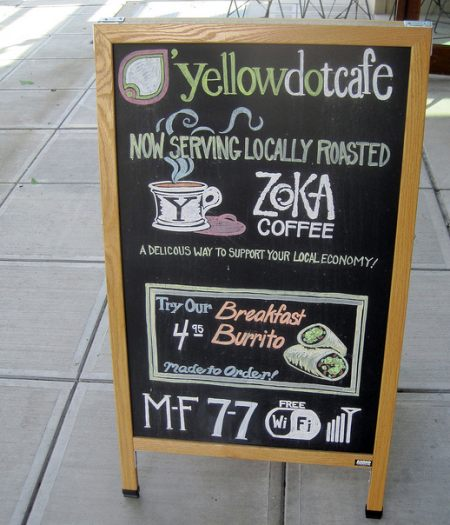

Creating a web page is an inexpensive and effective way for a cafe to promote itself. People looking to find a new coffeehouse in the neighborhood or while traveling will often start researching on the Internet. However, what should be a straightforward way to promote a business frequently turns ugly. The vast majority of websites devoted to local coffeehouses are failures. They lack information and design and are rarely maintained. This article discusses what elements should go into designing a website for cafes.

### Information Checklist – The Basics

90% of the battle is being able to describe a cafe from a website completely. What information belongs on a cafe website? There are many examples of cafes that try to be cool before being functional. Get the following basics down before you get fancy:

-   **Location** – Provide an address, phone number, and map for each location.
-   **Hours** – Post the hours of operation for each day of the week. If you are closed on Sunday, let the web surfers know before they drive across town to try your espresso.
-   **Pictures** – A picture is worth a thousand words. Take photos of the outside, the inside, and even the staff. Invite users into your cafe from the comfort of their browsers.
-   **Menu** – This is very important. EVERY coffeehouse website should include a full drink and food menu. With a website, you can do things that aren’t possible with a chalkboard menu inside the cafe. Describe the drinks. Take a photo of each of the desserts. In my opinion, you should also list the prices.
-   **About the business** – Tell the readers what makes the cafe unique. Do you have a one-page history that you can share?
-   **Press** – If your cafe is any good then at some point it has been mentioned or reviewed in the local newspapers. Share those reprints on the website. Tell the user about any awards the cafe has won.

  
*This sidewalk board shows hours, wifi status, and the roaster and highlights a menu item. Are these data points on the website?*

### Additional Ideas

Once you’ve tackled the basics on the website, include some more elaborate features. The following are but a few ideas:

-   **Promotional Items** – Offer coupons on the website as a way to bring in the casual surfer. Last week, I visited a Las Vegas microbrewery because they offered a “free beer” coupon on their website.
-   **Employment Opportunities** – Is your cafe hiring? Devote a page to open positions with job descriptions and qualifications. Don’t forget to post the URL in the cafe. Maybe one of your customers is seeking a part-time position.
-   **Webcam** – Let the surfer peek into the cafe in real-time. This should only be done if there is a commitment to maintaining a live connection and the staff is trained on how to work the webcam.
-   **Staff Extranet** – Develop a secured extranet to enable employees to log in from home to check schedules, access training manuals, and do issue tracking. Is there a procedure checklist that needs to be shared? Allow employees to make vacation requests and trade hours from a secured website.

### Design – Colors and Fonts

Ideally, you should create a website that looks as visually stimulating as the cafe itself. Starbucks matches the same colors and fonts on its website as it does in its cafe. That isn’t by accident. If your coffeehouse is brick, then don’t use purple as the website’s background color.

Paying for a top-notch professional specializing in graphics for the Internet isn’t always an option for many small businesses. Too many novices make cluttered websites with background images, loud colors, and obnoxious music. Many cafe owners will spend thousands of dollars furnishing and designing the interior of the coffeehouse and then spend nothing to capture the look and feel of that cafe on the website. A beautiful cafe should never be reduced to a FrontPage template. To those trying to do graphics themselves, I advise keeping it simple. Use 2-3 colors, a consistent font, and easy navigation.

### Maintainability

As with any website that holds data, there must be a commitment to maintaining the site. Did you discontinue a line of desserts? Are you opening an hour later on Saturday? Are you closed on a national holiday? The website needs to reflect these changes accurately.

From a June 2000 review of Xando cafe:

> Is the site being updated? Last night I walked by the Xando in the Old Town section of Alexandria, VA that isn’t listed on the site. As new Xando locations open, the web site should be updated.

Four months later, that information still hasn’t been updated. Anybody planning a trip to the DC Metropolitan area looking for a coffeehouse near Arlington Cemetery will blindly stumble into Starbucks because they won’t know about this local gem. Meanwhile, Starbucks meticulously maintains its website.

### Summary

Creating a functional website for a coffeehouse is not very complex. Sites can stand out from the crowd by merely providing users with basic information surrounded by a simple, consistent design. These basics, combined with a commitment to maintaining the site and a vision of the website as a tool for both customers and employees, will make the website an asset for all involved.
