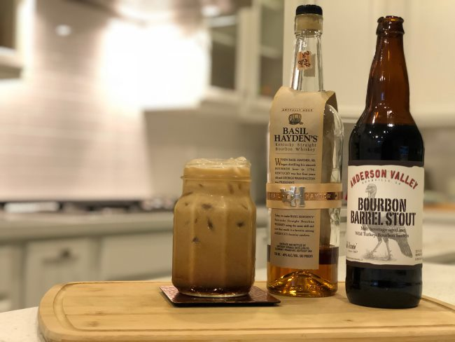
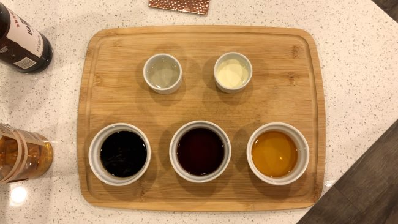
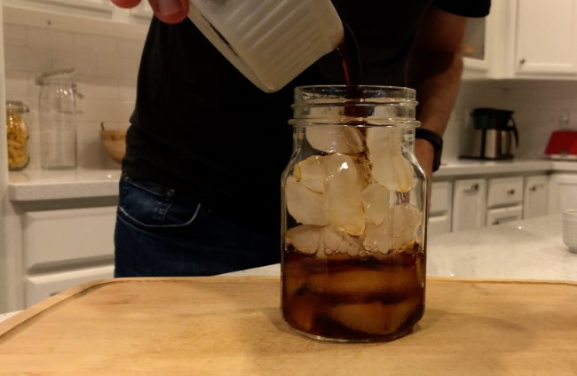
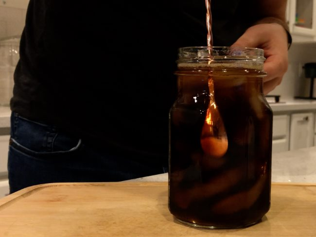
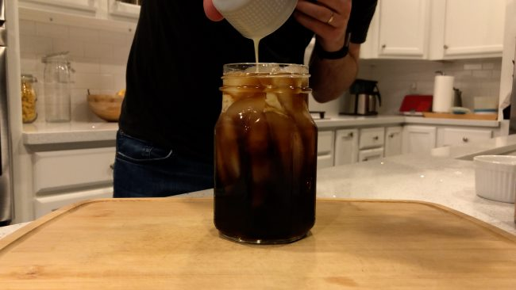
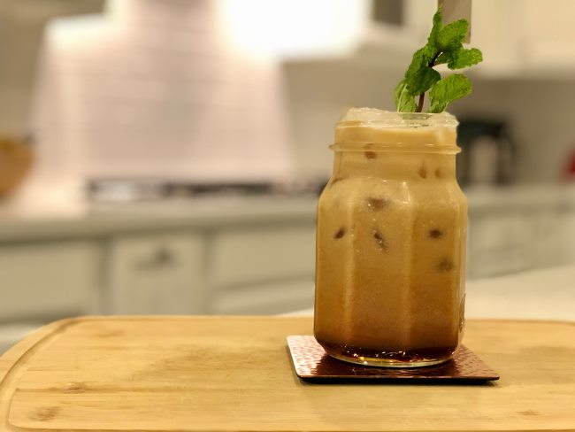
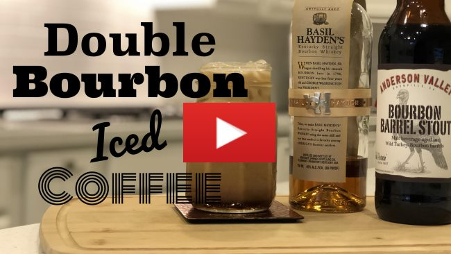

Alcoholic drinks with coffee are a kind of an oxymoron of sorts. At first, your heart starts pumping, and you feel fresh with energy, ready for the day or the moment ahead, but there is a calm need to relax almost immediately. Your body says, take a seat buddy, put your legs up, and enjoy another sip.

The Double Bourbon Iced Coffee is no different in those regards. This drink combines three of my favorite things: cold brew, stout beer, and bourbon. It’s the perfect combination of sweet coffee and bourbon with the slight bitterness of the stout. Best of all, nobody will know you have this brunch trick up your sleeve for those who prefer coffee to a bloody mary or a mimosa.

Ice cold and creamy with that smooth bourbon undertone, this drink will have you yearning for more. So go ahead, double the recipe while you’re at it, and share with some friends or family.

### Ingredients

-   2 oz. strong cold-brew coffee
-   2 oz. stout beer (I used Anderson Valley’s Bourbon Barrel Stout)
-   1½ oz. Bourbon (Here I used Basil Hayden’s)
-   ¾ oz. simple syrup
-   1/2 ounce heavy cream

### 

### Directions

Fill a large glass with ice then pour in the coffee, beer, bourbon, and simple syrup, and stir. Pour the cream over the top and stir. Then enjoy!

### Video Tutorial

Watch the video version of the Double Bourbon Iced Coffee Recipe on YouTube.

*[Double Bourbon Iced Coffee](https://youtu.be/PLzw2FqL84o) by Random Crockery*

### Resources

[Cold Brew Coffee is Not Rocket Science](http://ineedcoffee.com/cold-brew-coffee-is-not-rocket-science/) – A guide to making your cold brew coffee.

[Homebrewing: Espresso Stout](http://ineedcoffee.com/homebrewing-espresso-stout/) – If you wish to make a stout for this recipe, here is a primer on homebrewing.

[The Coffee Martini](http://ineedcoffee.com/the-coffee-martini/) – Recipes using coffee and vodka.