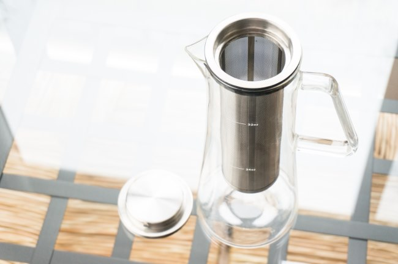
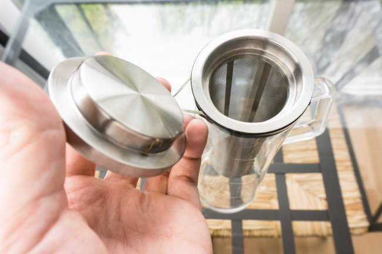
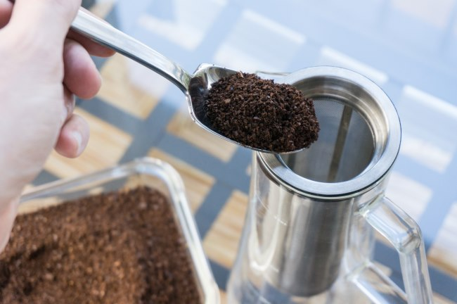
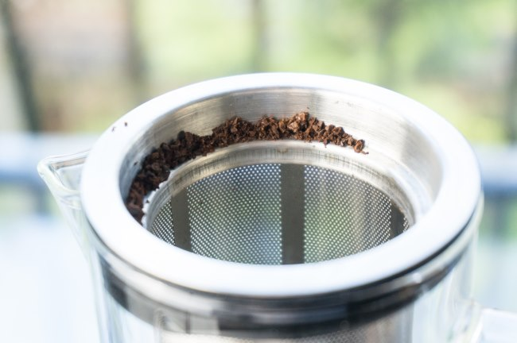
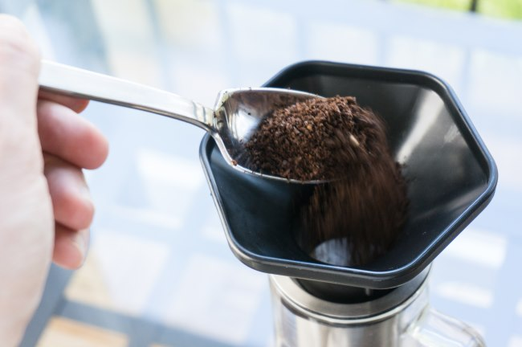
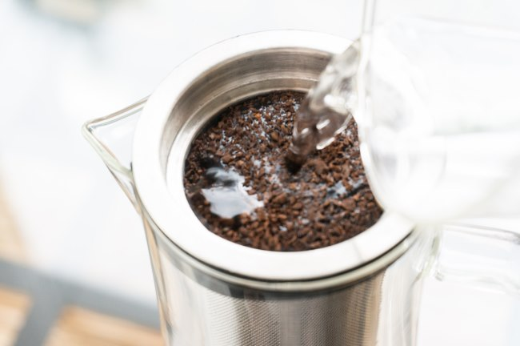
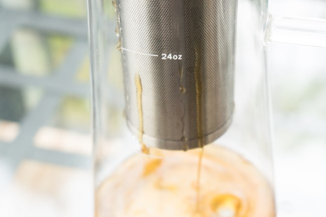
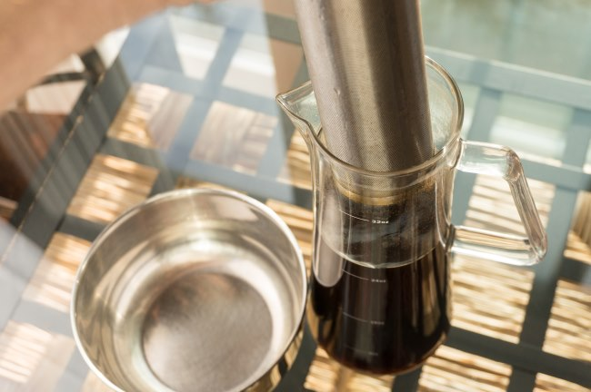

In an earlier article titled [Cold Brew Coffee is Not Rocket Science](/cold-brew-coffee-is-not-rocket-science/), I outlined just how easy it was to make cold brew coffee at home. No matter how you tackle the task of making cold brew, it all breaks down to some basic steps:

1.  Grind coffee to a medium-coarse or regular coarse setting.
2.  Place coffee inside a filter.
3.  Put that filter in cold water.
4.  Wait 12-24 hours.
5.  Remove the filter and serve.

There is one remaining step: cleaning everything up so your cold brewer is ready to go the next time you brew coffee. Some of the more basic methods require a little more time for cleanup. In this tutorial, I’ll show you how to make cold brew coffee using the Cold Brew Coffee Maker from Home and Above. Not only is it easy to use, but it is also super easy to clean up.

*Cold Brew Coffee Maker – Iced Coffee Glass Pitcher 32oz with Sealing Removable Filter  
*

### Why I Like the Cold Brew Coffee Maker

The first step in using a new coffee brewer is the math. How much coffee do I use? Is that in grams? Where is my scale? Now, how much water do I need? The Cold Brew Coffee Maker is very simple. It is as if they anticipated these questions when they designed the brewer.

Along the side of the brewer, there are markings for 8 oz, 16 oz, 24 oz, and 32 oz. Pretty cool. Now, I don’t need to use a measuring cup to add water. **For this brewer, I advise only using the 32 oz mark.** At 24 oz, not all the coffee will be under the water line. But at 32 oz, the water line reaches exactly the level in the filter where the ground coffee reaches.

Also, note that once you remove the filter, you won’t get 32 ounces of coffee. It will be closer to 24 ounces.

The other thing I like about this brewer is its design. Not only does it functionally perform its task as a cold brewer, but it also looks nice on the counter. When the coffee is finished brewing, it has a nice handle that makes pouring easy.

Let us make some cold brew coffee.

### #1 Grind 1 Cup of Coffee

A common ratio in cold brew coffee is 4 to 1. This means four parts water for 1 part coffee. 32 ounces is 1 quart, or 4 cups in a quart. Divide by 4, and we get 1 cup of coffee. For those who prefer grams, use 85 grams of coffee. The coffee should be ground medium-coarse to coarse. See our [Coffee Grind Chart](/coffee-grind-chart/) for more guidance, but don’t be concerned with being exact. Cold brew is very forgiving.

### #2  Place Filter in Brewer and Add Ground Coffee to Filter

Place the metal filter inside the Cold Brew Coffee Maker. Then add 1 cup of ground coffee into the metal filter. Make sure to brush off any loose grounds on the top lip. Alternatively, you can use a funnel. If you have an AeroPress, you can use that funnel. It fits perfectly.

*If you have a funnel, use it. Otherwise, brush the loose grounds down into the filter.* 

### #3 Add Cold Water

Slowly pour cold water over the coffee grounds. Continue pouring water until the water reaches the 32-ounce line.

### #4 Add Lid and Wait 12-24 Hours

Place the lid on the brewer. At this point, all we need to do is let the brewing begin.

Place the brewer out of the way somewhere for 12-24 hours. I brew on the counter at room temperature. There is an exposed opening at the top where you will pour later. If you are concerned about dust or fruit flies in the coffee, place a plastic bag or plastic wrap over the top of the brewer during the 12-24 hours while it is brewing.

### #5 Remove Filter and Serve

Even though the lid should be firmly attached to the metal filter, I advise slowly removing it. Set the filter in the sink for now because a small amount of coffee will continue to drain out.

Depending on your personal taste and how long you brewed the coffee, it might be too strong. If so, add water to taste. At this point, you can serve it over ice or place it in the refrigerator to chill. You can also heat it up in a microwave and drink your coffee hot. Even hot, your cold brew will retain a clean, low-acidity taste.

### Clean Up

Remove the lid and knock the grounds into a compost bin. Give the filter a quick rinse, or you can put it in the dishwasher. I wash mine by hand. Even though it is dishwasher safe, I don’t know how many cycles in the dishwasher could damage the rubber lip where the lid secures into the filter.

### Troubleshooting

If the coffee tastes too strong, you can add water and, in the future, use either a shorter brewing time, less coffee, or coarser coffee grounds. If the coffee tastes too weak, you can use a longer brew time or a finer ground coffee. Adding more coffee likely wouldn’t help with this brewer since the additional coffee would be above the water line.

### Last Words

I’m a big fan of the design of the *Cold Brew Coffee Maker from Home and Above*. The only issue is the exposed lip during the brewing, which is easily solved by covering it with an upside-down plastic bag. Don’t waste your money buying expensive cold brew coffee in the coffee shops. It is too easy to make it yourself. Cold Brew coffee is also ideal for people who are pressed for time in the morning. Time the brew so it is finished before you leave your house. Pour and go.

### Resources

*Cold Brew Coffee Maker by Home and Above*

[Cold Brew Coffee is Not Rocket Science](/cold-brew-coffee-is-not-rocket-science/) – The basics of cold brew coffee.

[The Perfect Solution For Cold Brew Coffee on the Go](/the-perfect-solution-for-cold-brew-coffee-on-the-go/) – Cold brew coffee with the Primula travel mug.

*Disclosure: INeedCoffee received a Cold Brew Coffee Maker from Home and Above for this tutorial, which did not affect its content.*

*Brewing photos by Joseph Robertson of Extracted Magazine, a digital coffee magazine published for iOS and Android.  
*
