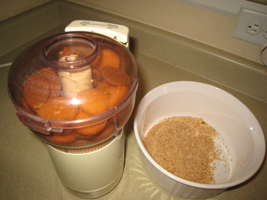
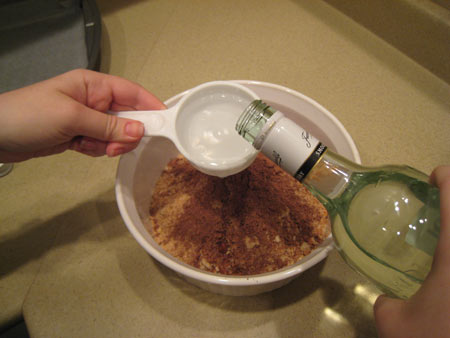

Rum balls are a holiday favorite and a box of them can make a wonderful gift. These rum balls are especially good because they are easy to assemble and they are less intoxicating than other recipes. This recipe makes about 45 rum balls.

  
*Espresso rum balls on the tray.*

### Ingredients – For the Rum Balls

-   3 cups of vanilla wafers, chopped (about one package)
-   1/2 cup of chopped nuts (walnuts, or pecans)
-   1/3 cup of light or dark rum
-   2 shots of espresso
-   3 tablespoons of honey
-   1 1/2 tablespoons of cocoa powder

### Ingredients – For the Coating

-   3 plastic Ziploc bags – sandwich size, or something similar.

### Ingredients – First Bag

-   3/4 cup of powdered sugar

### Ingredients – Second Bag

-   3/4 cup of powdered sugar
-   1 tablespoon of cocoa powder

### Ingredients – Third Bag

-   3/4 cup of chopped nuts

### Directions

Put the vanilla wafers in a food processor. Make sure that they are finely chopped, if there are large pieces, you will end up with lumpy rum balls.

Put the walnuts in the food processor. Chop these to a fine chop also. Make sure to separate some of the walnuts for the coating.

  
*Put walnuts into the food processor.*

Combine the chopped wafers, chopped walnuts, espresso, rum, honey, and cocoa powder into a large bowl. Mix thoroughly.

  
*Add rum.*

  
*Stir the mixture.*

### Presentation

Wash your hands well before beginning. Place a small amount of the batter in your palm and roll it into a ball shape. These rum balls are very rich, so make sure that you make the balls very small. Place a ball into one of the three Ziploc bags that you have prepared for the coating. Zip the bag shut and shake the bag so that the rum ball is thoroughly coated. Remove the rum ball and set it aside.

  
*Rum ball gift box*

  
*Multiple rum ball gift boxes*

### Tips

Place the coated rum balls on an ungreased cookie sheet covered with wax paper. Let the rum balls breathe for at least an hour before attempting to store/package them. They will mellow over the next few days. They do not need to be refrigerated, but they must be stored in an airtight container. If refrigerated, the coating may need to be reapplied.
