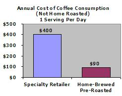
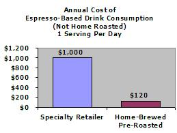
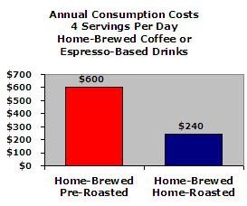

### Financial Benefits

The economics of coffee consumption is quite relevant to the home roasting industry. There is a direct relationship between the quality – perceived or real – of coffee and the amount consumed (people will drink more coffee if it tastes better). Because of perceived quality increases, many consumers have increased their visits to specialty coffee retailers. (The following numbers used are generalizations, but should be pretty close to reality.)

These retailers routinely charge $1.50 for a 12 oz. serving of coffee and $4.00 for an espresso-based drink. Some people will actually drive to the retailer and gladly pay those amounts – daily. This doesn’t even take into consideration the cost of gas, the value of time in transit to the retail location, or the time spent in line at the shop. Assuming five orders per week, that amounts to $7.50 for the coffee drinker and $20 for the espresso-drink consumer. Annual costs for pre-made drinks can begin to approach $400-$1,000.

Some consumers realize the expenses they are incurring from purchasing coffee at retail outlets and move on to making the drinks in their homes. To have coffee close to the quality of specialty retailers, consumers will need to buy beans, and roasted specialty-grade coffee is about $12 per pound before any applicable shipping costs. The cost obviously comes down quite a bit relative to the retailer-made drinks.

A pound of coffee is about 450 grams of which you can make approximately 20 servings of coffee (12 oz. each, using 14g of ground coffee for each 8 oz. of water) and 25 double-shots of espresso (using 18g of ground coffee per double). Assuming five servings a week as in the scenario with the retailer-made drinks, that amounts to only $12.00 a month for coffee drinkers and $10 a month for espresso drinkers.

The annual difference is dramatic, reduced to about $90 a year for coffee and $120 for espresso. These consumption assumptions for homemade drinks are probably not all that realistic (way too low) but are only meant to make an appropriate comparison to the cost of retailer-made drinks.

  
*Annual Cost of Coffee (Not Home Roasted) – 1 serving daily*

  
*Annual Cost of Espresso-Based Drink (Not Home Roasted) – 1 serving daily*

Here is a more likely situation. As consumers begin to realize that the quality of their coffee could be improved greatly just by increasing the freshness, they may be led to roast their own coffee. As the resulting cup quality increases through the greater level of freshness attained by home roasting, consumers will be more likely to use more coffee.

People will also experiment more when home roasting, which can also increase usage. It would not be uncommon for home roasters to go through an average of 4 to 6 cups of coffee or 4 double shots of espresso per day. At that rate, one pound of coffee would only last a week. Purchasing roasted coffee would cost about $50 a month, or about $600 annually.

Significant savings and benefits from higher quality will accrue to consumers that decide to home roast. Unroasted beans can generally be purchased for about $5 a pound, reducing monthly coffee costs to about $20, or about $240 annually. For some people, the opportunities of home roasting will significantly increase usage to the point where they may not be reducing the expense of purchasing coffee, particularly in the case of an avid espresso drinker.

  
*Annual Costs – 4 servings per day*

### Non-Financial Benefits

Home roasting can take up a fair amount of time. There is some opportunity cost (the value you give up by choosing not to do something of benefit to you) in home roasting relative to purchasing roasted beans from a retailer that ships immediately after roasting. Roasts can take up to 30 minutes with set-up, cool-down, and wrap-up.

For some people, this may be too great a commitment on the surface. People are overloaded and seem to have little room for anything new in their lives. However, people will always find time to do the things that are important to them. The economic benefits of home roasting are real, but perhaps the greater benefit is in the therapy that comes from the relaxing experience of home roasting (the lull of beans, the excitement of first/second crack, the wafting aroma, etc.) Home roasting is an enjoyable experience with benefits that go well beyond the resulting coffee.

*For an economic case study comparing a premium store-roasted coffee with a home-roasted one, read The 2 Best Cups of Coffee I’ve Ever Had.*
