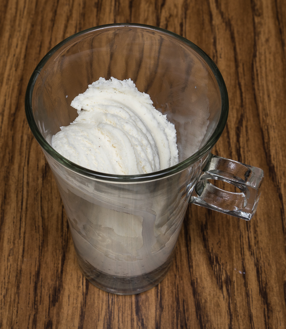
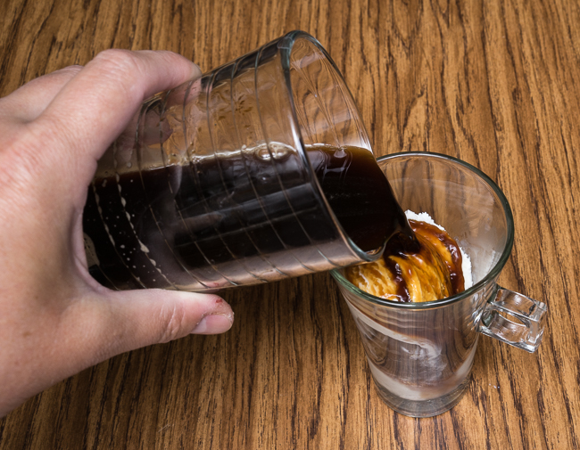

Eiskaffee is German for Ice Cream Coffee. It is darn simple to make, and really hard to screw up. It is great for hot weather, especially when you want coffee, but not hot coffee.

It is somewhat reminiscent of a root beer float, with a little less sweetness and calories. Best of all, it takes just a minute or two to make.

### Basic Ingredients

-   2-3 Scoops of vanilla ice cream
-   4-8 ounces of cold, double-strength instant or brewed coffee (or double espresso, hot should be OK)
-   Real whipped cream

### #1 Put your scoops of ice cream in the bottom of the glass

### 

### #2 Pour the cold coffee over the ice cream

### #3 Top with whipped cream

### Some Variation Ideas

-   Try another flavor of ice cream, such as Rocky Road or Cookies and Cream
-   Sprinkle some shaved chocolate sprinkles, cocoa powder, or cinnamon on top
-   Make it an adult beverage by adding some booze, like whiskey
-   Try drizzling some caramel sauce on sprinkle a small amount of coarse sea salt on the caramel
-   You can sprinkle Krokant or Crocant on top, which is a type of nut brittle (usually peanut, hazelnut, or almond)
-   Best idea yet! Try some homemade ice cream.

### Resources

[An Introduction to Affogato (Recipes and Tips)](http://ineedcoffee.com/an-introduction-to-affogato-recipes-and-tips/) – A similar recipe that uses coffee and ice cream.

[Homemade Coffee Ice Cream Recipe](http://ineedcoffee.com/homemade-coffee-ice-cream-recipe/) – How to make coffee ice cream at home.

[Coffee Brewing Guide](http://ineedcoffee.com/coffee-brewing-guide/) – Our collection of coffee brewing tutorials.