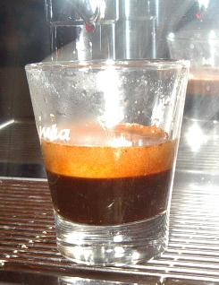
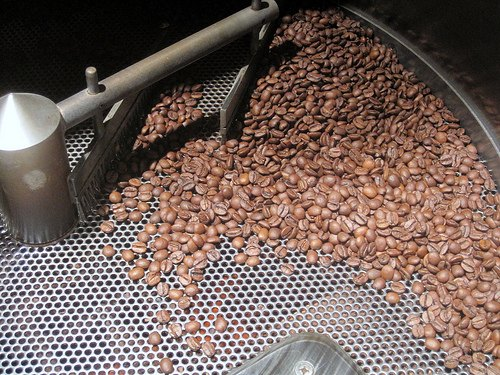

Why just espresso blending? Why not talk about blending in general? Blending for the press pot or filter machine doesn’t need to be as precise. For one, it’s a far weaker part of the cup compared to espresso, and there are rules that can’t be broken in espresso blending that work really well in filter blends. Espresso blending is an art.

### What makes me the expert?

Well, I’ve been blending for espresso in the commercial setting of a coffee shop for four years and have created well over 200 blends from 60 different origins in search of the perfect blend, and drunk many thousands of cups of espresso not just for enjoyment (it’s a tough job) but also in the quest for the better espresso. My *Has Bean Espresso* blend is one of the best-selling coffees I sell, and has received critical acclaim from people in the trade, but more importantly from customers.

### So, what makes a good blend?

I’ve got to start off by saying *I think I know best* and of course this is true, but these are my rules and not yours. Don’t be afraid to break them if you think it’s going to work. One man’s ristretto is another man’s poison.

Good espresso comes from blends. This is the most popular way of thinking in the coffee world, and I have to say that I agree. But in saying that, it is of vital importance that you taste all your single-origin coffees in the espresso machine. Tasting single origins and cupping them lets you know what they taste like alone. So when you are looking for a little sweetness, you can refer to your experiences of tasting it at origin and think *I’ll add some…*

It’s also a good idea to keep detailed notes of cupping experiences and don’t be afraid to go back again and try something else. We all know that one day you try a shot and it’s awful, and the next it’s perfection, so more than one session is important. Also, a good idea can be to cup like the professionals. Only here can you really get a feeling for the coffee. It’s all well and good trying it in the espresso machine, but it can be a lazy way of finding tastes. Make your palate work and here you can compare. Only with comparisons will you understand the real differences between the coffees.

Work, work, and work. Your blend will not be done in the first mix. It shouldn’t be done by the 10th attempt. And when it finally is what you’re after, it will change as soon as the next crops rotate in. It’s an ongoing process of cupping, tasting, adapting, and repeat. Your blend will never be finished and if anyone tells you theirs is, don’t trust them. With so many variables going into the espresso no shot is ever going to be the same and no blend is going to be the same.

  
*Espresso Cooling*

### What makes a bad blend?

A bad espresso blend is like no other. If the roaster gets this wrong, he will be lambasted forever and likely lose his customers. If a filter blend isn’t to someone’s taste, he will be forgiven, and it will be put down to the palate, or just not their type of coffee. Also, the ratio of coffee to water is much higher, so mistakes are highlighted.

Bad espresso blends are over complicated, under complicated, too smooth, too bitter, too fresh, and too stale… I could go on but I’m sure you get the picture. My favourite espresso blend wouldn’t make my catalogue. It is too rich, full-bodied and expensive for me to sell retail. A roaster’s job is to find some middle ground to keep everyone happy, and not to go too far one way or the other.

One rule I always follow is to avoid acidic coffees like Kenyans. As a young and foolish roaster with my love for Kenyan coffee, I thought this could be carried over to my love for espresso. Alas, it was a waste to see a good Kenyan / Costa Rican blend about to be thrown away until I found it to be the best filter blend I had ever created, which I have sold from this day on and is my most popular filter blend in the catalogue. So, even from mistakes, small triumphs can be found.

### Roast

A pretty important part of good espresso blending. There are two schools of thought on whether to roast as a blend or separately. For the commercial roaster, it is easier to post blend (and indeed the most popular) as this cuts down on waste. If he has already roasted some Colombian up for an order, it is easy to add the rest of this to the blend. The thinking behind this is that you can treat each bean as an individual.

However, I prefer to pre-blend and roast it as a whole. All I can tell you is my experience has shown me that I get the best results this way. You get a more even cup, the blend tastes as if it belongs together. You can get very anal about every part of the process of creating espresso, but I go with what works for me.

I agree or at least can relate to David Schomer on most things in his Espresso Coffee Professional Techniques book (which is a *must-read* for the espresso enthusiast) but on the roast type, we definitely agree. David Schomer calls it a Northern Italian Roast. I call it medium/dark roast. It’s just at the point where the beans look like they want to shine with oils but don’t. A deep mahogany brown. If you take it any further you get a bitter cup which contrary to what Starbucks is trying to tell us is not what good espresso is about. If you must vary the above roast then go a little lighter, but avoid the charcoal blend.

### So come on then, give us your recipe!

#### Ethiopian Yirgacheffe

As a commercial roaster, I stopped stocking Yirgacheffe for a whole year. This was due to (in my opinion, not the industries) a poor Yirg crop that lacked the vibrancy I associate with it. I went to Sidamo (not bad, certainly better than 2002 crop Yirgacheffe), Djimma (a real mistake – it was a good cup, but the bean grade was very poor, which meant 20 minutes before roasting were spent fishing out the pebbles). However, nothing gives my espresso the lift it needs, like a good Yirgacheffe. So now it’s back, it’s good, and it’s in most of my blends for sure. It gives the cup citrus bursts and combines with the other smoother beans to balance the cup.

#### Ethiopian Longberry Harrar

I’m a convert. For years I have refused to stock this bean. Why? Well, I put it down to a bad experience and listening to others in the trade. I cupped this way back at the very start of Has Bean online. It was the most rancid cup of coffee I have ever drunk. It was acidic to the max and worse than some robustas I’d tried. So I stayed away, until 2 months or so ago. When I cupped it I decided to buy some there and then. A great addition to a blend, but only in small amounts; it adds some flavour but avoids overpowering your blend. It has a very distinctive taste similar to that of Yemen coffees.

#### Brazil Bourbon Fazenda Cachoeira

Until only less than 12 months ago the best Brazilian I stocked was a generic Santos. Brazil’s coffee is boring (so I thought), flat and dull so why bother trying to find a single estate that’s going to taste the same as cheap old Santos? Well that was what I thought until I was convinced by a very good friend to try some of this. This sweet smooth little number is perfect in any espresso blend and has definitely improved my blends beyond any other factor.

#### Colombian La Manuela

Smooth again but without the fresh sweetness of F. Cachoeira. It has a more silky sweetness and gives the cup more body. A substantial bean that sits well in the blend.

#### Brazil Santa Terezinha

Its smooth subtlety calms down an over-sweet blend and can add substance to one where otherwise you would have “citrus overkill”. This is also great when you have a blend that you think is *there* but when in fact there is too much going on in the cup. A *calmer*.

#### Bolivian Organic

A great bean that gives chocolate hints to the blend and roasts like a dream. It’s a great quality bean that adds to any blend.

#### ROBUSTA!!!

I don’t care what anyone says to me, I’ve never tasted a better espresso blend than one with Robusta. Now small amounts (less than 10%) are rules of thumb, and it’s got to be good quality robusta (there are some out there. In fact I’ve tasted robustas better than some arabica beans I’ve been sent).

Don’t be a snob, it adds a little caffeine kick to a blend, and it gives you great crema and balances out the cup. I have great blends without robusta, but none are better than those blends that contain robusta. Don’t let pre-conceptions stop you from trying this; with amounts as low as 10%, you can’t even taste it, but it gives the cup so much more.

  
*Espresso Shot*

### Conclusion

This is a brief guide to espresso blending and roasting. I could write a book with recipes and alike in, but I’m wondering how many of you are still awake reading a few pages. It’s all about opinions and taste and of course: mine are right and if you disagree you’re wrong unless, of course, you become a customer, and then it’s *Sorry sir/madam I am a fool*.

For me, the blend is the most important part of good espresso. I can get around a useless machine or no tamp, and I can go buy some bottled water. I can buy a stove-top Moka pot for just over a tenner and I’ve used some unusual tamps in the past. But if the blend is bad: well, you can’t make a doppio out of a sow’s ear!

### Resources

[Coffee Blending For the Home Roaster](/coffee-blending-for-the-home-roaster/) – INeedCoffee article

*This article originally appeared on [Too Much Coffee](http://www.toomuchcoffee.com "A meeting place for European coffee enthusiasts"). This article and its photos are Copyright 2004 Too Much Coffee and are reproduced with permission.*
