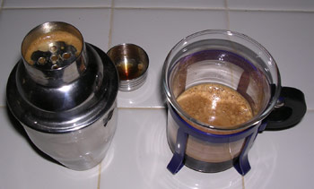

I will happily drink hot coffee any time of year. I have been good-naturedly derided for firing up the espresso machine on a ninety-degree afternoon. I went into a cafe and ordered a latte in August. I even drank coffee with verve after working all day in the steamy weather of a tropical fishing village in Nicaragua. In short, I’m not shy about drinking hot coffee on a hot day. There are times, however, when an iced coffee hits the spot.

The question is: how do you brew a hot coffee and chill it quickly without watering it down? There is, in fact, a cheap, easy way of icing any coffee or tea drink on the spot. All you need is a cocktail shaker. Simply pour your drink into the mixer with three or four ice cubes, shake until cold, and strain your beverage into an appropriate glass. It’s simple enough, and this formula should work well for almost any coffee drink.

  
*Ice inside a cocktail shaker*

If you’re going to go out and buy a cocktail shaker, you’ll need to decide which style you want to purchase. The one I own consists of a cup-like base and a two-piece lid with a built-in strainer and removable cap. This works nicely because it doesn’t require any special skill to use, and it reliably leaves a good crema on my espresso. There is another style of mixer that consists of two cups that fit together to create a sealed compartment for shaking the beverage. I get the impression that this kind of mixer is less common. I have not used a two-cup shaker, and it looks difficult, so I’m sticking to the three-piece model, if for no other reason, in the interest of keeping my precious coffee off the kitchen floor. I’m sure, however, that the two-piece style ultimately works just as well as its three-piece counterpart.

Now that you have your shaker, you’re ready to start icing. Remember that it’s better to put in too much ice than too little. If you don’t use enough, you’ll just end up with a lukewarm (and rather unsatisfying) drink. With that in mind, have fun! I’ve included some of my favorite iced coffee recipes below to provide a starting point, but I maintain that just about any drink can be iced. It just takes a little creativity.

  
*Prepare espresso shots*

### Caffe Freddo (Chilled Espresso)

Begin with a double shot of espresso. Pour your drink into a cocktail mixer with three ice cubes. Shake well. Strain it into an empty glass. If you do it just so, you should be able to obtain a long-lasting, foamy crema on top of the drink.

  
*Chilled Espresso*

### Iced Cafe Americano

Begin with a double shot of espresso. Add an equal portion of water. Pour your drink into a cocktail mixer with three ice cubes. Add milk or cream to taste. Shake well. Strain it into a glass with fresh ice.

### Regular Iced Coffee

Make a glassful of regular coffee in your preferred method (drip or French press). Pour your drink into a cocktail mixer with four ice cubes. Add milk or cream to taste. Shake well. Strain it into a glass with fresh ice.

### Iced “Latte”

Begin with a double shot of espresso. Add an equal portion of milk. Pour your drink into a cocktail mixer with three ice cubes. Shake well. Strain it into a glass with fresh ice.