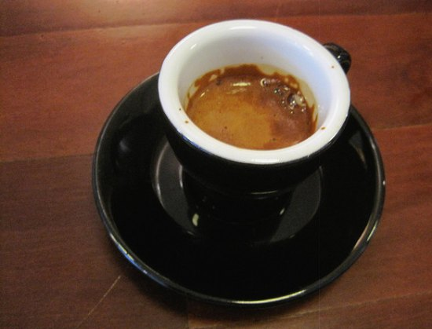
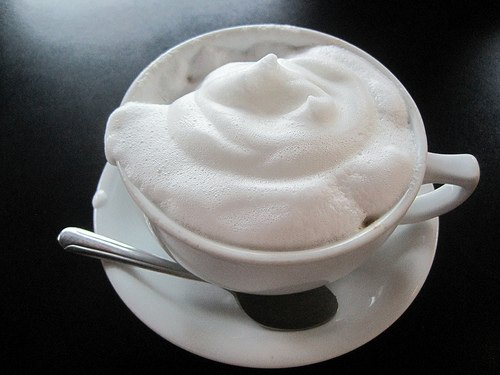
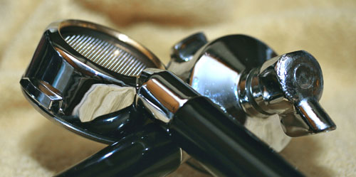

Love the taste of freshly brewed espresso but are confused by some of the language used to describe the processes, machinery, and serving suggestions? Well, then you’ve come to the right place. Following is an alphabetized list of easy-to-understand definitions for some of the most commonly used terms.

### Barista

The term is used to describe a person who has reached an expert level of espresso-making, whether professionally-trained or personally achieved, through practice. A Barista also possesses a wide knowledge of all things coffee. It’s an Americanized word derived from the Italian phrase for ‘bartender’ as most Baristas prepare and serve espresso from behind a cafe counter or ‘bar’.

### Basket

The shape of an espresso machine’s basket plays a very important part in the overall brewing process. Make sure to choose one with a straight-walled basket because curved sides will create an uneven brew and ultimately, deter from the taste of your espresso.

### Boiler

Correct boiler pressure is imperative because it determines the amount of water that will be incorporated into the steaming process. So, if milk is not foaming to your satisfaction, check the boiler pressure setting on your machine and refer to your user manual for information and/or a phone number you can call to request professional guidance.

### Brewing Time

Brewing is the method by which water passes through the grounds. It’s recommended that brewing time be kept to around 30 seconds for an espresso shot, to avoid the coffee deteriorating in flavor.

### Brush

Between dispensed shots, use a brush to clean out espresso ground deposits that have settled into your machine. This will keep it running efficiently and provide the best-tasting beverage.

### Burr Grinder

Describes two revolving mechanical elements of a grinder that crush or tear the beans. Milling the beans in this manner produces consistent ground size, lessening the risk of burning and maximizing both aroma and taste.

### Crema

Crema is the creamy foam that appears on top of a well-brewed cup of espresso. The crema color varies between pale and reddish-brown depending on the brewing process and coffee strength.

### Descaler

An agent commonly used in powder, pod, or liquid form for cleansing espresso machine parts. Descalers remove deposits from the boiler and brewing mechanisms to keep your machine healthy and consistently produce the highest quality results.

### Doser

A doser is the part of a grinder that automatically releases a pre-determined amount of coffee grounds for brewing. Some machines are equipped with adjustable dosers, while others aren’t. Single-shot servings, or doses, are usually around 7-9 grams, while a 14-18 gram dose merits a double shot.

### Froth

Froth is the foam covering the surface of a cup of espresso, cappuccino, latte, etc. It’s a result of rendering and aerating the milk via the steaming process.

### Group Head

This is the main chamber of an espresso machine that draws pressurized steam through the coffee. A group head describes a multi-faceted fixture that allows for dispensing into multiple cups at once.

### Long

A two-ounce shot of espresso is also referred to as a long (shot).

### Portafilter

The part of an espresso machine that has a handle to facilitate manipulation and which holds the basket storing the grounds during the brewing process. It is cupped in appearance and should be kept clean, exhibiting a shiny, metallic surface for best, continued results.

### Pump

This is the mechanism within an espresso machine that creates the correct amount of pressure, allowing the pistons to operate properly. A widely-used variant of the pump consists of between 8-10 bars of pressure.

### Ristretto

Describes the term used for a 1 ounce, ‘short shot’ of espresso. Many connoisseurs opt for this serving size as the brewing process differs somewhat from a standard shot of espresso (2 oz) and results in more profound robustness of flavor.

### Seal

The part of the espresso machine that acts as a buffer, preventing any water from seeping through the mechanisms and away from the end product.

### Steam Wand

This is the pipe on the front of the espresso machine which is used to release steam for frothing milk to top a cup of espresso.

### Tamper

A tamper is the mechanical part of the espresso machine used for compressing, or pressurizing, the grounds within the filter basket. This process is referred to as ‘tamping’ and is recognized as a forgotten art form. Tamping pressure is most commonly applied in increments of 20 and then 30 pounds of pressure for the highest quality.

### Water Filter

For best results, water used to make espresso should always be filtered. Something to keep in mind if you’re in the market for an espresso machine is that some come equipped with their own, built-in water filter, while others do not.

### Water Temperature

Espresso machine water temperatures vary but should be stabilized at 92-93 C to produce the best-tasting espresso.