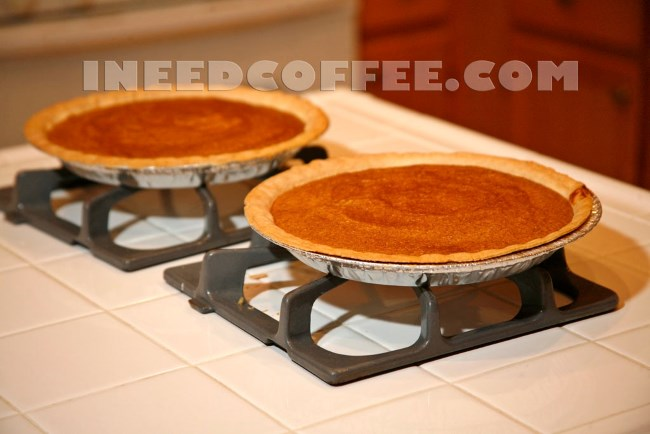
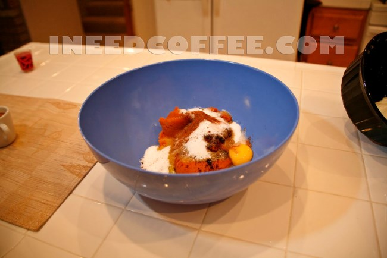
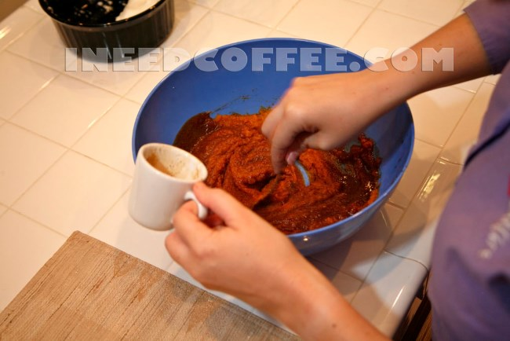
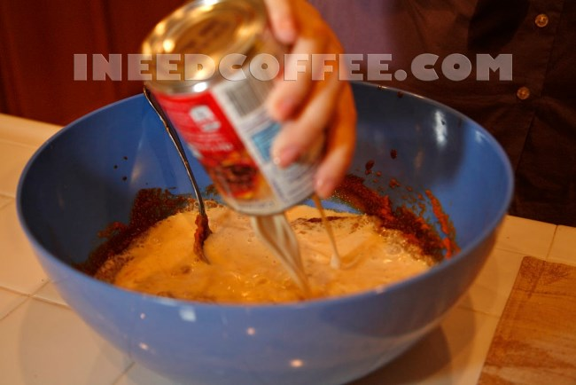
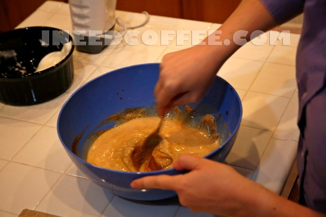
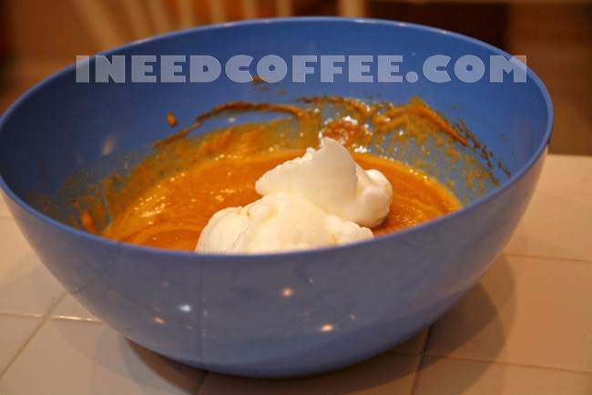
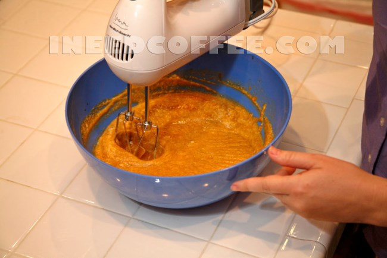
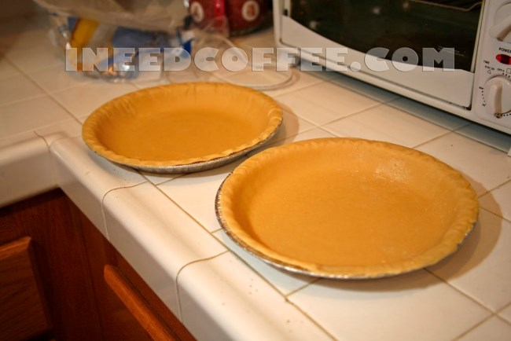
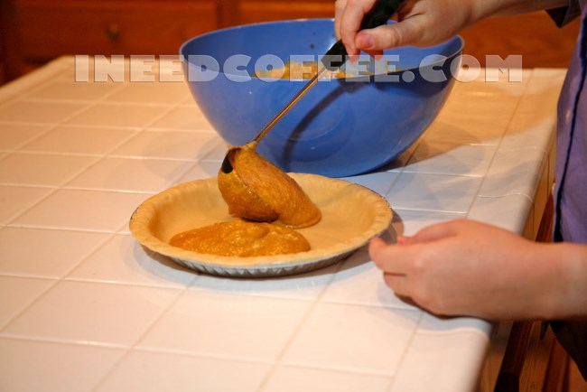
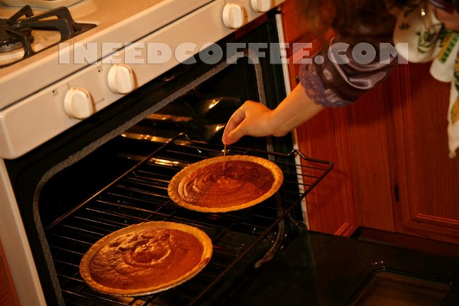

I always crave pumpkin pie as soon as the first leaves start turning colors or the crisp autumn breeze turns my cheeks red. This year, I expanded upon my old pumpkin pie recipe and improved it by adding espresso. It’s a simple recipe using canned pumpkin.

The purist bakers among the crowd can modify a *from scratch* pumpkin pie recipe accordingly, if they have the patience to fool around with whole pumpkins, but this recipe is for the majority of people who want the pie minus the fuss.

  
*Espresso Pumpkin Pie*

### Why Espresso?

Many pies are too sweet for me. I prefer a slightly more complex taste, and you’ll get that when you add espresso to a pumpkin pie. In this recipe, I used espresso as both a spice and a liquid ingredient, and I think that it really adds something special to the taste. Give it a try; you won’t be disappointed.

### Ingredients

-   2 shots of espresso
-   A 29 oz. can of pumpkin puree
-   1 3/4 cups (22 oz.) of evaporated milk
-   4 large eggs
-   1 1/2 cups of sugar
-   1 1/2 teaspoons of ground cinnamon
-   1 teaspoon of allspice
-   1 1/2 teaspoons of finely ground espresso
-   2 “deep dish” 9 inches, pre-fab. pie crusts

### The Secret

The secret to making a good, fluffy/creamy pumpkin pie (instead of one that is heavy) comes down to the eggs. Separate the eggs. Put the egg yolks into a large bowl, and the egg whites in a small bowl off to the side. Whip the egg whites to stiff peaks and set them to the side.

### The Big Bowl

Add the pumpkin puree, evaporated milk, sugar, and spices to the big bowl, which already includes the egg yolks. Use a spoon to mix the ingredients.

In the picture above, I used a Turkish coffee hand-grinder to add the ground espresso. Next, I poured in the espresso shots.

Keep in mind the following: the recipe on the back of the pumpkin can suggests using 24 oz. of evaporated milk. Since I added 2 oz. of espresso, I subtracted that amount of milk from the recipe on the can.

### The Big Mix Up

Fold in the egg whites then stir them in, then use an electric mixer on medium speed to mix the ingredients. This whips a lot of air into the pie filling, which will give the pie a fluffy and light texture after baking.

### Into the Fire

Bake the pies at 425 degrees Fahrenheit for 15 minutes. After that, lower the temperature to 325 degrees for approximately 40 minutes. Use a clean, dry knife to check the pies. If the knife comes out clean, the pies are done. When the pies have been baked thoroughly, pull them out of the oven and cool them on a baking rack for at least 30 minutes before serving.

*Photos by Carl Melville.*