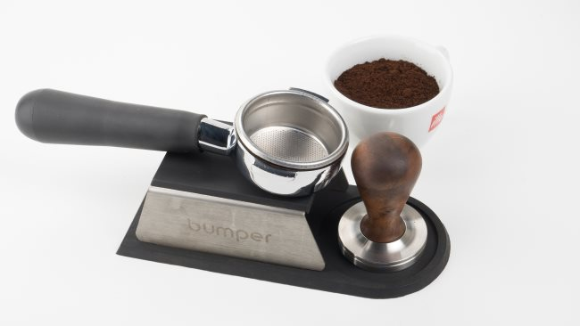
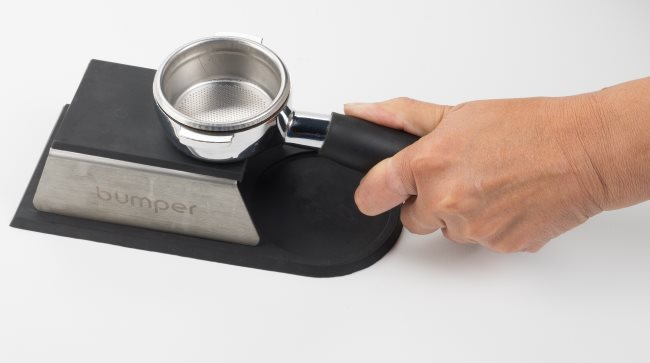
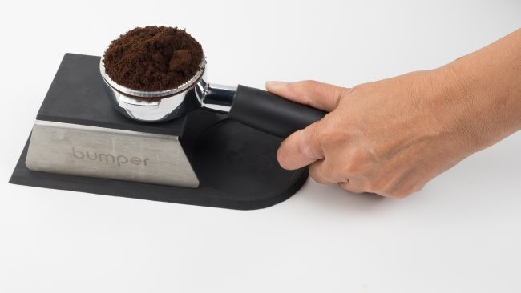
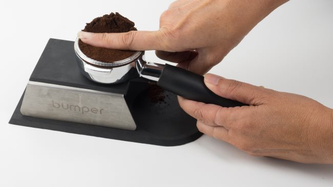
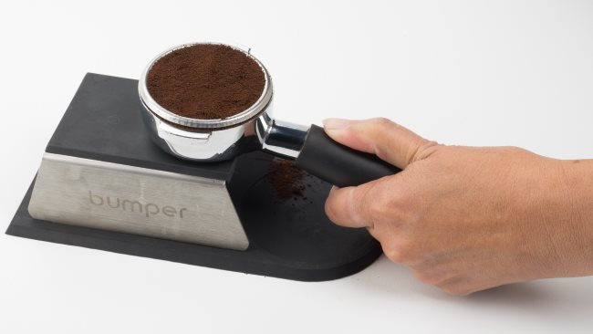
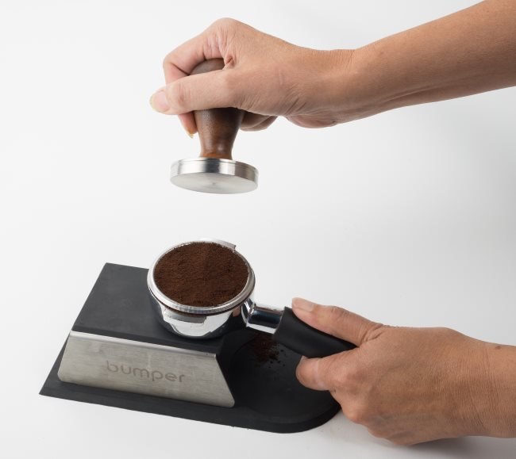
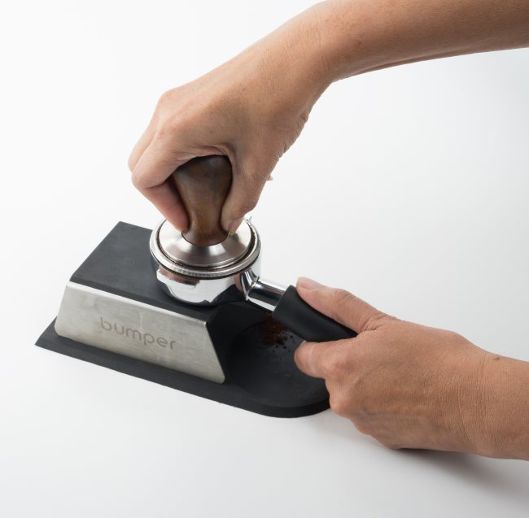
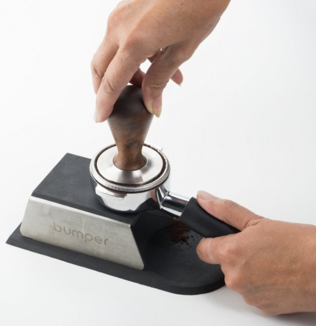
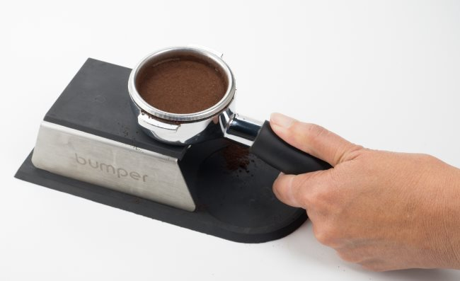

To consistently make great espresso, you must have an excellent tamp. This visual tutorial will serve as an initial guide to get you started. Follow the steps below and practice. With practice, your espresso shots will get better and better. Excellent form and consistency are your goals. Let’s get started.

You will need ground espresso, a tamper, and a portafilter. Many espresso machines ship with a plastic tamper. Don’t use those. Get a decently weighted tamper. Once you find the correct size of the tamper, you’ll need to decide if you want a flat or convex bottom. If you need help deciding, check out the Resources section at the end of the tutorial.

In our example, we use an espresso tamping stand, but this is optional. You can also use any clean, flat surface.

### #1 Confirm the Portafilter Basket is Clean and Dry

You will rinse and wipe the portafilter between shots. Over time, you’ll want to do a more extensive cleaning by soaking the basket and portafilter in a dedicated cleaner such as Puro Caff.

### #2 Add Ground Espresso to the Portafilter Basket

Espresso can be ground directly into the portafilter or poured in from another container. A single shot is usually around 7 grams, a double around 14 grams, and a triple around 21 grams. There are baskets for each size, and double baskets are the most common. These weights are a starting point. You can experiment with “up dosing,” which could mean adding a few more grams to the basket.

A very good (and often expensive) coffee grinder [fine enough for espresso](/coffee-grind-chart/) will go a long way to producing quality and consistency in your espresso shots. The Baratza Virtuoso, Rancilio Rocky, and the Mazzer Mini are three grinders that excel at espresso.

Adding the coffee to the basket creates an even bed of grounds. In the photo below you can see the espresso mounds up above the base. This is done to have enough coffee when the grounds are evened out and tamped down.

### #3 Even the Ground Espresso With Your Finger

Draw your finger across the top of the portafilter to even out the shot before tamping.

If any grounds are on the rim, brush them aside.

### #4 Tamp the Shot

The goal with the tamp is to place an even extraction with about 30 pounds of pressure. You can use a bathroom scale to measure how much weight you put into a tamp. Developing consistent pressure is more important than always hitting 30 pounds of pressure. Your arm should be straight so the tamper evenly matches the coffee bed.

### #5 (optional) Polish the Shot

At this point, you can spin the tamper. This is called polishing and is an optional step. Some say it helps with evening out the tamp, while others say it is cosmetic and unnecessary. There are even specialized “smart” polishers now being sold on eBay that some believe do a better job of evening out the shot.

That is it. You now have an evenly tamped portafilter, which is ready for brewing.

### Last Words

Now that you’ve successfully tamped a shot of espresso, the goal is to do it consistently. With practice, you will be able to repeat these steps better and better over time. Use the same tamp technique so that when you are working with a new coffee, there is one less variable to think about.

There is one more topic that was not covered, and that is weighing. Once you’ve mastered your tamp, you can start experimenting with more precise dosing. You can get the exact number of grams by placing the portafilter on a kitchen scale and zeroing it out before dosing. Dosing by weight instead of volume can give you more repeatable results when making espresso.
